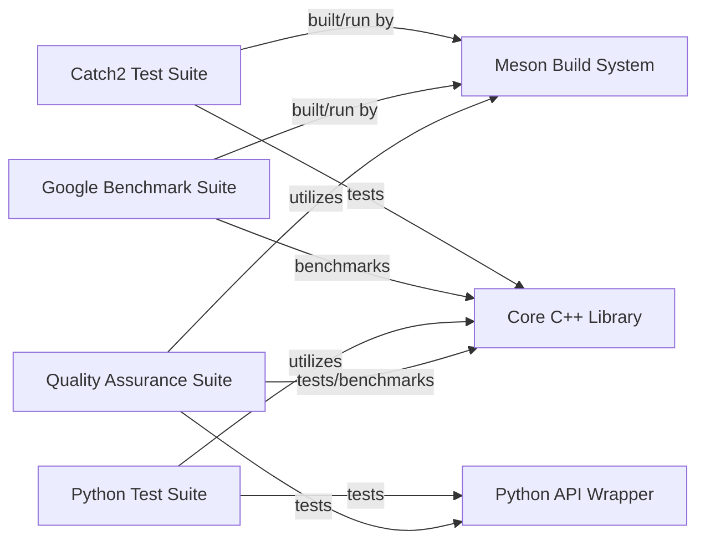

## Details

Abstract Components Overview

### Quality Assurance Suite [[Expand]](./Quality_Assurance_Suite.md)
The Quality Assurance Suite is a critical, abstract subsystem responsible for ensuring the correctness, reliability, and optimal performance of the project's core functionalities. It orchestrates various testing and benchmarking activities primarily focused on the Core C++ Library and the Python API Wrapper. As an abstract component, it does not have direct source code references but is composed of the Catch2 Test Suite, Google Benchmark Suite, and Python Test Suite.

**Related Classes/Methods**: _None_

### Catch2 Test Suite
This sub-component, part of the Quality Assurance Suite, is dedicated to comprehensive unit and integration testing of the Core C++ Library. It leverages the Catch2 framework to define and execute test cases, ensuring the functional correctness of C++ modules.

**Related Classes/Methods**:

- `catch2.wrap` (1:1)

### Google Benchmark Suite
This sub-component, part of the Quality Assurance Suite, is responsible for performance benchmarking of the Core C++ Library. It uses the Google Benchmark library to measure execution times and resource consumption of critical C++ algorithms and data structures, identifying performance bottlenecks and regressions.

**Related Classes/Methods**:

- `benchmark.cpp` (1:1)
- `bench_ds.cpp` (1:1)
- `google-benchmark.wrap` (1:1)

### Python Test Suite
This sub-component, part of the Quality Assurance Suite, provides specific tests for the Python API Wrapper, ensuring that the Python bindings correctly expose and interact with the underlying Core C++ Library functionalities. It validates data marshalling, function calls, and overall integration between Python and C++.

**Related Classes/Methods**:

- <a href="https://github.com/VeryAmazed/digest/blob/main/tests/approximation/approx.py#L1-L1" target="_blank" rel="noopener noreferrer">`approx.py` (1:1)</a>

### Core C++ Library [[Expand]](./Core_C_Library.md)
This is the foundational C++ codebase containing the core logic, algorithms, and functionalities of the project. It is the primary target for comprehensive testing and performance benchmarking by the Quality Assurance Suite.

**Related Classes/Methods**: _None_

### Python API Wrapper
This component acts as an interface layer, providing Python bindings and an API that allows Python applications to interact with and utilize the functionalities exposed by the Core C++ Library. It is thoroughly tested by the Python Test Suite to ensure correct integration and data exchange.

**Related Classes/Methods**: _None_

### Meson Build System
An external build system used to configure, compile, and run various components of the project, including the Catch2 Test Suite and Google Benchmark Suite. It plays a crucial role in the continuous integration and testing pipeline of the Quality Assurance Suite.

**Related Classes/Methods**: _None_

### [FAQ](https://github.com/CodeBoarding/GeneratedOnBoardings/tree/main?tab=readme-ov-file#faq)