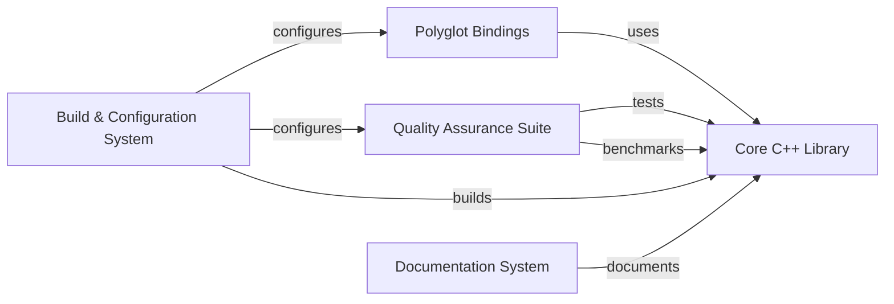

## Details

The `digest` project is architected as a polyglot library, featuring a performance-critical Core C++ Library that serves as the computational backbone, implementing the ntHash algorithm and related bioinformatics utilities. This core functionality is made accessible to various programming environments through Polyglot Bindings, which include Python interfaces via Pybind11 and Rust interfaces via FFI. The entire project's compilation, linking, and installation are orchestrated by the Build & Configuration System (Meson), ensuring cross-platform compatibility for all components. To guarantee the reliability and efficiency of the core algorithms, a Quality Assurance Suite integrates both unit/integration testing (Catch2) and performance benchmarking (Google Benchmark). Lastly, a dedicated Documentation System (Doxygen) generates comprehensive API documentation for the C++ core, providing essential reference material for developers. The main flow involves the C++ core executing the primary bioinformatics computations, with the polyglot bindings acting as an interface layer, all built and validated by the respective systems.

### Core C++ Library [[Expand]](./Core_C_Library.md)
Implements the high-performance ntHash algorithm and related bioinformatics utilities, serving as the computational backbone of the project.

**Related Classes/Methods**:

- `data_structure.hpp` (1:1)
- `digester.hpp` (1:1)
- `mod_minimizer.hpp` (1:1)
- `syncmer.hpp` (1:1)
- `thread_out.hpp` (1:1)
- `window_minimizer.hpp` (1:1)

### Polyglot Bindings [[Expand]](./Polyglot_Bindings.md)
Provides multi-language interfaces (Python via Pybind11, Rust via FFI) to the Core C++ Library, enabling accessibility from different programming environments.

**Related Classes/Methods**:

- `bindings.cpp` (1:1)
- `digest_utils.hpp` (1:1)
- `lib.rs` (1:1)
- `bindings.cpp` (1:1)

### Build & Configuration System [[Expand]](./Build_Configuration_System.md)
Manages the compilation, linking, and installation of all project components using Meson, ensuring cross-platform compatibility and project structure.

**Related Classes/Methods**:

- `meson.build` (1:1)

### Quality Assurance Suite [[Expand]](./Quality_Assurance_Suite.md)
Encompasses both unit/integration testing (Catch2) and performance benchmarking (Google Benchmark) to ensure the correctness, reliability, and optimal performance of the Core C++ Library.

**Related Classes/Methods**:

- `catch2.wrap` (1:1)
- <a href="https://github.com/VeryAmazed/digest/blob/main/tests/approximation/approx.py#L1-L1" target="_blank" rel="noopener noreferrer">`approx.py` (1:1)</a>
- `benchmark.cpp` (1:1)
- `bench_ds.cpp` (1:1)
- `google-benchmark.wrap` (1:1)

### Documentation System
Generates comprehensive API documentation for the C++ core using Doxygen, providing essential reference material for developers.

**Related Classes/Methods**:

- `Doxyfile` (1:1)

### [FAQ](https://github.com/CodeBoarding/GeneratedOnBoardings/tree/main?tab=readme-ov-file#faq)