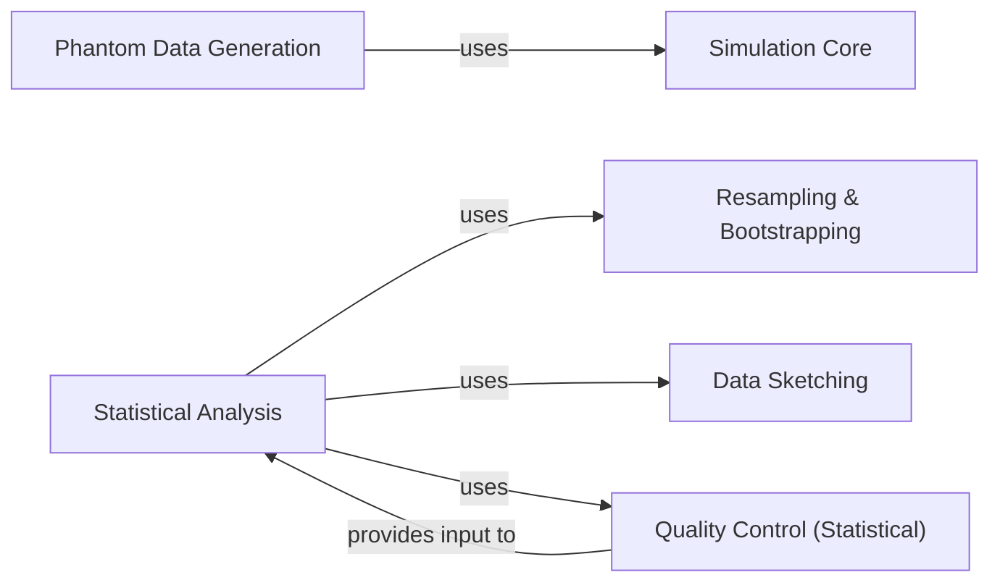

## Details

The Advanced Analytics & Simulation component in dipy is a critical subsystem for both generating synthetic diffusion MRI data and performing robust statistical analysis on real or simulated data. It adheres to the project's architectural patterns by providing modular, performance-oriented tools for quantitative research and algorithm validation.

### Simulation Core
This component is the foundational module for generating synthetic diffusion-weighted MRI signals at the voxel level. It implements various biophysical models (e.g., single tensor, multi-tensor, sticks and ball, diffusion kurtosis imaging (DKI) signals) and can incorporate noise. It is crucial for creating controlled environments to test and validate reconstruction and analysis algorithms, providing ground truth data.

**Related Classes/Methods**:

- <a href="https://github.com/dipy/dipy/blob/master/dipy/sims/voxel.py" target="_blank" rel="noopener noreferrer">`dipy.sims.voxel`</a>

### Phantom Data Generation
This component extends the voxel-level simulation capabilities to create more complex, spatially extended phantom datasets. These phantoms mimic realistic brain structures or specific diffusion environments, serving as essential ground truth for algorithm development, benchmarking, and validation in a controlled setting.

**Related Classes/Methods**:

- <a href="https://github.com/dipy/dipy/blob/master/dipy/sims/phantom.py" target="_blank" rel="noopener noreferrer">`dipy.sims.phantom`</a>

### Statistical Analysis
This component provides a comprehensive suite of higher-level statistical tools for analyzing diffusion MRI data, including metrics derived from diffusion models and tractography results. It encompasses functions for extracting peak values, computing anatomical measures, performing streamline clustering assignments, and generating tractometry profiles (e.g., AFQ profiles). It is essential for quantitative research and extracting meaningful insights from processed data.

**Related Classes/Methods**:

- <a href="https://github.com/dipy/dipy/blob/master/dipy/stats/analysis.py" target="_blank" rel="noopener noreferrer">`dipy.stats.analysis`</a>

### Quality Control (Statistical)
This module focuses on assessing the quality and integrity of diffusion MRI data from a statistical standpoint. It includes functions to identify neighboring q-space points and compute correlations between diffusion-weighted images, which are critical steps to ensure the reliability and validity of subsequent analyses.

**Related Classes/Methods**:

- <a href="https://github.com/dipy/dipy/blob/master/dipy/stats/qc.py" target="_blank" rel="noopener noreferrer">`dipy.stats.qc`</a>

### Resampling & Bootstrapping
This component implements various statistical resampling techniques, such as bootstrapping. These methods are crucial for estimating the variability and uncertainty of statistical measures, enabling robust statistical inference in scientific studies, especially when dealing with limited or noisy datasets.

**Related Classes/Methods**:

- <a href="https://github.com/dipy/dipy/blob/master/dipy/stats/resampling.py" target="_blank" rel="noopener noreferrer">`dipy.stats.resampling`</a>

### Data Sketching
This component provides methods for efficient data summarization and sketching. These techniques are valuable for reducing data dimensionality while preserving essential information, which can be applied in various analytical contexts, including accelerating computations or improving robustness in denoising algorithms.

**Related Classes/Methods**:

- <a href="https://github.com/dipy/dipy/blob/master/dipy/stats/sketching.py" target="_blank" rel="noopener noreferrer">`dipy.stats.sketching`</a>

### [FAQ](https://github.com/CodeBoarding/GeneratedOnBoardings/tree/main?tab=readme-ov-file#faq)