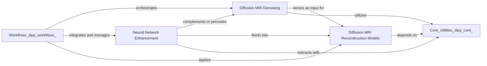

## Details

The `Preprocessing & Reconstruction` component in `dipy` is a critical part of the library, focusing on preparing diffusion MRI data for analysis and extracting meaningful microstructural information. It adheres to the project's architectural biases by providing modular, performance-oriented algorithms and leveraging a clear separation of concerns.

### Diffusion MRI Denoising
This component provides a comprehensive suite of algorithms for noise reduction and artifact correction in diffusion MRI data. It addresses common issues such as Gibbs ringing, thermal noise, and other acquisition artifacts, employing methods like Local PCA (LPCA), Non-Local Means (NLMeans), Adaptive Soft Matching (ASCM), and Patch2Self. Its primary role is to improve the signal-to-noise ratio (SNR) and data fidelity, ensuring that subsequent analyses are based on high-quality input.

**Related Classes/Methods**:

- <a href="https://github.com/dipy/dipy/blob/master/dipy/denoise/gibbs.py#L1-L1" target="_blank" rel="noopener noreferrer">`dipy.denoise.gibbs` (1:1)</a>
- <a href="https://github.com/dipy/dipy/blob/master/dipy/denoise/localpca.py#L391-L497" target="_blank" rel="noopener noreferrer">`dipy.denoise.localpca` (391:497)</a>
- <a href="https://github.com/dipy/dipy/blob/master/dipy/denoise/nlmeans.py#L14-L99" target="_blank" rel="noopener noreferrer">`dipy.denoise.nlmeans` (14:99)</a>
- <a href="https://github.com/dipy/dipy/blob/master/dipy/denoise/noise_estimate.py#L1-L1" target="_blank" rel="noopener noreferrer">`dipy.denoise.noise_estimate` (1:1)</a>
- <a href="https://github.com/dipy/dipy/blob/master/dipy/denoise/non_local_means.py#L9-L97" target="_blank" rel="noopener noreferrer">`dipy.denoise.non_local_means` (9:97)</a>
- <a href="https://github.com/dipy/dipy/blob/master/dipy/denoise/patch2self.py#L277-L381" target="_blank" rel="noopener noreferrer">`dipy.denoise.patch2self` (277:381)</a>
- <a href="https://github.com/dipy/dipy/blob/master/dipy/denoise/adaptive_soft_matching.py#L7-L85" target="_blank" rel="noopener noreferrer">`dipy.denoise.adaptive_soft_matching` (7:85)</a>

### Neural Network Enhancement
This component integrates state-of-the-art deep learning models, built with frameworks like TensorFlow and PyTorch, to perform advanced image enhancement tasks on diffusion MRI data. This includes neural network-based denoising (e.g., DeepN4, HistoResDNN) and synthetic B0 image generation (SynB0), offering powerful, data-driven approaches to improve image quality and correct for acquisition-related distortions.

**Related Classes/Methods**:

- `dipy.nn.tf` (1:1)
- `dipy.nn.torch` (1:1)
- <a href="https://github.com/dipy/dipy/blob/master/dipy/nn/utils.py#L1-L1" target="_blank" rel="noopener noreferrer">`dipy.nn.utils` (1:1)</a>

### Diffusion MRI Reconstruction Models
This is a central and extensive component that provides a wide array of biophysical and empirical models for reconstructing diffusion MRI signals. It enables the derivation of quantitative microstructural parameters (e.g., Diffusion Tensor Imaging (DTI), Diffusion Kurtosis Imaging (DKI), Intravoxel Incoherent Motion (IVIM), Mean Apparent Propagator MRI (MAPMRI)) and Orientation Distribution Functions (ODFs) using methods like Spherical Harmonics (SHM), Constrained Spherical Deconvolution (CSD), Diffusion Spectrum Imaging (DSI), and Generalized Q-Ball Imaging (GQI). The consistent `ReconstModel`/`ReconstFit` pattern promotes extensibility and modularity.

**Related Classes/Methods**:

- <a href="https://github.com/dipy/dipy/blob/master/dipy/reconst/base.py#L1-L1" target="_blank" rel="noopener noreferrer">`dipy.reconst.base` (1:1)</a>
- <a href="https://github.com/dipy/dipy/blob/master/dipy/reconst/dti.py#L1-L1" target="_blank" rel="noopener noreferrer">`dipy.reconst.dti` (1:1)</a>
- <a href="https://github.com/dipy/dipy/blob/master/dipy/reconst/dki.py#L1-L1" target="_blank" rel="noopener noreferrer">`dipy.reconst.dki` (1:1)</a>
- <a href="https://github.com/dipy/dipy/blob/master/dipy/reconst/csdeconv.py#L468-L633" target="_blank" rel="noopener noreferrer">`dipy.reconst.csdeconv` (468:633)</a>
- <a href="https://github.com/dipy/dipy/blob/master/dipy/reconst/shm.py#L1-L1" target="_blank" rel="noopener noreferrer">`dipy.reconst.shm` (1:1)</a>
- <a href="https://github.com/dipy/dipy/blob/master/dipy/reconst/odf.py#L1-L1" target="_blank" rel="noopener noreferrer">`dipy.reconst.odf` (1:1)</a>
- <a href="https://github.com/dipy/dipy/blob/master/dipy/reconst/dsi.py#L1-L1" target="_blank" rel="noopener noreferrer">`dipy.reconst.dsi` (1:1)</a>
- <a href="https://github.com/dipy/dipy/blob/master/dipy/reconst/mapmri.py#L1-L1" target="_blank" rel="noopener noreferrer">`dipy.reconst.mapmri` (1:1)</a>
- <a href="https://github.com/dipy/dipy/blob/master/dipy/reconst/ivim.py#L1-L1" target="_blank" rel="noopener noreferrer">`dipy.reconst.ivim` (1:1)</a>
- <a href="https://github.com/dipy/dipy/blob/master/dipy/reconst/shore.py#L1-L1" target="_blank" rel="noopener noreferrer">`dipy.reconst.shore` (1:1)</a>
- <a href="https://github.com/dipy/dipy/blob/master/dipy/reconst/mcsd.py#L1-L1" target="_blank" rel="noopener noreferrer">`dipy.reconst.mcsd` (1:1)</a>
- <a href="https://github.com/dipy/dipy/blob/master/dipy/reconst/utils.py#L1-L1" target="_blank" rel="noopener noreferrer">`dipy.reconst.utils` (1:1)</a>
- <a href="https://github.com/dipy/dipy/blob/master/dipy/reconst/bingham.py#L1-L1" target="_blank" rel="noopener noreferrer">`dipy.reconst.bingham` (1:1)</a>
- <a href="https://github.com/dipy/dipy/blob/master/dipy/reconst/cti.py#L1-L1" target="_blank" rel="noopener noreferrer">`dipy.reconst.cti` (1:1)</a>
- <a href="https://github.com/dipy/dipy/blob/master/dipy/reconst/dki_micro.py#L1-L1" target="_blank" rel="noopener noreferrer">`dipy.reconst.dki_micro` (1:1)</a>
- <a href="https://github.com/dipy/dipy/blob/master/dipy/reconst/forecast.py#L1-L1" target="_blank" rel="noopener noreferrer">`dipy.reconst.forecast` (1:1)</a>
- <a href="https://github.com/dipy/dipy/blob/master/dipy/reconst/fwdti.py#L1-L1" target="_blank" rel="noopener noreferrer">`dipy.reconst.fwdti` (1:1)</a>
- <a href="https://github.com/dipy/dipy/blob/master/dipy/reconst/gqi.py#L1-L1" target="_blank" rel="noopener noreferrer">`dipy.reconst.gqi` (1:1)</a>
- <a href="https://github.com/dipy/dipy/blob/master/dipy/reconst/msdki.py#L1-L1" target="_blank" rel="noopener noreferrer">`dipy.reconst.msdki` (1:1)</a>
- <a href="https://github.com/dipy/dipy/blob/master/dipy/reconst/qtdmri.py#L1-L1" target="_blank" rel="noopener noreferrer">`dipy.reconst.qtdmri` (1:1)</a>
- <a href="https://github.com/dipy/dipy/blob/master/dipy/reconst/qti.py#L1-L1" target="_blank" rel="noopener noreferrer">`dipy.reconst.qti` (1:1)</a>
- <a href="https://github.com/dipy/dipy/blob/master/dipy/reconst/rumba.py#L1-L1" target="_blank" rel="noopener noreferrer">`dipy.reconst.rumba` (1:1)</a>
- <a href="https://github.com/dipy/dipy/blob/master/dipy/reconst/sfm.py#L1-L1" target="_blank" rel="noopener noreferrer">`dipy.reconst.sfm` (1:1)</a>
- <a href="https://github.com/dipy/dipy/blob/master/dipy/reconst/cache.py#L1-L1" target="_blank" rel="noopener noreferrer">`dipy.reconst.cache` (1:1)</a>
- <a href="https://github.com/dipy/dipy/blob/master/dipy/reconst/cross_validation.py#L1-L1" target="_blank" rel="noopener noreferrer">`dipy.reconst.cross_validation` (1:1)</a>
- <a href="https://github.com/dipy/dipy/blob/master/dipy/reconst/multi_voxel.py#L1-L1" target="_blank" rel="noopener noreferrer">`dipy.reconst.multi_voxel` (1:1)</a>
- <a href="https://github.com/dipy/dipy/blob/master/dipy/reconst/weights_method.py#L1-L1" target="_blank" rel="noopener noreferrer">`dipy.reconst.weights_method` (1:1)</a>

### [FAQ](https://github.com/CodeBoarding/GeneratedOnBoardings/tree/main?tab=readme-ov-file#faq)