```mermaid
graph LR
    Image_Registration_Alignment["Image Registration & Alignment"]
    Streamline_Alignment_Bundle_Registration["Streamline Alignment & Bundle Registration"]
    Direction_Peak_Estimation["Direction & Peak Estimation"]
    Tractography_Algorithms["Tractography Algorithms"]
    Streamline_Processing_Analysis["Streamline Processing & Analysis"]
    Anatomical_Segmentation_Masking["Anatomical Segmentation & Masking"]
    Streamline_Clustering_Bundle_Recognition["Streamline Clustering & Bundle Recognition"]
    Image_Registration_Alignment -- "uses" --> Core_Optimization
    Workflows_and_CLI -- "uses" --> Image_Registration_Alignment
    Streamline_Alignment_Bundle_Registration -- "uses" --> Streamline_Processing_Analysis
    Streamline_Clustering_Bundle_Recognition -- "uses" --> Streamline_Alignment_Bundle_Registration
    Direction_Peak_Estimation -- "uses" --> Reconstruction_Algorithms
    Tractography_Algorithms -- "uses" --> Direction_Peak_Estimation
    Streamline_Processing_Analysis -- "uses" --> Tractography_Algorithms
    Streamline_Processing_Analysis -- "uses" --> Core_Geometry_Utilities
    Streamline_Clustering_Bundle_Recognition -- "uses" --> Streamline_Processing_Analysis
    Anatomical_Segmentation_Masking -- "uses" --> Reconstruction_Algorithms
    Tractography_Algorithms -- "uses" --> Anatomical_Segmentation_Masking
    Statistical_Analysis -- "uses" --> Streamline_Clustering_Bundle_Recognition
```

## Details

The `Spatial & Structural Analysis` component in `DIPY` is a critical part of the library, focusing on the geometric and anatomical aspects of diffusion MRI data. It encompasses a suite of algorithms for aligning images and streamlines, extracting directional information, reconstructing fiber pathways, and segmenting/clustering anatomical structures and fiber bundles. This component is fundamental to `DIPY`'s mission as a scientific computing library for neuroscience and medical imaging, as it provides the necessary tools for quantitative analysis and visualization of brain connectivity.

### Image Registration & Alignment
This component provides algorithms for spatially normalizing and transforming diffusion MRI images. It includes rigid, affine, and deformable registration methods, crucial for aligning different scans, correcting for head motion, or bringing data into a common anatomical space.

**Related Classes/Methods**:

- <a href="https://github.com/dipy/dipy/blob/master/dipy/align/imaffine.py#L1-L1" target="_blank" rel="noopener noreferrer">`dipy.align.imaffine` (1:1)</a>
- <a href="https://github.com/dipy/dipy/blob/master/dipy/align/imwarp.py#L1-L1" target="_blank" rel="noopener noreferrer">`dipy.align.imwarp` (1:1)</a>
- <a href="https://github.com/dipy/dipy/blob/master/dipy/align/metrics.py#L1-L1" target="_blank" rel="noopener noreferrer">`dipy.align.metrics` (1:1)</a>
- <a href="https://github.com/dipy/dipy/blob/master/dipy/align/scalespace.py#L1-L1" target="_blank" rel="noopener noreferrer">`dipy.align.scalespace` (1:1)</a>
- <a href="https://github.com/dipy/dipy/blob/master/dipy/align/reslice.py#L17-L119" target="_blank" rel="noopener noreferrer">`dipy.align.reslice` (17:119)</a>

### Streamline Alignment & Bundle Registration
This component specializes in aligning and registering streamline (fiber tract) data. It offers methods for both linear (e.g., Streamline Linear Registration - SLR) and non-linear alignment of individual streamlines or entire fiber bundles, essential for comparing tractography results across subjects or for creating bundle atlases.

**Related Classes/Methods**:

- <a href="https://github.com/dipy/dipy/blob/master/dipy/align/streamlinear.py#L1-L1" target="_blank" rel="noopener noreferrer">`dipy.align.streamlinear` (1:1)</a>
- <a href="https://github.com/dipy/dipy/blob/master/dipy/align/streamwarp.py#L1-L1" target="_blank" rel="noopener noreferrer">`dipy.align.streamwarp` (1:1)</a>
- <a href="https://github.com/dipy/dipy/blob/master/dipy/align/cpd.py#L1-L1" target="_blank" rel="noopener noreferrer">`dipy.align.cpd` (1:1)</a>

### Direction & Peak Estimation
This component is responsible for deriving directional information from diffusion MRI signals. It includes algorithms for estimating Orientation Distribution Functions (ODFs) and extracting their peaks, which represent the primary directions of water diffusion within each voxel. This information is a fundamental prerequisite for any fiber tracking algorithm.

**Related Classes/Methods**:

- <a href="https://github.com/dipy/dipy/blob/master/dipy/direction/peaks.py#L1-L1" target="_blank" rel="noopener noreferrer">`dipy.direction.peaks` (1:1)</a>

### Tractography Algorithms
This component implements the core fiber tracking algorithms, including both deterministic and probabilistic tractography. These algorithms reconstruct the 3D trajectories of white matter fibers by following the estimated principal diffusion directions across voxels.

**Related Classes/Methods**:

- <a href="https://github.com/dipy/dipy/blob/master/dipy/tracking/local_tracking.py#L1-L1" target="_blank" rel="noopener noreferrer">`dipy.tracking.local_tracking` (1:1)</a>
- <a href="https://github.com/dipy/dipy/blob/master/dipy/tracking/tracker.py#L1-L1" target="_blank" rel="noopener noreferrer">`dipy.tracking.tracker` (1:1)</a>
- <a href="https://github.com/dipy/dipy/blob/master/dipy/tracking/life.py#L1-L1" target="_blank" rel="noopener noreferrer">`dipy.tracking.life` (1:1)</a>

### Streamline Processing & Analysis
This component provides a comprehensive set of tools for manipulating, filtering, and analyzing reconstructed streamlines. This includes operations such as orienting streamlines consistently, extracting quantitative values along them (e.g., fractional anisotropy along a fiber bundle, known as tractometry), and computing various metrics related to streamline geometry and shape.

**Related Classes/Methods**:

- <a href="https://github.com/dipy/dipy/blob/master/dipy/tracking/streamline.py#L1-L1" target="_blank" rel="noopener noreferrer">`dipy.tracking.streamline` (1:1)</a>
- <a href="https://github.com/dipy/dipy/blob/master/dipy/tracking/utils.py#L1-L1" target="_blank" rel="noopener noreferrer">`dipy.tracking.utils` (1:1)</a>
- <a href="https://github.com/dipy/dipy/blob/master/dipy/tracking/metrics.py#L1-L1" target="_blank" rel="noopener noreferrer">`dipy.tracking.metrics` (1:1)</a>

### Anatomical Segmentation & Masking
This component focuses on segmenting anatomical structures within diffusion MRI images, such as brain extraction (removing non-brain tissue) or general tissue classification (e.g., white matter, gray matter, CSF). It generates binary or probabilistic masks that are often used to define regions of interest or to constrain other processing steps like tractography seeding.

**Related Classes/Methods**:

- <a href="https://github.com/dipy/dipy/blob/master/dipy/segment/mask.py#L1-L1" target="_blank" rel="noopener noreferrer">`dipy.segment.mask` (1:1)</a>
- <a href="https://github.com/dipy/dipy/blob/master/dipy/segment/tissue.py#L1-L1" target="_blank" rel="noopener noreferrer">`dipy.segment.tissue` (1:1)</a>

### Streamline Clustering & Bundle Recognition
This component groups individual streamlines into anatomically meaningful fiber bundles using various clustering algorithms (e.g., QuickBundles, QuickBundlesX). It also includes functionalities for recognizing known anatomical bundles, either through comparison with atlases or by learning bundle characteristics.

**Related Classes/Methods**:

- <a href="https://github.com/dipy/dipy/blob/master/dipy/segment/clustering.py#L1-L1" target="_blank" rel="noopener noreferrer">`dipy.segment.clustering` (1:1)</a>
- <a href="https://github.com/dipy/dipy/blob/master/dipy/segment/bundles.py#L1-L1" target="_blank" rel="noopener noreferrer">`dipy.segment.bundles` (1:1)</a>
- <a href="https://github.com/dipy/dipy/blob/master/dipy/segment/fss.py#L1-L1" target="_blank" rel="noopener noreferrer">`dipy.segment.fss` (1:1)</a>
- <a href="https://github.com/dipy/dipy/blob/master/dipy/segment/metric.py#L1-L1" target="_blank" rel="noopener noreferrer">`dipy.segment.metric` (1:1)</a>

### [FAQ](https://github.com/CodeBoarding/GeneratedOnBoardings/tree/main?tab=readme-ov-file#faq)