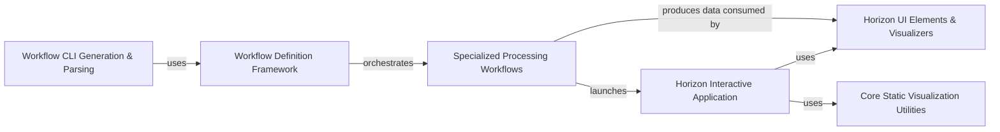

## Details

The `Visualization & Workflow Orchestration` component in Dipy is a high-level system designed to provide both interactive and static visualization capabilities for neuroimaging data, alongside a robust framework for orchestrating complex processing pipelines via a user-friendly command-line interface. This dual focus allows users to visually explore data and automate multi-step analyses.

### Horizon Interactive Application
This is the primary interactive graphical user interface (GUI) within Dipy, specifically the "Horizon" application. It provides a unified environment for loading, displaying, and exploring various neuroimaging data types (images, streamlines, peaks, surfaces) in 3D. It acts as a direct user interface for visual data inspection and quality control.

**Related Classes/Methods**:

- <a href="https://github.com/dipy/dipy/blob/master/dipy/viz/horizon/app.py#L64-L758" target="_blank" rel="noopener noreferrer">`dipy.viz.horizon.app.Horizon` (64:758)</a>
- <a href="https://github.com/dipy/dipy/blob/master/dipy/viz/gmem.py#L3-L48" target="_blank" rel="noopener noreferrer">`dipy.viz.gmem.GlobalHorizon` (3:48)</a>

### Horizon UI Elements & Visualizers
This component comprises the modular building blocks for the Horizon application's user interface and data rendering. It includes abstract base classes for UI tabs (`HorizonTab`) and concrete implementations for different data types (e.g., `ClustersTab`, `PeaksTab`, `SlicesTab`, `SurfaceTab`). It also contains the visualizer classes (`ClustersVisualizer`, `PeaksVisualizer`, `SlicesVisualizer`, `SurfaceVisualizer`) responsible for translating neuroimaging data into renderable objects within the 3D scene.

**Related Classes/Methods**:

- <a href="https://github.com/dipy/dipy/blob/master/dipy/viz/horizon/tab/base.py#L30-L124" target="_blank" rel="noopener noreferrer">`dipy.viz.horizon.tab.base.HorizonTab` (30:124)</a>
- <a href="https://github.com/dipy/dipy/blob/master/dipy/viz/horizon/tab/cluster.py#L5-L203" target="_blank" rel="noopener noreferrer">`dipy.viz.horizon.tab.cluster.ClustersTab` (5:203)</a>
- <a href="https://github.com/dipy/dipy/blob/master/dipy/viz/horizon/tab/peak.py#L15-L448" target="_blank" rel="noopener noreferrer">`dipy.viz.horizon.tab.peak.PeaksTab` (15:448)</a>
- <a href="https://github.com/dipy/dipy/blob/master/dipy/viz/horizon/tab/roi.py#L1-L1" target="_blank" rel="noopener noreferrer">`dipy.viz.horizon.tab.roi` (1:1)</a>
- <a href="https://github.com/dipy/dipy/blob/master/dipy/viz/horizon/tab/slice.py#L22-L507" target="_blank" rel="noopener noreferrer">`dipy.viz.horizon.tab.slice.SlicesTab` (22:507)</a>
- <a href="https://github.com/dipy/dipy/blob/master/dipy/viz/horizon/tab/surface.py#L5-L108" target="_blank" rel="noopener noreferrer">`dipy.viz.horizon.tab.surface.SurfaceTab` (5:108)</a>
- <a href="https://github.com/dipy/dipy/blob/master/dipy/viz/horizon/visualizer/cluster.py#L17-L188" target="_blank" rel="noopener noreferrer">`dipy.viz.horizon.visualizer.cluster.ClustersVisualizer` (17:188)</a>
- <a href="https://github.com/dipy/dipy/blob/master/dipy/viz/horizon/visualizer/peak.py#L520-L546" target="_blank" rel="noopener noreferrer">`dipy.viz.horizon.visualizer.peak.PeaksVisualizer` (520:546)</a>
- <a href="https://github.com/dipy/dipy/blob/master/dipy/viz/horizon/visualizer/slice.py#L16-L257" target="_blank" rel="noopener noreferrer">`dipy.viz.horizon.visualizer.slice.SlicesVisualizer` (16:257)</a>
- <a href="https://github.com/dipy/dipy/blob/master/dipy/viz/horizon/visualizer/surface.py#L10-L24" target="_blank" rel="noopener noreferrer">`dipy.viz.horizon.visualizer.surface.SurfaceVisualizer` (10:24)</a>
- <a href="https://github.com/dipy/dipy/blob/master/dipy/viz/horizon/util.py#L1-L1" target="_blank" rel="noopener noreferrer">`dipy.viz.horizon.util` (1:1)</a>

### Core Static Visualization Utilities
This component provides general-purpose visualization functionalities and helper tools that can be used across Dipy, not exclusively within the Horizon application. This includes basic plotting functions, utilities for projections, registration visualization tools, and streamline-specific rendering. It often leverages external visualization libraries (like FURY).

**Related Classes/Methods**:

- <a href="https://github.com/dipy/dipy/blob/master/dipy/viz/plotting.py#L1-L1" target="_blank" rel="noopener noreferrer">`dipy.viz.plotting` (1:1)</a>
- <a href="https://github.com/dipy/dipy/blob/master/dipy/viz/projections.py#L1-L1" target="_blank" rel="noopener noreferrer">`dipy.viz.projections` (1:1)</a>
- <a href="https://github.com/dipy/dipy/blob/master/dipy/viz/regtools.py#L1-L1" target="_blank" rel="noopener noreferrer">`dipy.viz.regtools` (1:1)</a>
- <a href="https://github.com/dipy/dipy/blob/master/dipy/viz/streamline.py#L1-L1" target="_blank" rel="noopener noreferrer">`dipy.viz.streamline` (1:1)</a>
- <a href="https://github.com/dipy/dipy/blob/master/dipy/viz/panel.py#L1-L1" target="_blank" rel="noopener noreferrer">`dipy.viz.panel` (1:1)</a>

### Workflow Definition Framework
This component is the central hub for defining, managing, and executing complex, multi-step processing pipelines (workflows) within Dipy. It provides a consistent framework for workflow creation, handles input/output, and defines the base structure for all Dipy's automated functionalities.

**Related Classes/Methods**:

- <a href="https://github.com/dipy/dipy/blob/master/dipy/workflows/workflow.py#L8-L153" target="_blank" rel="noopener noreferrer">`dipy.workflows.workflow.Workflow` (8:153)</a>
- <a href="https://github.com/dipy/dipy/blob/master/dipy/workflows/combined_workflow.py#L1-L1" target="_blank" rel="noopener noreferrer">`dipy.workflows.combined_workflow` (1:1)</a>
- <a href="https://github.com/dipy/dipy/blob/master/dipy/workflows/base.py#L1-L1" target="_blank" rel="noopener noreferrer">`dipy.workflows.base` (1:1)</a>
- <a href="https://github.com/dipy/dipy/blob/master/dipy/workflows/flow_runner.py#L1-L1" target="_blank" rel="noopener noreferrer">`dipy.workflows.flow_runner` (1:1)</a>

### Workflow CLI Generation & Parsing
This component is responsible for dynamically generating user-friendly command-line interfaces (CLIs) for all exposed Dipy functionalities. It parses workflow docstrings to extract necessary information for CLI arguments, help messages, and integrates with the documentation system.

**Related Classes/Methods**:

- <a href="https://github.com/dipy/dipy/blob/master/dipy/workflows/cli.py#L1-L1" target="_blank" rel="noopener noreferrer">`dipy.workflows.cli` (1:1)</a>
- <a href="https://github.com/dipy/dipy/blob/master/dipy/workflows/docstring_parser.py#L1-L1" target="_blank" rel="noopener noreferrer">`dipy.workflows.docstring_parser` (1:1)</a>
- <a href="https://github.com/dipy/dipy/blob/master/dipy/workflows/utils.py#L1-L1" target="_blank" rel="noopener noreferrer">`dipy.workflows.utils` (1:1)</a>

### Specialized Processing Workflows
This component encompasses the numerous concrete implementations of various neuroimaging processing pipelines. Each workflow encapsulates a specific set of operations (e.g., image alignment, data reconstruction, input/output operations, tractography, statistical analysis), inheriting from the `Workflow` base class.

**Related Classes/Methods**:

- <a href="https://github.com/dipy/dipy/blob/master/dipy/workflows/align.py#L1-L1" target="_blank" rel="noopener noreferrer">`dipy.workflows.align` (1:1)</a>
- <a href="https://github.com/dipy/dipy/blob/master/dipy/workflows/reconst.py#L1-L1" target="_blank" rel="noopener noreferrer">`dipy.workflows.reconst` (1:1)</a>
- <a href="https://github.com/dipy/dipy/blob/master/dipy/workflows/io.py#L1-L1" target="_blank" rel="noopener noreferrer">`dipy.workflows.io` (1:1)</a>
- <a href="https://github.com/dipy/dipy/blob/master/dipy/workflows/tracking.py#L1-L1" target="_blank" rel="noopener noreferrer">`dipy.workflows.tracking` (1:1)</a>
- <a href="https://github.com/dipy/dipy/blob/master/dipy/workflows/denoise.py#L1-L1" target="_blank" rel="noopener noreferrer">`dipy.workflows.denoise` (1:1)</a>
- <a href="https://github.com/dipy/dipy/blob/master/dipy/workflows/mask.py#L1-L1" target="_blank" rel="noopener noreferrer">`dipy.workflows.mask` (1:1)</a>
- <a href="https://github.com/dipy/dipy/blob/master/dipy/workflows/nn.py#L1-L1" target="_blank" rel="noopener noreferrer">`dipy.workflows.nn` (1:1)</a>
- <a href="https://github.com/dipy/dipy/blob/master/dipy/workflows/segment.py#L1-L1" target="_blank" rel="noopener noreferrer">`dipy.workflows.segment` (1:1)</a>
- <a href="https://github.com/dipy/dipy/blob/master/dipy/workflows/stats.py#L1-L1" target="_blank" rel="noopener noreferrer">`dipy.workflows.stats` (1:1)</a>
- <a href="https://github.com/dipy/dipy/blob/master/dipy/workflows/viz.py#L25-L289" target="_blank" rel="noopener noreferrer">`dipy.workflows.viz.HorizonFlow` (25:289)</a>

### [FAQ](https://github.com/CodeBoarding/GeneratedOnBoardings/tree/main?tab=readme-ov-file#faq)