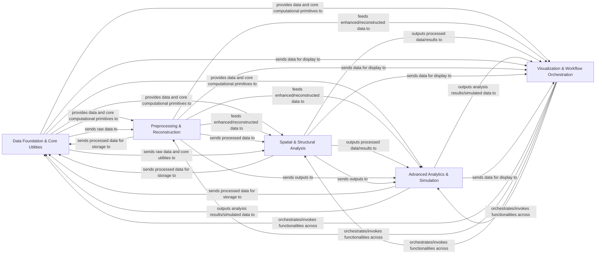

## Details

The `dipy` project exhibits a well-structured layered architecture, typical of a scientific computing library, with a clear separation of concerns from low-level data handling to high-level workflows and visualization. The core data flow revolves around processing neuroimaging data through a series of specialized computational stages.

### Data Foundation & Core Utilities [[Expand]](./Data_Foundation_Core_Utilities.md)
This foundational layer manages all data input/output operations, including loading, saving, and fetching diverse neuroimaging data formats (e.g., NIfTI, tractograms). It also provides essential mathematical operations, linear algebra routines, gradient table manipulation, spherical coordinate system conversions, and optimization algorithms that underpin all higher-level processes.

**Related Classes/Methods**:

- `dipy.io` (1:1)
- `dipy.data` (1:1)
- `dipy.core` (1:1)

### Preprocessing & Reconstruction [[Expand]](./Preprocessing_Reconstruction.md)
This component focuses on enhancing the quality of diffusion MRI data and deriving microstructural information. It implements various algorithms for noise reduction, artifact correction (e.g., Gibbs ringing, local PCA, non-local means), and integrates neural network models for advanced image enhancement. It also contains a comprehensive suite of diffusion MRI models to fit signals and derive quantitative parameters and orientation distribution functions (ODFs).

**Related Classes/Methods**:

- `dipy.denoise` (1:1)
- `dipy.nn` (1:1)
- `dipy.reconst` (1:1)

### Spatial & Structural Analysis [[Expand]](./Spatial_Structural_Analysis.md)
This component handles spatial normalization, transformation, and the extraction of anatomical and structural information. It includes algorithms for image registration (rigid, affine, deformable), streamline alignment, and the entire fiber tracking pipeline (peak estimation, deterministic/probabilistic tractography). Additionally, it provides tools for manipulating, processing, analyzing streamlines, and for segmenting anatomical structures or clustering streamlines into meaningful bundles.

**Related Classes/Methods**:

- `dipy.align` (1:1)
- `dipy.direction` (1:1)
- `dipy.tracking` (1:1)
- `dipy.segment` (1:1)

### Advanced Analytics & Simulation [[Expand]](./Advanced_Analytics_Simulation.md)
This component offers quantitative analysis and statistical inference methods for diffusion MRI metrics, tractometry results, and group comparisons. It also includes robust tools for generating synthetic diffusion MRI data and phantoms, which are crucial for algorithm testing, validation, and development.

**Related Classes/Methods**:

- `dipy.stats` (1:1)
- `dipy.sims` (1:1)

### Visualization & Workflow Orchestration [[Expand]](./Visualization_Workflow_Orchestration.md)
This high-level component provides interactive and static visualization tools for displaying various neuroimaging data types, including images, streamlines, and ODFs, facilitating exploration and interpretation. It also serves as the primary user interface, orchestrating complex, multi-step processing pipelines and exposing the library's functionalities through a user-friendly command-line interface (CLI).

**Related Classes/Methods**:

- `dipy.viz` (1:1)
- `dipy.workflows` (1:1)

### [FAQ](https://github.com/CodeBoarding/GeneratedOnBoardings/tree/main?tab=readme-ov-file#faq)