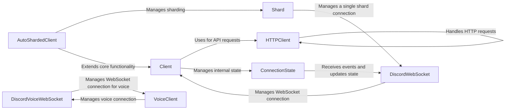

## Component Details

The Core Abstraction component provides the foundational elements for interacting with the Discord API. It encompasses client management, state management, HTTP request handling, and gateway communication, forming the bedrock upon which higher-level functionalities are built. The client interfaces with the API through HTTP requests and manages the bot's connection to Discord, handling real-time events and maintaining the bot's state. Gateway managers handle the WebSocket connections for both the main Discord gateway and voice connections, ensuring reliable communication. The HTTP handler is responsible for making HTTP requests to the API, including handling rate limits.

### Client
The Client class serves as the primary interface for interacting with the Discord API. It manages user authentication, connection lifecycle, and event dispatching. It provides methods for performing actions like sending messages, fetching users, and managing guilds. The Client relies on HTTPClient for API requests and ConnectionState for managing the internal state.
- **Related Classes/Methods**: `discord.client.Client`

### AutoShardedClient
The AutoShardedClient extends the Client class to automatically manage sharding for larger bots. It distributes shards across multiple connections to the Discord gateway, optimizing performance and scalability. It interacts with the Shard class to manage individual shard connections and inherits core functionality from the Client class.
- **Related Classes/Methods**: `discord.shard.AutoShardedClient`

### ConnectionState
The ConnectionState class maintains the internal state of the client, including users, guilds, channels, and messages. It receives events from the gateway and updates its internal data structures. It provides methods for accessing and manipulating this state, allowing other components to retrieve information about the Discord environment. It interacts with the Client class to receive events and the HTTPClient for fetching data.
- **Related Classes/Methods**: `discord.state.ConnectionState`, `discord.state.AutoShardedConnectionState`

### HTTPClient
The HTTPClient class handles all HTTP requests to the Discord API. It provides methods for performing various actions such as sending messages, fetching users, and managing guilds. It also handles rate limiting to prevent exceeding the API limits. It interacts with the Client class to receive requests and the Ratelimit class for rate limiting.
- **Related Classes/Methods**: `discord.http.HTTPClient`, `discord.http.Ratelimit`

### DiscordWebSocket
The DiscordWebSocket class manages the WebSocket connection to the Discord gateway. It handles sending and receiving events, as well as heartbeating to maintain the connection. It interacts with the Client class to receive events and the ConnectionState class to update the internal state.
- **Related Classes/Methods**: `discord.gateway.DiscordWebSocket`, `discord.gateway.KeepAliveHandler`

### DiscordVoiceWebSocket
The DiscordVoiceWebSocket class manages the WebSocket connection to the Discord voice gateway. It handles sending and receiving voice data, as well as heartbeating to maintain the connection. It interacts with the VoiceClient class to manage the voice connection.
- **Related Classes/Methods**: `discord.gateway.DiscordVoiceWebSocket`, `discord.gateway.VoiceKeepAliveHandler`

### VoiceClient
The VoiceClient class manages the connection to a Discord voice channel. It handles establishing a voice connection, sending and receiving audio data, and managing voice states. It interacts with the DiscordVoiceWebSocket for the voice WebSocket connection.
- **Related Classes/Methods**: `discord.voice_client.VoiceClient`

### Shard
The Shard class represents a single connection to the Discord gateway. It is responsible for managing the WebSocket connection, authenticating with the gateway, and handling events. It interacts with the AutoShardedClient class to manage sharding and the DiscordWebSocket class for the WebSocket connection.
- **Related Classes/Methods**: `discord.shard.Shard`
