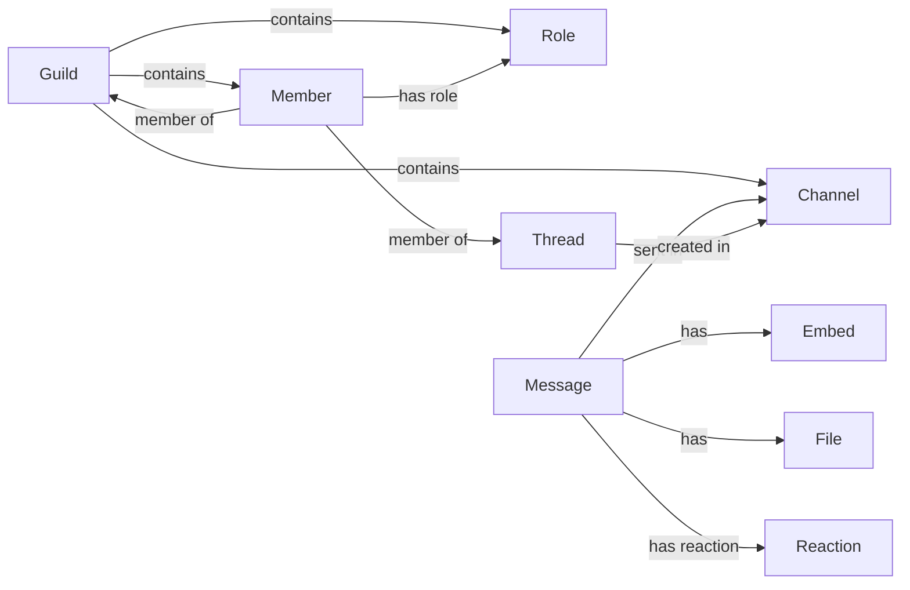

## Component Details

The Data Model component in the Discord API represents the structure and organization of Discord's data. It defines how various entities like servers (Guilds), users (Members), channels, messages, and roles are represented and how they relate to each other. This component provides a consistent and intuitive way for developers to interact with Discord's data, enabling them to build applications that can access and manipulate Discord resources effectively. The core of this model revolves around the Guild, which contains Members, Roles, and various types of Channels. Messages are sent within Channels, and can contain Embeds and Files. Reactions are associated with Messages.

### Guild
Represents a Discord server, encapsulating its channels, members, roles, and other server-specific data. It provides methods for creating, fetching, and editing server elements.
- **Related Classes/Methods**: `discord.guild.Guild`

### Member
Represents a member of a Discord server, storing member-specific information like roles, permissions, and presence. It provides methods for editing member properties, moving them between voice channels, and managing roles.
- **Related Classes/Methods**: `discord.member.Member`

### Role
Represents a role in a Discord server, storing role-specific information like permissions, color, and icon. It provides methods for editing role properties and managing role assignments.
- **Related Classes/Methods**: `discord.role.Role`

### Channel
Represents a channel in a Discord server. This is an abstract component with multiple concrete implementations like TextChannel, VoiceChannel, StageChannel, CategoryChannel, and ForumChannel.
- **Related Classes/Methods**: `discord.channel.TextChannel`, `discord.channel.VoiceChannel`, `discord.channel.StageChannel`, `discord.channel.CategoryChannel`, `discord.channel.ForumChannel`

### Thread
Represents a thread within a channel. It provides methods for managing thread properties, adding tags, and fetching members.
- **Related Classes/Methods**: `discord.threads.Thread`

### Message
Represents a message sent in a Discord channel. It stores message content, author information, and attachments. It provides methods for editing messages and handling reactions.
- **Related Classes/Methods**: `discord.message.Message`

### Embed
Represents an embed in a Discord message. It allows for rich content to be displayed in messages.
- **Related Classes/Methods**: `discord.embeds.Embed`

### File
Represents a file attachment in a Discord message.
- **Related Classes/Methods**: `discord.file.File`

### Reaction
Represents a reaction to a Discord message.
- **Related Classes/Methods**: `discord.reaction.Reaction`
