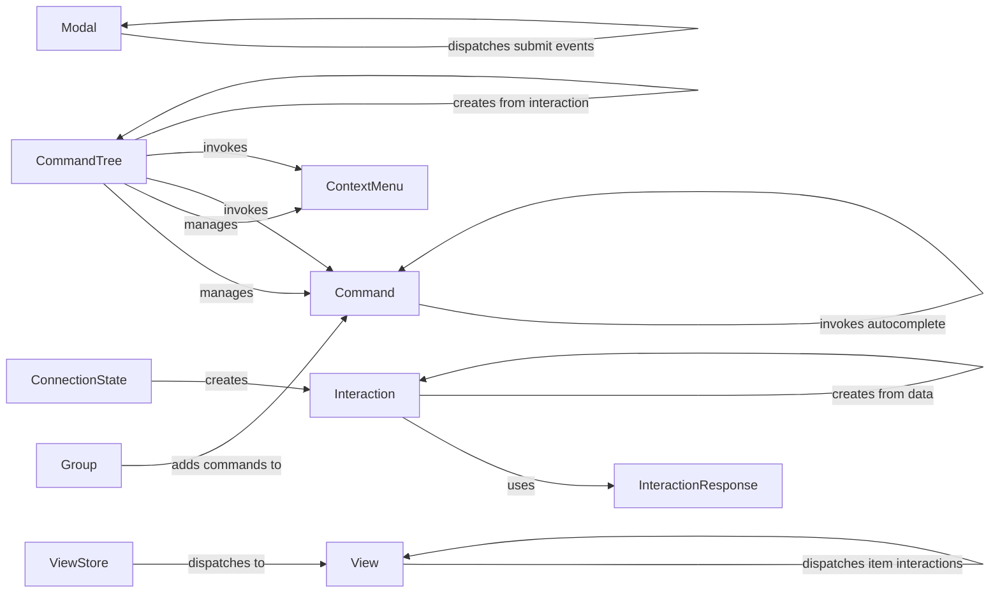

## Component Details

The Interaction Handler component is responsible for managing and processing interactions between users and the Discord bot. It encompasses handling application commands (slash commands and context menu commands) and UI components (buttons, select menus, and modals). The component receives interaction data from Discord, parses it, and dispatches it to the appropriate handler. It also manages the responses to these interactions, including sending messages, modals, and handling autocomplete requests. The core functionality revolves around the `CommandTree`, which manages commands, and the `ViewStore`, which manages active views. The `Interaction` and `InteractionResponse` components provide the data structures and methods for representing and responding to interactions.

### Interaction
Represents an interaction received from Discord. It holds the interaction data and provides methods for responding to the interaction, such as sending messages, modals, or deferring the response. It also manages followup messages and editing the original response.
- **Related Classes/Methods**: `discord.interactions.Interaction`, `discord.interactions.Interaction:_from_data`, `discord.interactions.Interaction:response`, `discord.interactions.Interaction:followup`, `discord.interactions.Interaction:original_response`, `discord.interactions.Interaction:edit_original_response`

### InteractionResponse
Represents the response to an interaction. It provides methods for different types of responses, such as sending a message, editing a message, sending a modal, or acknowledging the interaction with a pong. It also handles autocomplete responses.
- **Related Classes/Methods**: `discord.interactions.InteractionResponse`, `discord.interactions.InteractionResponse:defer`, `discord.interactions.InteractionResponse:pong`, `discord.interactions.InteractionResponse:send_message`, `discord.interactions.InteractionResponse:edit_message`, `discord.interactions.InteractionResponse:send_modal`, `discord.interactions.InteractionResponse:autocomplete`

### ConnectionState
Manages the connection state with Discord. It's responsible for parsing incoming data, including interaction create events, and creating the corresponding `Interaction` object.
- **Related Classes/Methods**: `discord.state.ConnectionState`, `discord.state.ConnectionState:parse_interaction_create`

### View
Represents a UI view containing interactive components like buttons and select menus. It handles dispatching item interactions, refreshing the view, and managing timeouts.
- **Related Classes/Methods**: `discord.ui.view.View`, `discord.ui.view.View:_dispatch_item`, `discord.ui.view.View:_refresh`, `discord.ui.view.View:_dispatch_timeout`, `discord.ui.view.View:_scheduled_task`

### ViewStore
Manages the active views. It dispatches view interactions to the appropriate view and handles dynamic item calls.
- **Related Classes/Methods**: `discord.ui.view.ViewStore`, `discord.ui.view.ViewStore:dispatch_view`, `discord.ui.view.ViewStore:schedule_dynamic_item_call`, `discord.ui.view.ViewStore:dispatch_dynamic_items`

### Command
Represents an application command. It handles command invocation, argument parsing, autocomplete, and permission checks.
- **Related Classes/Methods**: `discord.app_commands.commands.Command`, `discord.app_commands.commands.Command:__init__`, `discord.app_commands.commands.Command:_do_call`, `discord.app_commands.commands.Command:_invoke_with_namespace`, `discord.app_commands.commands.Command:_invoke_autocomplete`

### ContextMenu
Represents a context menu command. It handles context menu invocation and permission checks.
- **Related Classes/Methods**: `discord.app_commands.commands.ContextMenu`, `discord.app_commands.commands.ContextMenu:__init__`, `discord.app_commands.commands.ContextMenu:_invoke`

### Group
Represents a group of commands. It allows adding subcommands to create a hierarchical command structure.
- **Related Classes/Methods**: `discord.app_commands.commands.Group`, `discord.app_commands.commands.Group:__init__`, `discord.app_commands.commands.Group:add_command`

### CommandTree
Manages the application command tree. It handles adding commands, retrieving commands, and processing command invocations from interactions.
- **Related Classes/Methods**: `discord.app_commands.tree.CommandTree`, `discord.app_commands.tree.CommandTree:_call`, `discord.app_commands.tree.CommandTree:_call_context_menu`, `discord.app_commands.tree.CommandTree:add_command`, `discord.app_commands.tree.CommandTree:_from_interaction`

### Modal
Represents a modal UI element. It handles dispatching submit events when the modal is submitted.
- **Related Classes/Methods**: `discord.ui.modal.Modal`, `discord.ui.modal.Modal:_dispatch_submit`
