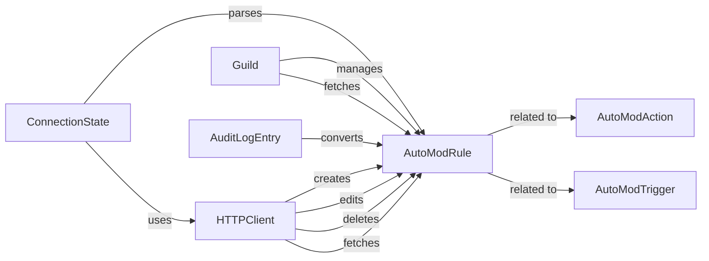

## Component Details

The Moderation Tools component automates content moderation tasks within Discord servers. It revolves around defining rules, triggers, and actions to manage content automatically. The core flow involves creating AutoModRule objects, which specify the conditions (AutoModTrigger) under which certain actions (AutoModAction) are performed. The ConnectionState and HTTPClient components handle the communication with the Discord API to manage these rules. Guild objects provide a context for managing rules within a specific server. Audit logs track changes to moderation rules, ensuring transparency and accountability.

### AutoModRule
Represents an auto moderation rule, encompassing the trigger, actions, and settings. It provides methods for converting the rule to a dictionary and accessing its properties. This component is central to defining the behavior of the moderation system.
- **Related Classes/Methods**: `discord.automod.AutoModRule`

### AutoModAction
Represents an action performed when an auto moderation rule is triggered, containing information about the action type and its configuration. This component defines what happens when a rule's conditions are met.
- **Related Classes/Methods**: `discord.automod.AutoModAction`

### AutoModTrigger
Represents the trigger for an auto moderation rule, defining the conditions under which the rule is activated. This component specifies when a rule should be applied.
- **Related Classes/Methods**: `discord.automod.AutoModTrigger`

### ConnectionState
Manages the connection state of the Discord client, parsing auto moderation rule events and updating the internal state accordingly. It acts as an intermediary between the Discord API and the internal representation of auto moderation rules.
- **Related Classes/Methods**: `discord.state.ConnectionState`

### HTTPClient
Handles HTTP requests to the Discord API, providing methods for creating, fetching, editing, and deleting auto moderation rules. This component is responsible for communicating with the Discord API to manage auto moderation rules.
- **Related Classes/Methods**: `discord.http.HTTPClient`

### Guild
Represents a Discord guild, providing methods for fetching and managing auto moderation rules within the guild. This component provides the context in which auto moderation rules are applied.
- **Related Classes/Methods**: `discord.guild.Guild`

### AuditLogEntry
Represents an entry in the audit log, converting target auto moderation information. This component provides a record of changes made to auto moderation rules.
- **Related Classes/Methods**: `discord.audit_logs.AuditLogEntry`
