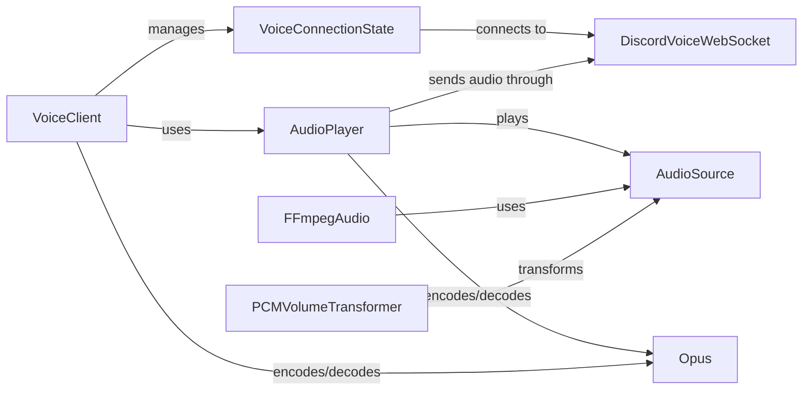

## Component Details

The Multimedia Engine handles voice communication within the Discord bot. It manages the connection to voice channels, encodes and decodes audio, and plays audio sources. The engine uses a stateful connection managed by VoiceConnectionState and transmits data via DiscordVoiceWebSocket. Audio playback is handled by AudioPlayer, which utilizes AudioSource implementations like FFmpegAudio and applies audio transformations like PCMVolumeTransformer. The Opus codec is used for efficient audio encoding and decoding.

### VoiceClient
The VoiceClient is the main entry point for voice connections. It manages the overall lifecycle of a voice connection, including connecting to a voice channel, disconnecting, and handling voice server updates. It also orchestrates the audio playback by utilizing the AudioPlayer.
- **Related Classes/Methods**: `discord.voice_client.VoiceClient`

### VoiceConnectionState
The VoiceConnectionState manages the low-level connection details to the Discord voice server. It establishes and maintains a websocket connection using DiscordVoiceWebSocket, handles voice state updates, and manages the connection state.
- **Related Classes/Methods**: `discord.voice_state.VoiceConnectionState`

### DiscordVoiceWebSocket
The DiscordVoiceWebSocket handles the websocket communication with the Discord voice server. It sends and receives voice data, including identifying, selecting the protocol, and transmitting audio packets. It's the direct interface to the Discord voice server for voice communication.
- **Related Classes/Methods**: `discord.gateway.DiscordVoiceWebSocket`

### AudioPlayer
The AudioPlayer manages the audio playback process. It runs in a separate thread and handles playing, pausing, resuming, and stopping audio sources. It utilizes AudioSource implementations and the Opus codec for audio processing and transmission.
- **Related Classes/Methods**: `discord.player.AudioPlayer`

### AudioSource
The AudioSource is an abstract base class for audio sources. It defines a common interface for audio sources to be played by the AudioPlayer. Concrete implementations like FFmpegAudio provide specific audio decoding capabilities.
- **Related Classes/Methods**: `discord.player.AudioSource`

### FFmpegAudio
The FFmpegAudio class is an AudioSource implementation that uses FFmpeg to decode audio files. It spawns an FFmpeg process and reads audio data from it, providing a way to play various audio formats.
- **Related Classes/Methods**: `discord.player.FFmpegAudio`, `discord.player.FFmpegPCMAudio`, `discord.player.FFmpegOpusAudio`

### PCMVolumeTransformer
The PCMVolumeTransformer is an audio filter that adjusts the volume of PCM audio data. It transforms the audio data before it's sent to the Opus encoder or played, allowing for volume control.
- **Related Classes/Methods**: `discord.player.PCMVolumeTransformer`

### Opus
The Opus module handles the encoding and decoding of audio data using the Opus codec. It's crucial for compressing and decompressing audio for efficient transmission over the network, ensuring high-quality audio with low bandwidth usage.
- **Related Classes/Methods**: `discord.opus`
