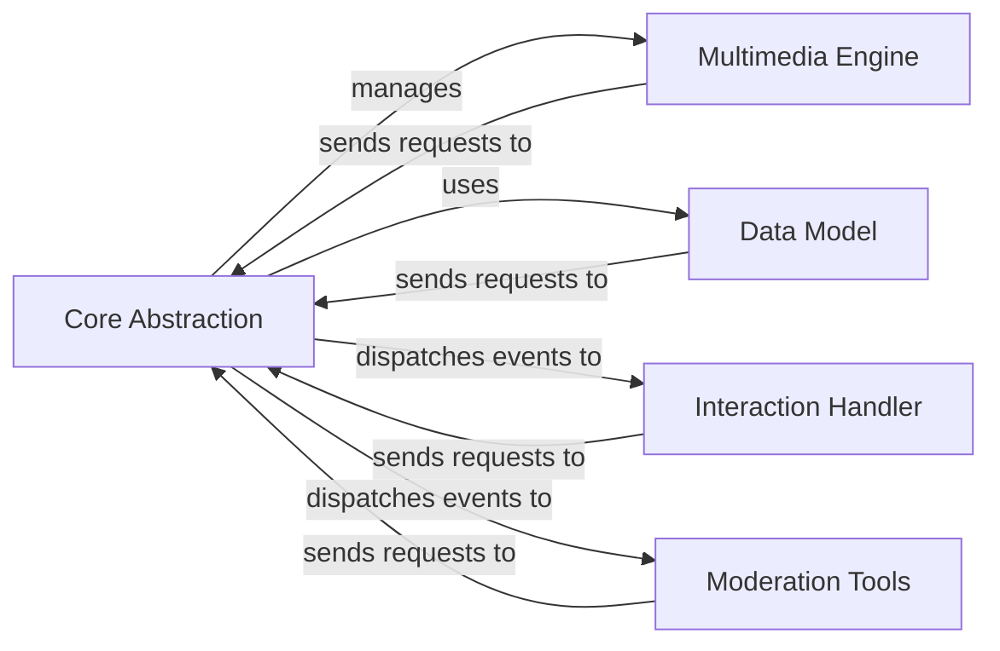

## Component Details

The discord.py library provides a comprehensive interface for interacting with the Discord API, enabling developers to create bots and applications that can perform a wide range of actions within Discord servers. The library handles tasks such as connecting to the Discord gateway, managing authentication, sending and receiving messages, managing users and channels, and handling voice communication. It provides a high-level abstraction over the Discord API, making it easier for developers to build complex and feature-rich Discord bots.

### Core Abstraction
The Core Abstraction component provides the fundamental building blocks for interacting with the Discord API. It encompasses the client interface, gateway manager, and HTTP handler, which are responsible for managing the bot's connection to Discord, handling real-time communication, and making HTTP requests to the API. This component forms the foundation upon which other components are built.
- **Related Classes/Methods**: `discord.client.Client`, `discord.shard.AutoShardedClient`, `discord.state.ConnectionState`, `discord.state.AutoShardedConnectionState`, `discord.gateway.DiscordWebSocket`, `discord.gateway.DiscordVoiceWebSocket`, `discord.gateway.KeepAliveHandler`, `discord.gateway.VoiceKeepAliveHandler`, `discord.http.HTTPClient`, `discord.http.Ratelimit`

### Data Model
The Data Model component defines the structure and representation of Discord objects, such as guilds, channels, members, roles, messages, and emojis. It provides a consistent and intuitive way to access and manipulate Discord data, allowing developers to easily interact with various Discord resources. This component acts as a central repository for all Discord-related data.
- **Related Classes/Methods**: `discord.guild.Guild`, `discord.member.Member`, `discord.role.Role`, `discord.channel.TextChannel`, `discord.channel.VoiceChannel`, `discord.channel.CategoryChannel`, `discord.threads.Thread`, `discord.message.Message`, `discord.embeds.Embed`, `discord.file.File`, `discord.reaction.Reaction`

### Interaction Handler
The Interaction Handler component provides support for creating and managing interactive elements within Discord, such as application commands (slash commands and context menu commands) and UI components (buttons, select menus, and modals). It allows developers to build rich and engaging experiences for users, enabling them to interact with bots in a more intuitive and dynamic way. This component facilitates user input and bot responses.
- **Related Classes/Methods**: `discord.app_commands.commands.Command`, `discord.app_commands.commands.Group`, `discord.app_commands.tree.CommandTree`, `discord.app_commands.transformers`, `discord.ui.view.View`, `discord.ui.button.Button`, `discord.ui.select.Select`, `discord.ui.modal.Modal`

### Multimedia Engine
The Multimedia Engine component handles voice communication, audio encoding/decoding, and audio playback. It allows bots to connect to voice channels, play audio, and manage voice settings, enabling them to participate in voice conversations and provide audio-based services. This component manages the complexities of audio processing and transmission.
- **Related Classes/Methods**: `discord.voice_client.VoiceClient`, `discord.voice_state.VoiceConnectionState`, `discord.opus.Encoder`, `discord.opus.Decoder`, `discord.player.AudioPlayer`

### Moderation Tools
The Moderation Tools component provides abstractions for creating and managing auto moderation rules. It allows developers to automatically moderate content based on keywords, mention limits, and other criteria, helping to maintain a safe and positive environment within Discord servers. This component automates content moderation tasks.
- **Related Classes/Methods**: `discord.automod.AutoModRule`, `discord.automod.AutoModAction`, `discord.automod.AutoModTrigger`