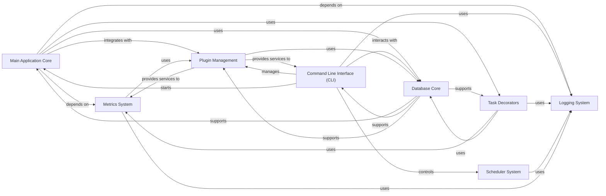

## Component Details

This graph illustrates the core application and infrastructure components of the Dispatch application. It highlights the central role of the Main Application Core in orchestrating API services and integrating with foundational services like database management, logging, metrics, and plugin extensibility. The Command Line Interface provides administrative control, interacting with various core services. Task decorators enhance application functions with cross-cutting concerns, while the Scheduler System manages background tasks. The Plugin Management system is crucial for extending functionality across multiple components.

### Main Application Core
The central FastAPI application setup, responsible for defining API routes, applying HTTP middleware (e.g., for database sessions, security headers, metrics, and exception handling), and serving the frontend static files. It orchestrates the main application flow.

**Related Classes/Methods**:

- `dispatch.src.dispatch.main` (full file reference)

### Command Line Interface (CLI)
Provides a comprehensive command-line interface for administrators and developers to interact with Dispatch, managing plugins, users, database operations, scheduler tasks, server functions, and signal processing.

**Related Classes/Methods**:

- `dispatch.src.dispatch.cli` (full file reference)
- `dispatch.src.dispatch.common.utils.cli` (full file reference)

### Task Decorators
Offers Python decorators that enhance functions with cross-cutting concerns such as database session management, project context execution, and automatic metric collection for function calls and execution times.

**Related Classes/Methods**:

- `dispatch.src.dispatch.decorators` (full file reference)

### Scheduler System
Manages the scheduling and execution of periodic and background tasks within Dispatch. It allows for the registration, removal, and execution of jobs using a thread pool.

**Related Classes/Methods**:

- `dispatch.src.dispatch.scheduler` (full file reference)

### Metrics System
Provides a centralized mechanism for collecting and reporting application metrics (gauges, counters, timers) to configured external metric providers. It leverages the Plugin Management system to interact with specific metric plugins.

**Related Classes/Methods**:

- `dispatch.src.dispatch.metrics` (full file reference)

### Logging System
Centralized logging utility for the Dispatch application, providing configurable log levels and handlers.

**Related Classes/Methods**:

- `dispatch.src.dispatch.logging` (full file reference)

### Plugin Management
A foundational system for dynamically loading, registering, and managing various types of plugins that extend Dispatch's functionality. It provides methods to access and interact with active plugin instances.

**Related Classes/Methods**:

- <a href="https://github.com/netflix/dispatch/blob/master/src/dispatch/plugins/base/manager.py#L17-L66" target="_blank" rel="noopener noreferrer">`dispatch.plugins.base.manager.PluginManager` (17:66)</a>
- <a href="https://github.com/netflix/dispatch/blob/master/src/dispatch/common/managers.py#L17-L75" target="_blank" rel="noopener noreferrer">`dispatch.src.dispatch.common.managers.InstanceManager` (17:75)</a>

### Database Core
Manages the core database connection, session management, and provides base models for database entities.

**Related Classes/Methods**:

- `dispatch.database.core` (full file reference)

### [FAQ](https://github.com/CodeBoarding/GeneratedOnBoardings/tree/main?tab=readme-ov-file#faq)