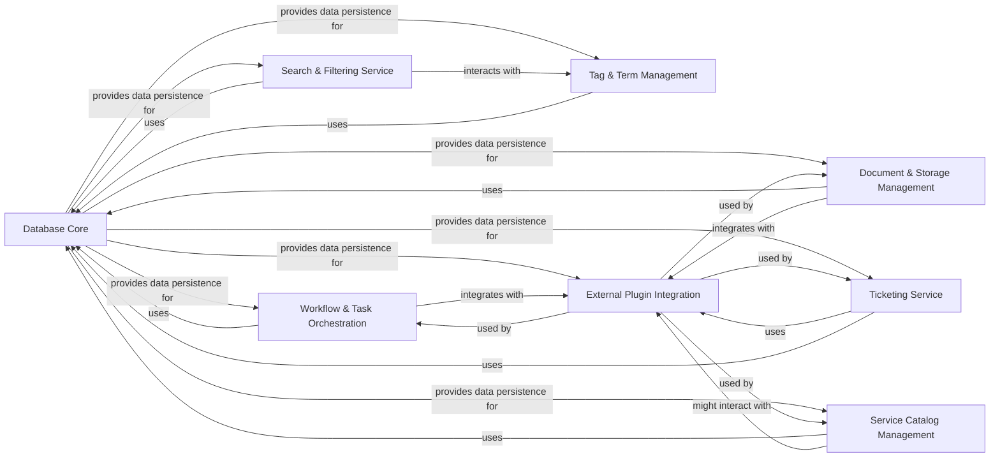

## Component Details

The Data & Integration Layer is responsible for all data persistence, retrieval, and search functionalities, including database interactions, full-text search, filtering, and categorization via tags and terms. It also provides a flexible plugin framework for integrating with various external services and systems, handling workflows, tasks, documents, storage, and external ticketing/on-call systems. This layer ensures that data is consistently managed and accessible, while also enabling seamless communication and operation with a wide array of external platforms.

### Database Core
Provides the fundamental database interaction layer for the entire Dispatch system. It manages sessions, handles database connections, and ensures data persistence and retrieval for all other components.

**Related Classes/Methods**:

- `dispatch.src.dispatch.database.manage` (full file reference)
- `dispatch.src.dispatch.database.service` (full file reference)
- `dispatch.src.dispatch.database.core` (full file reference)
- `src.dispatch.database.revisions.tenant.env` (full file reference)
- `src.dispatch.database.revisions.tenant.versions.2021-11-18_ce5c4ac967d8` (full file reference)
- `src.dispatch.database.revisions.tenant.versions.2023-03-09_7db13bf5c5d7` (full file reference)
- `src.dispatch.database.revisions.tenant.versions.2023-04-10_61a861559de9` (full file reference)
- `src.dispatch.database.revisions.tenant.versions.2021-08-09_b73416df5744` (full file reference)
- `src.dispatch.database.revisions.tenant.versions.2024-09-23_32652e0360dd` (full file reference)
- `src.dispatch.database.revisions.tenant.versions.2023-03-03_7ddae3ba7822` (full file reference)
- `src.dispatch.database.revisions.tenant.versions.2024-10-25_24322617ce9a` (full file reference)
- `src.dispatch.database.revisions.tenant.versions.2022-10-19_3b0f5b81376f` (full file reference)
- `src.dispatch.database.revisions.tenant.versions.2023-03-27_d1b5ed66d83d` (full file reference)
- `src.dispatch.database.revisions.tenant.versions.2022-05-23_748744207122` (full file reference)
- `src.dispatch.database.revisions.tenant.versions.2021-09-16_3820a792d88a` (full file reference)
- `src.dispatch.database.revisions.tenant.versions.2023-01-30_e4b4991dddcd` (full file reference)

### Search & Filtering Service
Handles full-text search, filtering, and categorization of data across the system, enabling efficient data retrieval based on various criteria like tags and terms.

**Related Classes/Methods**:

- `dispatch.src.dispatch.search.views` (full file reference)
- <a href="https://github.com/netflix/dispatch/blob/master/src/dispatch/search/fulltext/composite_search.py#L44-L111" target="_blank" rel="noopener noreferrer">`dispatch.src.dispatch.search.fulltext.composite_search.CompositeSearch` (44:111)</a>
- `dispatch.src.dispatch.search_filter.service` (full file reference)
- `dispatch.src.dispatch.search.fulltext.SearchQueryMixin` (full file reference)
- `dispatch.src.dispatch.search.fulltext` (full file reference)
- `dispatch.src.dispatch.search.fulltext.SQLConstruct` (full file reference)
- `dispatch.src.dispatch.search.fulltext.SearchManager` (full file reference)
- <a href="https://github.com/netflix/dispatch/blob/master/src/dispatch/search_filter/permissions.py#L9-L35" target="_blank" rel="noopener noreferrer">`dispatch.src.dispatch.search_filter.permissions.SearchFilterEditDeletePermission` (9:35)</a>
- `dispatch.src.dispatch.search_filter.views` (full file reference)

### Tag & Term Management
Manages the creation, retrieval, and application of tags and terms for data categorization and organization. It also includes scheduling and recommendation functionalities for tags and terms.

**Related Classes/Methods**:

- `dispatch.src.dispatch.tag.service` (full file reference)
- `dispatch.src.dispatch.term.service` (full file reference)
- `dispatch.src.dispatch.definition.service` (full file reference)
- `dispatch.src.dispatch.tag.scheduled` (full file reference)
- `dispatch.src.dispatch.tag.views` (full file reference)
- `dispatch.src.dispatch.tag.recommender` (full file reference)
- `dispatch.src.dispatch.tag_type.views` (full file reference)
- `dispatch.src.dispatch.tag_type.service` (full file reference)
- `dispatch.src.dispatch.term.scheduled` (full file reference)
- `dispatch.src.dispatch.term.views` (full file reference)

### Workflow & Task Orchestration
Facilitates the definition, execution, and management of automated workflows and individual tasks, integrating with various services to streamline operational processes.

**Related Classes/Methods**:

- `dispatch.src.dispatch.workflow.service` (full file reference)
- `dispatch.src.dispatch.workflow.flows` (full file reference)
- `dispatch.src.dispatch.task.service` (full file reference)
- `dispatch.src.dispatch.task.flows` (full file reference)
- `dispatch.src.dispatch.task.scheduled` (full file reference)
- `dispatch.src.dispatch.task.views` (full file reference)
- `dispatch.src.dispatch.workflow.scheduled` (full file reference)
- `dispatch.src.dispatch.workflow.views` (full file reference)

### Document & Storage Management
Manages the lifecycle of documents and storage resources, including persistence, retrieval, and integration with external storage solutions.

**Related Classes/Methods**:

- `dispatch.src.dispatch.document.scheduled` (full file reference)
- `dispatch.src.dispatch.document.views` (full file reference)
- `dispatch.src.dispatch.document.service` (full file reference)
- `dispatch.src.dispatch.document.flows` (full file reference)
- `dispatch.src.dispatch.storage.service` (full file reference)
- `dispatch.src.dispatch.storage.flows` (full file reference)

### External Plugin Integration
Provides a flexible framework for integrating with diverse external services and systems (e.g., Slack, Google Drive, Jira, OpsGenie, PagerDuty, GitHub, Duo, Zoom, Microsoft Teams, AWS). It manages plugin registration, configuration, and interaction.

**Related Classes/Methods**:

- <a href="https://github.com/netflix/dispatch/blob/master/src/dispatch/plugins/base/manager.py#L17-L66" target="_blank" rel="noopener noreferrer">`dispatch.src.dispatch.plugins.base.manager.PluginManager` (17:66)</a>
- `dispatch.src.dispatch.plugin.service` (full file reference)
- <a href="https://github.com/netflix/dispatch/blob/master/src/dispatch/plugin/models.py#L31-L65" target="_blank" rel="noopener noreferrer">`dispatch.src.dispatch.plugin.models.Plugin` (31:65)</a>
- <a href="https://github.com/netflix/dispatch/blob/master/src/dispatch/plugin/models.py#L88-L156" target="_blank" rel="noopener noreferrer">`dispatch.src.dispatch.plugin.models.PluginInstance` (88:156)</a>
- `dispatch.src.dispatch.plugin.views` (full file reference)
- <a href="https://github.com/netflix/dispatch/blob/master/src/dispatch/plugins/dispatch_slack/plugin.py#L74-L492" target="_blank" rel="noopener noreferrer">`dispatch.src.dispatch.plugins.dispatch_slack.plugin.SlackConversationPlugin` (74:492)</a>
- <a href="https://github.com/netflix/dispatch/blob/master/src/dispatch/plugins/dispatch_google/drive/plugin.py#L50-L133" target="_blank" rel="noopener noreferrer">`dispatch.src.dispatch.plugins.dispatch_google.drive.plugin.GoogleDriveStoragePlugin` (50:133)</a>
- `dispatch.src.dispatch.plugins.dispatch_jira.plugin` (full file reference)
- <a href="https://github.com/netflix/dispatch/blob/master/src/dispatch/plugins/dispatch_opsgenie/plugin.py#L34-L62" target="_blank" rel="noopener noreferrer">`dispatch.src.dispatch.plugins.dispatch_opsgenie.plugin.OpsGenieOncallPlugin` (34:62)</a>
- <a href="https://github.com/netflix/dispatch/blob/master/src/dispatch/plugins/dispatch_core/plugin.py#L234-L360" target="_blank" rel="noopener noreferrer">`dispatch.src.dispatch.plugins.dispatch_core.plugin.DispatchTicketPlugin` (234:360)</a>
- <a href="https://github.com/netflix/dispatch/blob/master/src/dispatch/plugins/dispatch_github/plugin.py#L49-L110" target="_blank" rel="noopener noreferrer">`dispatch.src.dispatch.plugins.dispatch_github.plugin.GithubMonitorPlugin` (49:110)</a>
- <a href="https://github.com/netflix/dispatch/blob/master/src/dispatch/plugins/dispatch_duo/plugin.py#L33-L120" target="_blank" rel="noopener noreferrer">`dispatch.src.dispatch.plugins.dispatch_duo.plugin.DuoMfaPlugin` (33:120)</a>
- `dispatch.src.dispatch.plugins.dispatch_zoom.plugin` (full file reference)
- <a href="https://github.com/netflix/dispatch/blob/master/src/dispatch/plugins/dispatch_zoom/plugin.py#L56-L101" target="_blank" rel="noopener noreferrer">`dispatch.src.dispatch.plugins.dispatch_zoom.plugin.ZoomConferencePlugin` (56:101)</a>
- <a href="https://github.com/netflix/dispatch/blob/master/src/dispatch/plugins/dispatch_zoom/client.py#L11-L50" target="_blank" rel="noopener noreferrer">`dispatch.src.dispatch.plugins.dispatch_zoom.client.ZoomClient` (11:50)</a>
- <a href="https://github.com/netflix/dispatch/blob/master/src/dispatch/plugins/dispatch_test/conversation.py#L15-L40" target="_blank" rel="noopener noreferrer">`dispatch.src.dispatch.plugins.dispatch_test.conversation.TestConversationPlugin` (15:40)</a>
- `dispatch.src.dispatch.plugins.dispatch_opsgenie.service` (full file reference)
- <a href="https://github.com/netflix/dispatch/blob/master/src/dispatch/plugins/dispatch_google/gmail/plugin.py#L67-L121" target="_blank" rel="noopener noreferrer">`dispatch.src.dispatch.plugins.dispatch_google.gmail.plugin.GoogleGmailEmailPlugin` (67:121)</a>
- `dispatch.src.dispatch.plugins.dispatch_google.drive.drive` (full file reference)
- <a href="https://github.com/netflix/dispatch/blob/master/src/dispatch/plugins/dispatch_google/drive/plugin.py#L50-L133" target="_blank" rel="noopener noreferrer">`dispatch.src.dispatch.plugins.dispatch_google.drive.plugin.GoogleDriveStoragePlugin` (50:133)</a>
- <a href="https://github.com/netflix/dispatch/blob/master/src/dispatch/plugins/dispatch_google/drive/plugin.py#L136-L177" target="_blank" rel="noopener noreferrer">`dispatch.src.dispatch.plugins.dispatch_google.drive.plugin.GoogleDriveTaskPlugin` (136:177)</a>
- `dispatch.src.dispatch.plugins.dispatch_google.drive.task` (full file reference)
- `dispatch.src.dispatch.plugins.dispatch_google.docs.plugin` (full file reference)
- <a href="https://github.com/netflix/dispatch/blob/master/src/dispatch/plugins/dispatch_google/docs/plugin.py#L159-L306" target="_blank" rel="noopener noreferrer">`dispatch.src.dispatch.plugins.dispatch_google.docs.plugin.GoogleDocsDocumentPlugin` (159:306)</a>
- `dispatch.src.dispatch.plugins.dispatch_google.groups.plugin` (full file reference)
- <a href="https://github.com/netflix/dispatch/blob/master/src/dispatch/plugins/dispatch_google/groups/plugin.py#L130-L195" target="_blank" rel="noopener noreferrer">`dispatch.src.dispatch.plugins.dispatch_google.groups.plugin.GoogleGroupParticipantGroupPlugin` (130:195)</a>
- `dispatch.src.dispatch.plugins.dispatch_google.calendar.plugin` (full file reference)
- <a href="https://github.com/netflix/dispatch/blob/master/src/dispatch/plugins/dispatch_google/calendar/plugin.py#L125-L171" target="_blank" rel="noopener noreferrer">`dispatch.src.dispatch.plugins.dispatch_google.calendar.plugin.GoogleCalendarConferencePlugin` (125:171)</a>
- <a href="https://github.com/netflix/dispatch/blob/master/src/dispatch/plugins/dispatch_microsoft_teams/conference/plugin.py#L13-L46" target="_blank" rel="noopener noreferrer">`dispatch.src.dispatch.plugins.dispatch_microsoft_teams.conference.plugin.MicrosoftTeamsConferencePlugin` (13:46)</a>
- <a href="https://github.com/netflix/dispatch/blob/master/src/dispatch/plugins/dispatch_microsoft_teams/conference/client.py#L10-L75" target="_blank" rel="noopener noreferrer">`dispatch.src.dispatch.plugins.dispatch_microsoft_teams.conference.client.MSTeamsClient` (10:75)</a>
- <a href="https://github.com/netflix/dispatch/blob/master/src/dispatch/plugins/dispatch_pagerduty/plugin.py#L50-L142" target="_blank" rel="noopener noreferrer">`dispatch.src.dispatch.plugins.dispatch_pagerduty.plugin.PagerDutyOncallPlugin` (50:142)</a>
- `dispatch.src.dispatch.plugins.dispatch_pagerduty.service` (full file reference)
- <a href="https://github.com/netflix/dispatch/blob/master/src/dispatch/plugins/dispatch_atlassian_confluence/plugin.py#L41-L138" target="_blank" rel="noopener noreferrer">`dispatch.src.dispatch.plugins.dispatch_atlassian_confluence.plugin.ConfluencePagePlugin` (41:138)</a>
- <a href="https://github.com/netflix/dispatch/blob/master/src/dispatch/plugins/dispatch_atlassian_confluence/docs/plugin.py#L30-L51" target="_blank" rel="noopener noreferrer">`dispatch.src.dispatch.plugins.dispatch_atlassian_confluence.docs.plugin.ConfluencePageDocPlugin` (30:51)</a>
- <a href="https://github.com/netflix/dispatch/blob/master/src/dispatch/plugins/dispatch_aws/plugin.py#L45-L155" target="_blank" rel="noopener noreferrer">`dispatch.src.dispatch.plugins.dispatch_aws.plugin.AWSSQSSignalConsumerPlugin` (45:155)</a>
- `dispatch.src.dispatch.plugins.dispatch_slack.messaging` (full file reference)
- `dispatch.src.dispatch.plugins.dispatch_slack.endpoints` (full file reference)
- <a href="https://github.com/netflix/dispatch/blob/master/src/dispatch/plugins/dispatch_slack/events.py#L19-L41" target="_blank" rel="noopener noreferrer">`dispatch.src.dispatch.plugins.dispatch_slack.events.ChannelActivityEvent` (19:41)</a>
- <a href="https://github.com/netflix/dispatch/blob/master/src/dispatch/plugins/dispatch_slack/events.py#L44-L67" target="_blank" rel="noopener noreferrer">`dispatch.src.dispatch.plugins.dispatch_slack.events.ThreadActivityEvent` (44:67)</a>
- `dispatch.src.dispatch.plugins.dispatch_slack.service` (full file reference)
- `dispatch.src.dispatch.plugins.dispatch_slack.middleware` (full file reference)
- `dispatch.src.dispatch.plugins.dispatch_slack.bolt` (full file reference)
- `dispatch.src.dispatch.plugins.dispatch_slack.workflow` (full file reference)
- `dispatch.src.dispatch.plugins.dispatch_slack.fields` (full file reference)
- `src.dispatch.plugins.dispatch_slack.feedback.interactive` (full file reference)
- `src.dispatch.plugins.dispatch_slack.case.messages` (full file reference)
- `src.dispatch.plugins.dispatch_slack.case.interactive` (full file reference)
- `src.dispatch.plugins.dispatch_slack.incident.interactive` (full file reference)
- <a href="https://github.com/netflix/dispatch/blob/master/src/dispatch/plugins/dispatch_core/plugin.py#L174-L231" target="_blank" rel="noopener noreferrer">`dispatch.src.dispatch.plugins.dispatch_core.plugin.AwsAlbAuthProviderPlugin` (174:231)</a>
- <a href="https://github.com/netflix/dispatch/blob/master/src/dispatch/plugins/dispatch_core/plugin.py#L363-L475" target="_blank" rel="noopener noreferrer">`dispatch.src.dispatch.plugins.dispatch_core.plugin.DispatchMfaPlugin` (363:475)</a>
- <a href="https://github.com/netflix/dispatch/blob/master/src/dispatch/plugins/dispatch_core/plugin.py#L478-L497" target="_blank" rel="noopener noreferrer">`dispatch.src.dispatch.plugins.dispatch_core.plugin.DispatchContactPlugin` (478:497)</a>
- <a href="https://github.com/netflix/dispatch/blob/master/src/dispatch/plugins/dispatch_core/plugin.py#L500-L592" target="_blank" rel="noopener noreferrer">`dispatch.src.dispatch.plugins.dispatch_core.plugin.DispatchParticipantResolverPlugin` (500:592)</a>

### Ticketing Service
Manages interactions with external ticketing systems, enabling the creation, update, and synchronization of tickets related to cases and incidents.

**Related Classes/Methods**:

- `dispatch.src.dispatch.ticket.service` (full file reference)
- `dispatch.src.dispatch.ticket.flows` (full file reference)

### Service Catalog Management
Manages the definition and retrieval of services within the system, potentially linking them to incidents or cases.

**Related Classes/Methods**:

- `dispatch.src.dispatch.service.views` (full file reference)
- `dispatch.src.dispatch.service.service` (full file reference)
- `dispatch.src.dispatch.service.flows` (full file reference)

### [FAQ](https://github.com/CodeBoarding/GeneratedOnBoardings/tree/main?tab=readme-ov-file#faq)