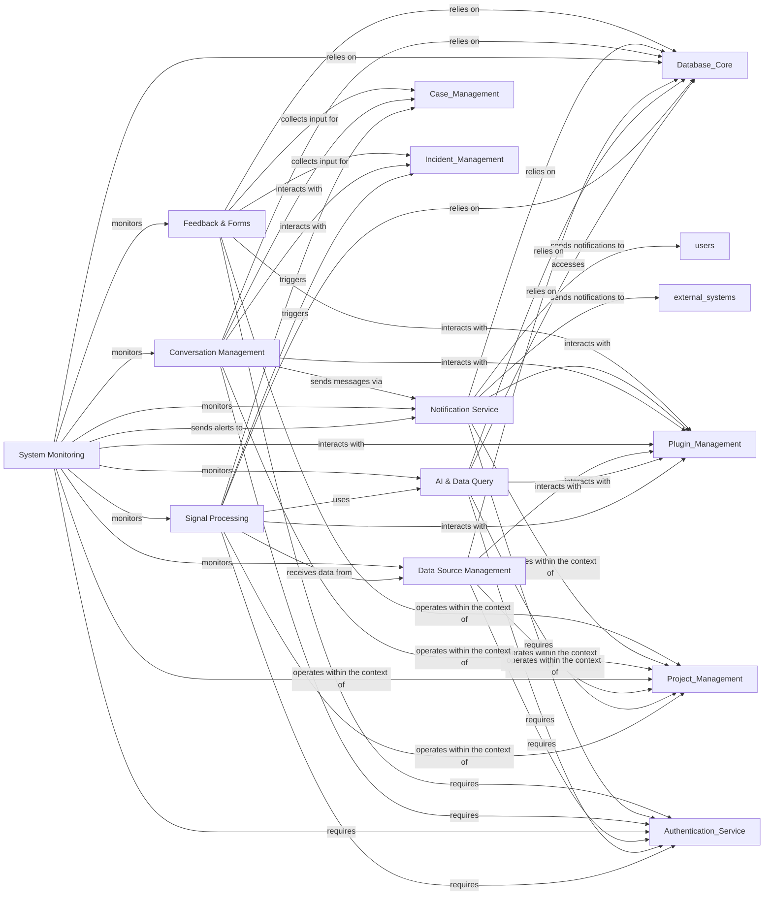

## Component Details

This component focuses on processing external security signals, integrating with AI services for insights, managing data sources, monitoring system health, and handling feedback collection. It also encompasses all communication channels and notification mechanisms within the platform, ensuring timely information flow and user interaction.

### Signal Processing
Responsible for ingesting, enriching, filtering, and routing external security signals. It acts as the primary entry point for external security events into the Dispatch platform.

**Related Classes/Methods**:

- `dispatch.src.dispatch.signal.views` (full file reference)
- `dispatch.src.dispatch.signal.service` (full file reference)
- `dispatch.src.dispatch.signal.flows` (full file reference)
- <a href="https://github.com/netflix/dispatch/blob/master/src/dispatch/signal/models.py#L118-L177" target="_blank" rel="noopener noreferrer">`dispatch.signal.models.Signal` (118:177)</a>
- <a href="https://github.com/netflix/dispatch/blob/master/src/dispatch/signal/models.py#L218-L255" target="_blank" rel="noopener noreferrer">`dispatch.signal.models.SignalInstance` (218:255)</a>
- <a href="https://github.com/netflix/dispatch/blob/master/src/dispatch/signal/models.py#L197-L215" target="_blank" rel="noopener noreferrer">`dispatch.signal.models.SignalFilter` (197:215)</a>
- <a href="https://github.com/netflix/dispatch/blob/master/src/dispatch/signal/models.py#L180-L194" target="_blank" rel="noopener noreferrer">`dispatch.signal.models.SignalEngagement` (180:194)</a>
- <a href="https://github.com/netflix/dispatch/blob/master/src/dispatch/plugins/bases/signal_consumer.py#L12-L16" target="_blank" rel="noopener noreferrer">`dispatch.plugins.bases.signal_consumer.SignalConsumerPlugin` (12:16)</a>
- <a href="https://github.com/netflix/dispatch/blob/master/src/dispatch/plugins/bases/signal_enrichment.py#L12-L16" target="_blank" rel="noopener noreferrer">`dispatch.plugins.bases.signal_enrichment.SignalEnrichmentPlugin` (12:16)</a>
- <a href="https://github.com/netflix/dispatch/blob/master/src/dispatch/plugins/dispatch_aws/plugin.py#L45-L155" target="_blank" rel="noopener noreferrer">`dispatch.plugins.dispatch_aws.plugin.AWSSQSSignalConsumerPlugin` (45:155)</a>

### AI & Data Query
Integrates with artificial intelligence services to derive insights from data and provides capabilities for querying and retrieving data from various sources.

**Related Classes/Methods**:

- `src.dispatch.ai.service` (full file reference)
- <a href="https://github.com/netflix/dispatch/blob/master/src/dispatch/plugins/bases/artificial_intelligence.py#L12-L19" target="_blank" rel="noopener noreferrer">`dispatch.plugins.bases.artificial_intelligence.ArtificialIntelligencePlugin` (12:19)</a>
- <a href="https://github.com/netflix/dispatch/blob/master/src/dispatch/plugins/dispatch_openai/plugin.py#L25-L58" target="_blank" rel="noopener noreferrer">`dispatch.plugins.dispatch_openai.plugin.OpenAIPlugin` (25:58)</a>
- `src.dispatch.data.query.views` (full file reference)
- `src.dispatch.data.query.service` (full file reference)
- <a href="https://github.com/netflix/dispatch/blob/master/src/dispatch/data/query/models.py#L38-L47" target="_blank" rel="noopener noreferrer">`dispatch.data.query.models.Query` (38:47)</a>

### Data Source Management
Manages the configuration, scheduling, and interaction with various external data sources, ensuring data is collected and made available for processing and analysis.

**Related Classes/Methods**:

- `src.dispatch.data.source.scheduled` (full file reference)
- `src.dispatch.data.source.views` (full file reference)
- `src.dispatch.data.source.service` (full file reference)
- `src.dispatch.data.source.transport.views` (full file reference)
- `src.dispatch.data.source.transport.service` (full file reference)
- `src.dispatch.data.source.type.views` (full file reference)
- `src.dispatch.data.source.type.service` (full file reference)
- `src.dispatch.data.source.status.views` (full file reference)
- `src.dispatch.data.source.status.service` (full file reference)
- `src.dispatch.data.source.environment.views` (full file reference)
- `src.dispatch.data.source.environment.service` (full file reference)
- `src.dispatch.data.source.data_format.views` (full file reference)
- `src.dispatch.data.source.data_format.service` (full file reference)
- `src.dispatch.data.alert.service` (full file reference)
- <a href="https://github.com/netflix/dispatch/blob/master/src/dispatch/plugins/bases/source.py#L12-L16" target="_blank" rel="noopener noreferrer">`dispatch.plugins.bases.source.SourcePlugin` (12:16)</a>

### System Monitoring
Continuously monitors the health, performance, and operational status of the Dispatch platform and its integrated services.

**Related Classes/Methods**:

- `src.dispatch.monitor.scheduled` (full file reference)
- `src.dispatch.monitor.service` (full file reference)
- `src.dispatch.monitor.flows` (full file reference)
- `src.dispatch.evergreen.scheduled` (full file reference)
- <a href="https://github.com/netflix/dispatch/blob/master/src/dispatch/plugins/bases/monitor.py#L11-L15" target="_blank" rel="noopener noreferrer">`dispatch.plugins.bases.monitor.MonitorPlugin` (11:15)</a>
- <a href="https://github.com/netflix/dispatch/blob/master/src/dispatch/plugins/dispatch_github/plugin.py#L49-L110" target="_blank" rel="noopener noreferrer">`dispatch.plugins.dispatch_github.plugin.GithubMonitorPlugin` (49:110)</a>

### Conversation Management
Facilitates real-time communication and collaboration within the platform, primarily through chat-based conversations.

**Related Classes/Methods**:

- `dispatch.src.dispatch.conversation.messaging` (full file reference)
- `dispatch.src.dispatch.conversation.service` (full file reference)
- `dispatch.src.dispatch.conversation.flows` (full file reference)
- <a href="https://github.com/netflix/dispatch/blob/master/src/dispatch/conversation/models.py#L12-L19" target="_blank" rel="noopener noreferrer">`dispatch.conversation.models.Conversation` (12:19)</a>
- <a href="https://github.com/netflix/dispatch/blob/master/src/dispatch/plugins/bases/conversation.py#L12-L22" target="_blank" rel="noopener noreferrer">`dispatch.plugins.bases.conversation.ConversationPlugin` (12:22)</a>
- <a href="https://github.com/netflix/dispatch/blob/master/src/dispatch/plugins/dispatch_slack/plugin.py#L74-L492" target="_blank" rel="noopener noreferrer">`dispatch.plugins.dispatch_slack.plugin.SlackConversationPlugin` (74:492)</a>

### Notification Service
Manages and dispatches various types of notifications to relevant users or systems based on events and predefined rules.

**Related Classes/Methods**:

- `dispatch.src.dispatch.notification.views` (full file reference)
- `dispatch.src.dispatch.notification.service` (full file reference)
- <a href="https://github.com/netflix/dispatch/blob/master/src/dispatch/notification/models.py#L37-L57" target="_blank" rel="noopener noreferrer">`dispatch.notification.models.Notification` (37:57)</a>
- <a href="https://github.com/netflix/dispatch/blob/master/src/dispatch/plugins/bases/email.py#L12-L16" target="_blank" rel="noopener noreferrer">`dispatch.plugins.bases.email.EmailPlugin` (12:16)</a>
- <a href="https://github.com/netflix/dispatch/blob/master/src/dispatch/plugins/dispatch_google/gmail/plugin.py#L67-L121" target="_blank" rel="noopener noreferrer">`dispatch.plugins.dispatch_google.gmail.plugin.GoogleGmailEmailPlugin` (67:121)</a>

### Feedback & Forms
Handles the collection of user feedback and manages dynamic forms for various data input and interaction purposes.

**Related Classes/Methods**:

- `src.dispatch.feedback.service.messaging` (full file reference)
- `src.dispatch.feedback.service.scheduled` (full file reference)
- `src.dispatch.feedback.service.views` (full file reference)
- `src.dispatch.feedback.incident.messaging` (full file reference)
- `src.dispatch.feedback.incident.scheduled` (full file reference)
- `src.dispatch.feedback.incident.views` (full file reference)
- `src.dispatch.feedback.incident.service` (full file reference)
- `src.dispatch.forms.views` (full file reference)
- `src.dispatch.forms.service` (full file reference)
- `src.dispatch.forms.type.views` (full file reference)
- `src.dispatch.forms.type.service` (full file reference)

### [FAQ](https://github.com/CodeBoarding/GeneratedOnBoardings/tree/main?tab=readme-ov-file#faq)