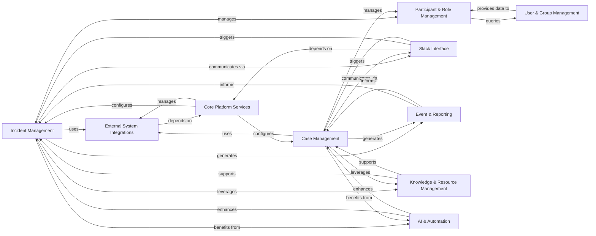

## Component Details

The Security Incident & Case Management subsystem is the core domain component responsible for handling the entire lifecycle of security incidents and cases. It encompasses their creation, updates, status transitions, and the management of related entities such as severity, priority, and cost tracking. The system also manages participants and contacts involved in these processes, integrates with external systems for ticketing and communication, and leverages AI and automation for enhanced response. It provides a comprehensive framework for managing security-related events from inception to resolution, supported by robust reporting and knowledge management capabilities.

### Incident Management
This component is responsible for the entire lifecycle of incidents, including their creation, updates, status transitions, and the management of associated data such as incident types, priorities, severities, roles, and calculated costs. It orchestrates various flows and services to ensure effective incident response.

**Related Classes/Methods**:

- `dispatch.src.dispatch.incident.views` (full file reference)
- `dispatch.src.dispatch.incident.service` (full file reference)
- `dispatch.src.dispatch.incident.flows` (full file reference)
- `dispatch.src.dispatch.incident.messaging` (full file reference)
- `dispatch.src.dispatch.incident.scheduled` (full file reference)
- `dispatch.src.dispatch.incident.metrics` (full file reference)
- `dispatch.src.dispatch.incident.type.service` (full file reference)
- `dispatch.src.dispatch.incident.severity.service` (full file reference)
- `dispatch.src.dispatch.incident.priority.service` (full file reference)
- `dispatch.src.dispatch.incident_role.service` (full file reference)
- `dispatch.src.dispatch.incident_cost.service` (full file reference)
- `dispatch.src.dispatch.incident_cost_type.service` (full file reference)
- `dispatch.src.dispatch.incident_role.views` (full file reference)
- `dispatch.src.dispatch.incident_cost.scheduled` (full file reference)
- `dispatch.src.dispatch.incident_cost.views` (full file reference)

### Case Management
This component handles the complete lifecycle of cases, encompassing their creation, updates, and transitions through various statuses. It also manages case-specific attributes like case types, priorities, severities, and calculates associated costs, ensuring a structured approach to case resolution.

**Related Classes/Methods**:

- `dispatch.src.dispatch.case.views` (full file reference)
- `dispatch.src.dispatch.case.service` (full file reference)
- `dispatch.src.dispatch.case.flows` (full file reference)
- `dispatch.src.dispatch.case.messaging` (full file reference)
- `dispatch.src.dispatch.case.scheduled` (full file reference)
- `dispatch.src.dispatch.case.type.service` (full file reference)
- `dispatch.src.dispatch.case.severity.service` (full file reference)
- `dispatch.src.dispatch.case.priority.service` (full file reference)
- `dispatch.src.dispatch.case_cost.service` (full file reference)
- `dispatch.src.dispatch.case_cost_type.service` (full file reference)
- `dispatch.src.dispatch.case_cost.scheduled` (full file reference)
- `dispatch.src.dispatch.case_cost.views` (full file reference)
- `dispatch.src.dispatch.case_cost_type.views` (full file reference)

### Participant & Role Management
This component is dedicated to managing the involvement of individuals and services in both incidents and cases. It handles the assignment and renouncement of roles, tracks participant activities, and ensures that the right personnel are engaged with appropriate responsibilities.

**Related Classes/Methods**:

- `dispatch.src.dispatch.participant.service` (full file reference)
- `dispatch.src.dispatch.participant.flows` (full file reference)
- `dispatch.src.dispatch.participant_role.service` (full file reference)
- `dispatch.src.dispatch.participant_role.flows` (full file reference)
- `dispatch.src.dispatch.participant_activity.service` (full file reference)

### External System Integrations
This component provides the necessary interfaces and logic for Dispatch to interact with external systems. This includes creating and updating tickets in platforms like Jira and resolving contact information from various sources, acting as a bridge for seamless data exchange.

**Related Classes/Methods**:

- `dispatch.src.dispatch.ticket.flows` (full file reference)
- `dispatch.src.dispatch.ticket.service` (full file reference)
- <a href="https://github.com/netflix/dispatch/blob/master/src/dispatch/plugins/dispatch_core/plugin.py#L234-L360" target="_blank" rel="noopener noreferrer">`dispatch.src.dispatch.plugins.dispatch_core.plugin.DispatchTicketPlugin` (234:360)</a>
- <a href="https://github.com/netflix/dispatch/blob/master/src/dispatch/plugins/dispatch_jira/plugin.py#L294-L606" target="_blank" rel="noopener noreferrer">`dispatch.src.dispatch.plugins.dispatch_jira.plugin.JiraTicketPlugin` (294:606)</a>
- <a href="https://github.com/netflix/dispatch/blob/master/src/dispatch/plugins/dispatch_core/plugin.py#L478-L497" target="_blank" rel="noopener noreferrer">`dispatch.src.dispatch.plugins.dispatch_core.plugin.DispatchContactPlugin` (478:497)</a>

### Slack Interface
This component serves as the primary interface for users to interact with Dispatch via Slack. It is responsible for sending various messages, handling interactive commands and buttons, and updating Slack channels to reflect the current state of incidents and cases.

**Related Classes/Methods**:

- `dispatch.src.dispatch.plugins.dispatch_slack.case.messages` (full file reference)
- `dispatch.src.dispatch.plugins.dispatch_slack.case.interactive` (full file reference)
- `dispatch.src.dispatch.plugins.dispatch_slack.incident.interactive` (full file reference)
- `dispatch.src.dispatch.plugins.dispatch_slack.incident.messages` (full file reference)

### Event & Reporting
This component is responsible for capturing and logging all significant events related to incidents and cases. It also handles the generation, scheduling, and distribution of various reports, providing insights and historical context for ongoing and past operations.

**Related Classes/Methods**:

- `dispatch.src.dispatch.event.service` (full file reference)
- `dispatch.src.dispatch.event.flows` (full file reference)
- `dispatch.src.dispatch.report.messaging` (full file reference)
- `dispatch.src.dispatch.report.scheduled` (full file reference)
- `dispatch.src.dispatch.report.service` (full file reference)
- `dispatch.src.dispatch.report.flows` (full file reference)

### Core Platform Services
This component provides the fundamental services that underpin the entire Dispatch platform. It includes managing projects, handling the lifecycle and configuration of various plugins, and offering general utilities for database interactions and data manipulation.

**Related Classes/Methods**:

- `dispatch.src.dispatch.project.flows` (full file reference)
- `dispatch.src.dispatch.project.service` (full file reference)
- `dispatch.src.dispatch.plugin.service` (full file reference)
- `dispatch.database.service` (full file reference)
- `dispatch.database.core` (full file reference)

### User & Group Management
This component is dedicated to managing user contacts, teams, and dynamic groups within the Dispatch system. It facilitates the organization of personnel for communication, collaboration, and access control purposes across incidents and cases.

**Related Classes/Methods**:

- `dispatch.src.dispatch.individual.service` (full file reference)
- `dispatch.src.dispatch.individual.views` (full file reference)
- `dispatch.src.dispatch.team.service` (full file reference)
- `dispatch.src.dispatch.team.views` (full file reference)
- `dispatch.src.dispatch.group.service` (full file reference)
- `dispatch.src.dispatch.group.flows` (full file reference)

### Knowledge & Resource Management
This component is responsible for the creation, storage, and controlled access of various documents, forms, and other essential resources. It ensures that relevant information is readily available to support incident and case management processes.

**Related Classes/Methods**:

- `dispatch.src.dispatch.document.service` (full file reference)
- `dispatch.src.dispatch.document.flows` (full file reference)
- `dispatch.src.dispatch.storage.flows` (full file reference)
- `dispatch.src.dispatch.forms.service` (full file reference)
- `dispatch.src.dispatch.forms.type.service` (full file reference)
- `dispatch.src.dispatch.evergreen.scheduled` (full file reference)

### AI & Automation
This component integrates artificial intelligence and automation capabilities into Dispatch. It provides functionalities such as generating incident summaries, extracting entities from text, and enabling automated workflows to streamline and enhance incident and case response.

**Related Classes/Methods**:

- `dispatch.ai.service` (full file reference)
- `dispatch.nlp` (full file reference)
- `dispatch.src.dispatch.workflow.service` (full file reference)
- `dispatch.src.dispatch.workflow.flows` (full file reference)
- `dispatch.src.dispatch.entity_type.views` (full file reference)
- `dispatch.src.dispatch.entity_type.flows` (full file reference)

### [FAQ](https://github.com/CodeBoarding/GeneratedOnBoardings/tree/main?tab=readme-ov-file#faq)