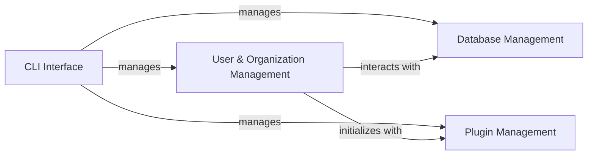

## Component Details

This graph illustrates the core components of the Dispatch platform, focusing on user, organization, and project management, along with foundational services like database interaction, plugin management, and command-line utilities. The central flow involves the CLI Interface managing various aspects of the system, including user and organization data, database operations, and plugin functionalities. The User & Organization Management component, in turn, relies on the Database Management for data persistence and interacts with Plugin Management for initialization and extended functionalities. This structure ensures a clear separation of concerns and modularity within the Dispatch application.

### User & Organization Management
This component is responsible for the comprehensive management of users, organizations, and projects within the Dispatch platform. It handles user authentication, authorization, and role-based access control across organizations and projects. It also manages the full lifecycle (creation, retrieval, update, deletion) of organizations and projects, defining their hierarchical structure and ensuring proper access permissions.

**Related Classes/Methods**:

- <a href="https://github.com/netflix/dispatch/blob/master/src/dispatch/auth/permissions.py#L33-L104" target="_blank" rel="noopener noreferrer">`dispatch.src.dispatch.auth.permissions.BasePermission` (33:104)</a>
- `dispatch.src.dispatch.auth.service` (full file reference)
- <a href="https://github.com/netflix/dispatch/blob/master/src/dispatch/auth/models.py#L53-L103" target="_blank" rel="noopener noreferrer">`dispatch.src.dispatch.auth.models.DispatchUser` (53:103)</a>
- `dispatch.src.dispatch.auth.views` (full file reference)
- <a href="https://github.com/netflix/dispatch/blob/master/src/dispatch/auth/models.py#L179-L189" target="_blank" rel="noopener noreferrer">`dispatch.src.dispatch.auth.models.UserRegister` (179:189)</a>
- <a href="https://github.com/netflix/dispatch/blob/master/src/dispatch/auth/models.py#L262-L275" target="_blank" rel="noopener noreferrer">`dispatch.src.dispatch.auth.models.UserCreate` (262:275)</a>
- `dispatch.src.dispatch.organization.views` (full file reference)
- `dispatch.src.dispatch.organization.service` (full file reference)
- `dispatch.src.dispatch.project.views` (full file reference)
- `dispatch.src.dispatch.project.service` (full file reference)
- `dispatch.src.dispatch.project.flows` (full file reference)
- <a href="https://github.com/netflix/dispatch/blob/master/src/dispatch/auth/permissions.py#L141-L151" target="_blank" rel="noopener noreferrer">`dispatch.src.dispatch.auth.permissions.OrganizationManagerPermission:has_required_permissions` (141:151)</a>
- <a href="https://github.com/netflix/dispatch/blob/master/src/dispatch/auth/permissions.py#L155-L166" target="_blank" rel="noopener noreferrer">`dispatch.src.dispatch.auth.permissions.OrganizationAdminPermission:has_required_permissions` (155:166)</a>
- <a href="https://github.com/netflix/dispatch/blob/master/src/dispatch/auth/permissions.py#L170-L185" target="_blank" rel="noopener noreferrer">`dispatch.src.dispatch.auth.permissions.OrganizationMemberPermission:has_required_permissions` (170:185)</a>
- <a href="https://github.com/netflix/dispatch/blob/master/src/dispatch/auth/permissions.py#L189-L200" target="_blank" rel="noopener noreferrer">`dispatch.src.dispatch.auth.permissions.SensitiveProjectActionPermission:has_required_permissions` (189:200)</a>
- <a href="https://github.com/netflix/dispatch/blob/master/src/dispatch/auth/permissions.py#L204-L227" target="_blank" rel="noopener noreferrer">`dispatch.src.dispatch.auth.permissions.IndividualContactUpdatePermission:has_required_permissions` (204:227)</a>
- <a href="https://github.com/netflix/dispatch/blob/master/src/dispatch/auth/permissions.py#L231-L238" target="_blank" rel="noopener noreferrer">`dispatch.src.dispatch.auth.permissions.ProjectCreatePermission:has_required_permissions` (231:238)</a>
- <a href="https://github.com/netflix/dispatch/blob/master/src/dispatch/auth/permissions.py#L242-L253" target="_blank" rel="noopener noreferrer">`dispatch.src.dispatch.auth.permissions.ProjectUpdatePermission:has_required_permissions` (242:253)</a>
- <a href="https://github.com/netflix/dispatch/blob/master/src/dispatch/auth/permissions.py#L257-L267" target="_blank" rel="noopener noreferrer">`dispatch.src.dispatch.auth.permissions.IncidentJoinOrSubscribePermission:has_required_permissions` (257:267)</a>
- <a href="https://github.com/netflix/dispatch/blob/master/src/dispatch/auth/permissions.py#L271-L291" target="_blank" rel="noopener noreferrer">`dispatch.src.dispatch.auth.permissions.IncidentViewPermission:has_required_permissions` (271:291)</a>
- <a href="https://github.com/netflix/dispatch/blob/master/src/dispatch/auth/permissions.py#L295-L306" target="_blank" rel="noopener noreferrer">`dispatch.src.dispatch.auth.permissions.IncidentEditPermission:has_required_permissions` (295:306)</a>
- <a href="https://github.com/netflix/dispatch/blob/master/src/dispatch/auth/permissions.py#L310-L321" target="_blank" rel="noopener noreferrer">`dispatch.src.dispatch.auth.permissions.IncidentEventPermission:has_required_permissions` (310:321)</a>
- <a href="https://github.com/netflix/dispatch/blob/master/src/dispatch/auth/permissions.py#L325-L340" target="_blank" rel="noopener noreferrer">`dispatch.src.dispatch.auth.permissions.IncidentReporterPermission:has_required_permissions` (325:340)</a>
- <a href="https://github.com/netflix/dispatch/blob/master/src/dispatch/auth/permissions.py#L344-L358" target="_blank" rel="noopener noreferrer">`dispatch.src.dispatch.auth.permissions.IncidentCommanderPermission:has_required_permissions` (344:358)</a>
- <a href="https://github.com/netflix/dispatch/blob/master/src/dispatch/auth/permissions.py#L362-L386" target="_blank" rel="noopener noreferrer">`dispatch.src.dispatch.auth.permissions.IncidentCommanderOrScribePermission:has_required_permissions` (362:386)</a>
- <a href="https://github.com/netflix/dispatch/blob/master/src/dispatch/auth/permissions.py#L390-L405" target="_blank" rel="noopener noreferrer">`dispatch.src.dispatch.auth.permissions.IncidentParticipantPermission:has_required_permissions` (390:405)</a>
- <a href="https://github.com/netflix/dispatch/blob/master/src/dispatch/auth/permissions.py#L412-L431" target="_blank" rel="noopener noreferrer">`dispatch.src.dispatch.auth.permissions.CaseViewPermission:has_required_permissions` (412:431)</a>
- <a href="https://github.com/netflix/dispatch/blob/master/src/dispatch/auth/permissions.py#L435-L445" target="_blank" rel="noopener noreferrer">`dispatch.src.dispatch.auth.permissions.CaseEditPermission:has_required_permissions` (435:445)</a>
- <a href="https://github.com/netflix/dispatch/blob/master/src/dispatch/auth/permissions.py#L449-L459" target="_blank" rel="noopener noreferrer">`dispatch.src.dispatch.auth.permissions.CaseParticipantPermission:has_required_permissions` (449:459)</a>
- <a href="https://github.com/netflix/dispatch/blob/master/src/dispatch/auth/permissions.py#L463-L473" target="_blank" rel="noopener noreferrer">`dispatch.src.dispatch.auth.permissions.CaseJoinPermission:has_required_permissions` (463:473)</a>
- <a href="https://github.com/netflix/dispatch/blob/master/src/dispatch/auth/permissions.py#L477-L503" target="_blank" rel="noopener noreferrer">`dispatch.src.dispatch.auth.permissions.FeedbackDeletePermission:has_required_permissions` (477:503)</a>
- <a href="https://github.com/netflix/dispatch/blob/master/src/dispatch/auth/models.py#L77-L81" target="_blank" rel="noopener noreferrer">`dispatch.src.dispatch.auth.models.DispatchUser:set_password` (77:81)</a>
- <a href="https://github.com/netflix/dispatch/blob/master/src/dispatch/auth/models.py#L83-L86" target="_blank" rel="noopener noreferrer">`dispatch.src.dispatch.auth.models.DispatchUser:is_owner` (83:86)</a>
- <a href="https://github.com/netflix/dispatch/blob/master/src/dispatch/auth/models.py#L186-L189" target="_blank" rel="noopener noreferrer">`dispatch.src.dispatch.auth.models.UserRegister:password_required` (186:189)</a>
- <a href="https://github.com/netflix/dispatch/blob/master/src/dispatch/auth/models.py#L273-L275" target="_blank" rel="noopener noreferrer">`dispatch.src.dispatch.auth.models.UserCreate:hash` (273:275)</a>
- <a href="https://github.com/netflix/dispatch/blob/master/src/dispatch/auth/views.py#L58-L79" target="_blank" rel="noopener noreferrer">`dispatch.src.dispatch.auth.views:get_users` (58:79)</a>
- <a href="https://github.com/netflix/dispatch/blob/master/src/dispatch/auth/views.py#L86-L116" target="_blank" rel="noopener noreferrer">`dispatch.src.dispatch.auth.views:create_user` (86:116)</a>
- <a href="https://github.com/netflix/dispatch/blob/master/src/dispatch/auth/views.py#L120-L129" target="_blank" rel="noopener noreferrer">`dispatch.src.dispatch.auth.views:get_user` (120:129)</a>
- <a href="https://github.com/netflix/dispatch/blob/master/src/dispatch/auth/views.py#L136-L179" target="_blank" rel="noopener noreferrer">`dispatch.src.dispatch.auth.views:update_user` (136:179)</a>
- <a href="https://github.com/netflix/dispatch/blob/master/src/dispatch/auth/views.py#L183-L223" target="_blank" rel="noopener noreferrer">`dispatch.src.dispatch.auth.views:change_password` (183:223)</a>
- <a href="https://github.com/netflix/dispatch/blob/master/src/dispatch/auth/views.py#L227-L258" target="_blank" rel="noopener noreferrer">`dispatch.src.dispatch.auth.views:admin_reset_password` (227:258)</a>
- <a href="https://github.com/netflix/dispatch/blob/master/src/dispatch/auth/views.py#L281-L314" target="_blank" rel="noopener noreferrer">`dispatch.src.dispatch.auth.views:login_user` (281:314)</a>
- <a href="https://github.com/netflix/dispatch/blob/master/src/dispatch/auth/views.py#L317-L337" target="_blank" rel="noopener noreferrer">`dispatch.src.dispatch.auth.views:register_user` (317:337)</a>
- <a href="https://github.com/netflix/dispatch/blob/master/src/dispatch/auth/views.py#L341-L380" target="_blank" rel="noopener noreferrer">`dispatch.src.dispatch.auth.views:mfa_check` (341:380)</a>
- <a href="https://github.com/netflix/dispatch/blob/master/src/dispatch/auth/service.py#L57-L80" target="_blank" rel="noopener noreferrer">`dispatch.src.dispatch.auth.service:create_or_update_project_role` (57:80)</a>
- <a href="https://github.com/netflix/dispatch/blob/master/src/dispatch/auth/service.py#L83-L114" target="_blank" rel="noopener noreferrer">`dispatch.src.dispatch.auth.service:create_or_update_project_default` (83:114)</a>
- <a href="https://github.com/netflix/dispatch/blob/master/src/dispatch/auth/service.py#L117-L145" target="_blank" rel="noopener noreferrer">`dispatch.src.dispatch.auth.service:create_or_update_organization_role` (117:145)</a>
- <a href="https://github.com/netflix/dispatch/blob/master/src/dispatch/auth/service.py#L148-L196" target="_blank" rel="noopener noreferrer">`dispatch.src.dispatch.auth.service:create` (148:196)</a>
- <a href="https://github.com/netflix/dispatch/blob/master/src/dispatch/auth/service.py#L199-L210" target="_blank" rel="noopener noreferrer">`dispatch.src.dispatch.auth.service:get_or_create` (199:210)</a>
- <a href="https://github.com/netflix/dispatch/blob/master/src/dispatch/auth/service.py#L213-L249" target="_blank" rel="noopener noreferrer">`dispatch.src.dispatch.auth.service:update` (213:249)</a>
- <a href="https://github.com/netflix/dispatch/blob/master/src/dispatch/auth/service.py#L252-L271" target="_blank" rel="noopener noreferrer">`dispatch.src.dispatch.auth.service:get_current_user` (252:271)</a>
- <a href="https://github.com/netflix/dispatch/blob/master/src/dispatch/organization/views.py#L33-L35" target="_blank" rel="noopener noreferrer">`dispatch.src.dispatch.organization.views:get_organizations` (33:35)</a>
- <a href="https://github.com/netflix/dispatch/blob/master/src/dispatch/organization/views.py#L42-L92" target="_blank" rel="noopener noreferrer">`dispatch.src.dispatch.organization.views:create_organization` (42:92)</a>
- <a href="https://github.com/netflix/dispatch/blob/master/src/dispatch/organization/views.py#L96-L104" target="_blank" rel="noopener noreferrer">`dispatch.src.dispatch.organization.views:get_organization` (96:104)</a>
- <a href="https://github.com/netflix/dispatch/blob/master/src/dispatch/organization/views.py#L112-L137" target="_blank" rel="noopener noreferrer">`dispatch.src.dispatch.organization.views:update_organization` (112:137)</a>
- <a href="https://github.com/netflix/dispatch/blob/master/src/dispatch/organization/service.py#L22-L36" target="_blank" rel="noopener noreferrer">`dispatch.src.dispatch.organization.service:get_default_or_raise` (22:36)</a>
- <a href="https://github.com/netflix/dispatch/blob/master/src/dispatch/organization/service.py#L44-L60" target="_blank" rel="noopener noreferrer">`dispatch.src.dispatch.organization.service:get_by_name_or_raise` (44:60)</a>
- <a href="https://github.com/netflix/dispatch/blob/master/src/dispatch/organization/service.py#L68-L84" target="_blank" rel="noopener noreferrer">`dispatch.src.dispatch.organization.service:get_by_slug_or_raise` (68:84)</a>
- <a href="https://github.com/netflix/dispatch/blob/master/src/dispatch/organization/service.py#L87-L93" target="_blank" rel="noopener noreferrer">`dispatch.src.dispatch.organization.service:get_by_name_or_default` (87:93)</a>
- <a href="https://github.com/netflix/dispatch/blob/master/src/dispatch/organization/service.py#L101-L112" target="_blank" rel="noopener noreferrer">`dispatch.src.dispatch.organization.service:create` (101:112)</a>
- <a href="https://github.com/netflix/dispatch/blob/master/src/dispatch/organization/service.py#L115-L126" target="_blank" rel="noopener noreferrer">`dispatch.src.dispatch.organization.service:get_or_create` (115:126)</a>
- <a href="https://github.com/netflix/dispatch/blob/master/src/dispatch/organization/service.py#L155-L168" target="_blank" rel="noopener noreferrer">`dispatch.src.dispatch.organization.service:add_user` (155:168)</a>
- <a href="https://github.com/netflix/dispatch/blob/master/src/dispatch/organization/service.py#L12-L14" target="_blank" rel="noopener noreferrer">`dispatch.src.dispatch.organization.service:get` (12:14)</a>
- <a href="https://github.com/netflix/dispatch/blob/master/src/dispatch/organization/service.py#L39-L41" target="_blank" rel="noopener noreferrer">`dispatch.src.dispatch.organization.service:get_by_name` (39:41)</a>
- <a href="https://github.com/netflix/dispatch/blob/master/src/dispatch/organization/service.py#L63-L65" target="_blank" rel="noopener noreferrer">`dispatch.src.dispatch.organization.service:get_by_slug` (63:65)</a>
- <a href="https://github.com/netflix/dispatch/blob/master/src/dispatch/organization/service.py#L129-L145" target="_blank" rel="noopener noreferrer">`dispatch.src.dispatch.organization.service:update` (129:145)</a>
- <a href="https://github.com/netflix/dispatch/blob/master/src/dispatch/project/views.py#L29-L31" target="_blank" rel="noopener noreferrer">`dispatch.src.dispatch.project.views:get_projects` (29:31)</a>
- <a href="https://github.com/netflix/dispatch/blob/master/src/dispatch/project/views.py#L40-L71" target="_blank" rel="noopener noreferrer">`dispatch.src.dispatch.project.views:create_project` (40:71)</a>
- <a href="https://github.com/netflix/dispatch/blob/master/src/dispatch/project/views.py#L79-L87" target="_blank" rel="noopener noreferrer">`dispatch.src.dispatch.project.views:get_project` (79:87)</a>
- <a href="https://github.com/netflix/dispatch/blob/master/src/dispatch/project/views.py#L95-L108" target="_blank" rel="noopener noreferrer">`dispatch.src.dispatch.project.views:update_project` (95:108)</a>
- <a href="https://github.com/netflix/dispatch/blob/master/src/dispatch/project/views.py#L116-L124" target="_blank" rel="noopener noreferrer">`dispatch.src.dispatch.project.views:delete_project` (116:124)</a>
- <a href="https://github.com/netflix/dispatch/blob/master/src/dispatch/project/service.py#L19-L33" target="_blank" rel="noopener noreferrer">`dispatch.src.dispatch.project.service:get_default_or_raise` (19:33)</a>
- <a href="https://github.com/netflix/dispatch/blob/master/src/dispatch/project/service.py#L41-L56" target="_blank" rel="noopener noreferrer">`dispatch.src.dispatch.project.service:get_by_name_or_raise` (41:56)</a>
- <a href="https://github.com/netflix/dispatch/blob/master/src/dispatch/project/service.py#L59-L65" target="_blank" rel="noopener noreferrer">`dispatch.src.dispatch.project.service:get_by_name_or_default` (59:65)</a>
- <a href="https://github.com/netflix/dispatch/blob/master/src/dispatch/project/service.py#L73-L87" target="_blank" rel="noopener noreferrer">`dispatch.src.dispatch.project.service:create` (73:87)</a>
- <a href="https://github.com/netflix/dispatch/blob/master/src/dispatch/project/service.py#L90-L100" target="_blank" rel="noopener noreferrer">`dispatch.src.dispatch.project.service:get_or_create` (90:100)</a>
- <a href="https://github.com/netflix/dispatch/blob/master/src/dispatch/project/service.py#L9-L11" target="_blank" rel="noopener noreferrer">`dispatch.src.dispatch.project.service:get` (9:11)</a>
- <a href="https://github.com/netflix/dispatch/blob/master/src/dispatch/project/service.py#L103-L114" target="_blank" rel="noopener noreferrer">`dispatch.src.dispatch.project.service:update` (103:114)</a>
- <a href="https://github.com/netflix/dispatch/blob/master/src/dispatch/project/service.py#L117-L121" target="_blank" rel="noopener noreferrer">`dispatch.src.dispatch.project.service:delete` (117:121)</a>
- <a href="https://github.com/netflix/dispatch/blob/master/src/dispatch/project/flows.py#L32-L155" target="_blank" rel="noopener noreferrer">`dispatch.src.dispatch.project.flows:project_init_flow` (32:155)</a>

### CLI Interface
This component provides command-line utilities for managing various aspects of the Dispatch system, including user registration and updates, database operations (init, restore, dump, drop, upgrade, merge, heads, history, downgrade, stamp, revision), plugin management (list, install, uninstall), scheduler control (list, start), server operations (routes, config, develop), and signal consumption and processing. It acts as the primary interface for administrative and development tasks.

**Related Classes/Methods**:

- `dispatch.src.dispatch.cli:dispatch_user` (full file reference)
- `dispatch.src.dispatch.cli:register_user` (full file reference)
- `dispatch.src.dispatch.cli:update_user` (full file reference)
- `dispatch.src.dispatch.cli:reset_user_password` (full file reference)
- `dispatch.src.dispatch.cli:dispatch_database` (full file reference)
- `dispatch.src.dispatch.cli:database_init` (full file reference)
- `dispatch.src.dispatch.cli:restore_database` (full file reference)
- `dispatch.src.dispatch.cli:dump_database` (full file reference)
- `dispatch.src.dispatch.cli:drop_database` (full file reference)
- `dispatch.src.dispatch.cli:upgrade_database` (full file reference)
- `dispatch.src.dispatch.cli:merge_revisions` (full file reference)
- `dispatch.src.dispatch.cli:head_database` (full file reference)
- `dispatch.src.dispatch.cli:history_database` (full file reference)
- `dispatch.src.dispatch.cli:downgrade_database` (full file reference)
- `dispatch.src.dispatch.cli:stamp_database` (full file reference)
- `dispatch.src.dispatch.cli:revision_database` (full file reference)
- `dispatch.src.dispatch.cli:dispatch_scheduler` (full file reference)
- `dispatch.src.dispatch.cli:list_tasks` (full file reference)
- `dispatch.src.dispatch.cli:start_tasks` (full file reference)
- `dispatch.src.dispatch.cli:dispatch_server` (full file reference)
- `dispatch.src.dispatch.cli:show_routes` (full file reference)
- `dispatch.src.dispatch.cli:show_config` (full file reference)
- `dispatch.src.dispatch.cli:run_server` (full file reference)
- `dispatch.src.dispatch.cli:signals_group` (full file reference)
- `dispatch.src.dispatch.cli:consume_signals` (full file reference)
- `dispatch.src.dispatch.cli:process_signals` (full file reference)

### Database Management
This component provides core functionalities for interacting with the database, including session management, generic search, filter, sort, and paginate operations, and schema initialization and migration. It serves as the foundational layer for data persistence across the Dispatch application.

**Related Classes/Methods**:

- <a href="https://github.com/netflix/dispatch/blob/master/src/dispatch/database/core.py#L229-L240" target="_blank" rel="noopener noreferrer">`dispatch.database.core.refetch_db_session` (229:240)</a>
- <a href="https://github.com/netflix/dispatch/blob/master/src/dispatch/database/service.py#L658-L760" target="_blank" rel="noopener noreferrer">`dispatch.database.service.search_filter_sort_paginate` (658:760)</a>
- <a href="https://github.com/netflix/dispatch/blob/master/src/dispatch/database/manage.py#L137-L170" target="_blank" rel="noopener noreferrer">`dispatch.database.manage.init_schema` (137:170)</a>

### Plugin Management
This component is responsible for managing plugins within the Dispatch system. It allows for listing, installing, and uninstalling plugins, and provides services for retrieving active plugin instances. Plugins extend the functionality of Dispatch by integrating with external services or providing custom behaviors.

**Related Classes/Methods**:

- <a href="https://github.com/netflix/dispatch/blob/master/src/dispatch/plugin/service.py#L52-L63" target="_blank" rel="noopener noreferrer">`dispatch.plugin.service.get_active_instance` (52:63)</a>
- <a href="https://github.com/netflix/dispatch/blob/master/src/dispatch/plugin/service.py#L33-L35" target="_blank" rel="noopener noreferrer">`dispatch.plugin.service.get_all` (33:35)</a>
- <a href="https://github.com/netflix/dispatch/blob/master/src/dispatch/plugin/service.py#L108-L125" target="_blank" rel="noopener noreferrer">`dispatch.plugin.service.create_instance` (108:125)</a>

### [FAQ](https://github.com/CodeBoarding/GeneratedOnBoardings/tree/main?tab=readme-ov-file#faq)