```mermaid
graph LR
    Core_Application_Infrastructure["Core Application & Infrastructure"]
    Security_Incident_Case_Management["Security Incident & Case Management"]
    Data_Integration_Layer["Data & Integration Layer"]
    User_Organization_Management["User & Organization Management"]
    Operational_Intelligence_Communication["Operational Intelligence & Communication"]
    Core_Application_Infrastructure -- "manages" --> User_Organization_Management
    Core_Application_Infrastructure -- "orchestrates" --> Security_Incident_Case_Management
    Core_Application_Infrastructure -- "utilizes" --> Data_Integration_Layer
    Core_Application_Infrastructure -- "receives feedback from" --> Operational_Intelligence_Communication
    Security_Incident_Case_Management -- "persists data via" --> Data_Integration_Layer
    Security_Incident_Case_Management -- "leverages" --> Data_Integration_Layer
    Security_Incident_Case_Management -- "communicates via" --> Operational_Intelligence_Communication
    Security_Incident_Case_Management -- "governed by" --> User_Organization_Management
    Data_Integration_Layer -- "supports" --> Core_Application_Infrastructure
    Data_Integration_Layer -- "provides services to" --> Security_Incident_Case_Management
    Data_Integration_Layer -- "integrates with" --> Operational_Intelligence_Communication
    Data_Integration_Layer -- "stores data for" --> User_Organization_Management
    User_Organization_Management -- "defines access for" --> Security_Incident_Case_Management
    User_Organization_Management -- "managed by" --> Core_Application_Infrastructure
    User_Organization_Management -- "persists data via" --> Data_Integration_Layer
    Operational_Intelligence_Communication -- "informs" --> Security_Incident_Case_Management
    Operational_Intelligence_Communication -- "integrates with" --> Data_Integration_Layer
    Operational_Intelligence_Communication -- "provides insights to" --> Core_Application_Infrastructure
    click Core_Application_Infrastructure href "https://github.com/CodeBoarding/GeneratedOnBoardings/blob/main/dispatch/Core Application & Infrastructure.md" "Details"
    click Security_Incident_Case_Management href "https://github.com/CodeBoarding/GeneratedOnBoardings/blob/main/dispatch/Security Incident & Case Management.md" "Details"
    click Data_Integration_Layer href "https://github.com/CodeBoarding/GeneratedOnBoardings/blob/main/dispatch/Data & Integration Layer.md" "Details"
    click User_Organization_Management href "https://github.com/CodeBoarding/GeneratedOnBoardings/blob/main/dispatch/User & Organization Management.md" "Details"
    click Operational_Intelligence_Communication href "https://github.com/CodeBoarding/GeneratedOnBoardings/blob/main/dispatch/Operational Intelligence & Communication.md" "Details"
```

## Component Details

The Dispatch application provides a comprehensive platform for managing security incidents and cases. Its main flow involves ingesting signals, creating and managing incidents/cases, automating workflows and tasks, facilitating communication, and integrating with various external services. The purpose is to streamline security operations, improve response times, and provide a centralized system for tracking and resolving security events.

### Core Application & Infrastructure
Provides the foundational structure for the Dispatch application, including command-line interfaces, application-wide decorators, metrics collection, scheduling services, and overall application setup. It orchestrates the main application flow and manages core services.

**Related Classes/Methods**:

- `dispatch.src.dispatch.main` (full file reference)
- `dispatch.src.dispatch.cli` (full file reference)
- `dispatch.src.dispatch.decorators` (full file reference)
- `dispatch.src.dispatch.scheduler` (full file reference)
- `dispatch.src.dispatch.metrics` (full file reference)
- `dispatch.src.dispatch.logging` (full file reference)
- `dispatch.src.dispatch.extensions` (full file reference)
- `dispatch.src.dispatch.common.utils.cli` (full file reference)
- <a href="https://github.com/netflix/dispatch/blob/master/src/dispatch/common/managers.py#L17-L75" target="_blank" rel="noopener noreferrer">`dispatch.src.dispatch.common.managers.InstanceManager` (17:75)</a>
- `dispatch.utils.github_utils` (full file reference)
- <a href="https://github.com/netflix/dispatch/blob/master/setup.py#L23-L194" target="_blank" rel="noopener noreferrer">`dispatch.setup.BaseBuildCommand` (23:194)</a>
- <a href="https://github.com/netflix/dispatch/blob/master/setup.py#L197-L332" target="_blank" rel="noopener noreferrer">`dispatch.setup.BuildAssetsCommand` (197:332)</a>

### Security Incident & Case Management
The central domain component for managing security incidents and cases. It handles their creation, updates, status transitions, role assignments, cost tracking, reporting, and related entities like severity and priority. It also manages participants and contacts involved in these processes.

**Related Classes/Methods**:

- `dispatch.src.dispatch.incident.service` (full file reference)
- `dispatch.src.dispatch.incident.flows` (full file reference)
- `dispatch.src.dispatch.incident.messaging` (full file reference)
- `dispatch.src.dispatch.incident.scheduled` (full file reference)
- `dispatch.src.dispatch.case.service` (full file reference)
- `dispatch.src.dispatch.case.flows` (full file reference)
- `dispatch.src.dispatch.case.messaging` (full file reference)
- `dispatch.src.dispatch.case.scheduled` (full file reference)
- `dispatch.src.dispatch.report.service` (full file reference)
- `dispatch.src.dispatch.incident_cost.service` (full file reference)
- `dispatch.src.dispatch.case_cost.service` (full file reference)
- `dispatch.src.dispatch.incident.type.service` (full file reference)
- `dispatch.src.dispatch.incident.severity.service` (full file reference)
- `dispatch.src.dispatch.incident.priority.service` (full file reference)
- `dispatch.src.dispatch.case.type.service` (full file reference)
- `dispatch.src.dispatch.case.severity.service` (full file reference)
- `dispatch.src.dispatch.case.priority.service` (full file reference)
- `dispatch.src.dispatch.incident_role.views` (full file reference)
- `dispatch.src.dispatch.incident_role.service` (full file reference)
- `dispatch.src.dispatch.incident_cost.scheduled` (full file reference)
- `dispatch.src.dispatch.incident_cost.views` (full file reference)
- `dispatch.src.dispatch.incident.metrics` (full file reference)
- `dispatch.src.dispatch.incident.views` (full file reference)
- `dispatch.src.dispatch.report.messaging` (full file reference)
- `dispatch.src.dispatch.report.scheduled` (full file reference)
- `dispatch.src.dispatch.report.flows` (full file reference)
- `src.dispatch.case_cost.scheduled` (full file reference)
- `src.dispatch.case_cost.views` (full file reference)
- `src.dispatch.case_cost.service` (full file reference)
- `src.dispatch.case_cost_type.views` (full file reference)
- `src.dispatch.case_cost_type.service` (full file reference)
- `dispatch.src.dispatch.case.views` (full file reference)
- `dispatch.src.dispatch.participant_role.service` (full file reference)
- `dispatch.src.dispatch.participant_role.flows` (full file reference)
- `dispatch.src.dispatch.participant_activity.service` (full file reference)
- `dispatch.src.dispatch.participant.service` (full file reference)
- `dispatch.src.dispatch.participant.flows` (full file reference)
- `dispatch.src.dispatch.individual.views` (full file reference)
- `dispatch.src.dispatch.individual.service` (full file reference)
- `dispatch.src.dispatch.group.service` (full file reference)
- `dispatch.src.dispatch.group.flows` (full file reference)
- `dispatch.src.dispatch.team.views` (full file reference)
- `dispatch.src.dispatch.team.service` (full file reference)

### Data & Integration Layer
Manages all data persistence, retrieval, and search functionalities, including database interactions, full-text search, filtering, and categorization via tags and terms. It also provides a flexible plugin framework for integrating with various external services and systems, handling workflows, tasks, documents, storage, and external ticketing/on-call systems.

**Related Classes/Methods**:

- `dispatch.src.dispatch.database.manage` (full file reference)
- `dispatch.src.dispatch.database.service` (full file reference)
- `dispatch.src.dispatch.database.core` (full file reference)
- `dispatch.src.dispatch.search.views` (full file reference)
- <a href="https://github.com/netflix/dispatch/blob/master/src/dispatch/search/fulltext/composite_search.py#L44-L111" target="_blank" rel="noopener noreferrer">`dispatch.src.dispatch.search.fulltext.composite_search.CompositeSearch` (44:111)</a>
- `dispatch.src.dispatch.search_filter.service` (full file reference)
- `dispatch.src.dispatch.tag.service` (full file reference)
- `dispatch.src.dispatch.term.service` (full file reference)
- `dispatch.src.dispatch.definition.service` (full file reference)
- `dispatch.src.dispatch.search.fulltext.SearchQueryMixin` (full file reference)
- `dispatch.src.dispatch.search.fulltext` (full file reference)
- `dispatch.src.dispatch.search.fulltext.SQLConstruct` (full file reference)
- `dispatch.src.dispatch.search.fulltext.SearchManager` (full file reference)
- <a href="https://github.com/netflix/dispatch/blob/master/src/dispatch/search_filter/permissions.py#L9-L35" target="_blank" rel="noopener noreferrer">`dispatch.src.dispatch.search_filter.permissions.SearchFilterEditDeletePermission` (9:35)</a>
- `dispatch.src.dispatch.search_filter.views` (full file reference)
- `dispatch.src.dispatch.tag.scheduled` (full file reference)
- `dispatch.src.dispatch.tag.views` (full file reference)
- `dispatch.src.dispatch.tag.recommender` (full file reference)
- `dispatch.src.dispatch.tag_type.views` (full file reference)
- `dispatch.src.dispatch.tag_type.service` (full file reference)
- `dispatch.src.dispatch.term.scheduled` (full file reference)
- `dispatch.src.dispatch.term.views` (full file reference)
- `dispatch.src.dispatch.workflow.service` (full file reference)
- `dispatch.src.dispatch.workflow.flows` (full file reference)
- `dispatch.src.dispatch.task.service` (full file reference)
- `dispatch.src.dispatch.task.flows` (full file reference)
- <a href="https://github.com/netflix/dispatch/blob/master/src/dispatch/plugins/base/manager.py#L17-L66" target="_blank" rel="noopener noreferrer">`dispatch.src.dispatch.plugins.base.manager.PluginManager` (17:66)</a>
- `dispatch.src.dispatch.plugin.service` (full file reference)
- <a href="https://github.com/netflix/dispatch/blob/master/src/dispatch/plugins/dispatch_slack/plugin.py#L74-L492" target="_blank" rel="noopener noreferrer">`dispatch.src.dispatch.plugins.dispatch_slack.plugin.SlackConversationPlugin` (74:492)</a>
- <a href="https://github.com/netflix/dispatch/blob/master/src/dispatch/plugins/dispatch_google/drive/plugin.py#L50-L133" target="_blank" rel="noopener noreferrer">`dispatch.src.dispatch.plugins.dispatch_google.drive.plugin.GoogleDriveStoragePlugin` (50:133)</a>
- `dispatch.src.dispatch.plugins.dispatch_jira.plugin` (full file reference)
- <a href="https://github.com/netflix/dispatch/blob/master/src/dispatch/plugins/dispatch_opsgenie/plugin.py#L34-L62" target="_blank" rel="noopener noreferrer">`dispatch.src.dispatch.plugins.dispatch_opsgenie.plugin.OpsGenieOncallPlugin` (34:62)</a>
- <a href="https://github.com/netflix/dispatch/blob/master/src/dispatch/plugins/dispatch_core/plugin.py#L234-L360" target="_blank" rel="noopener noreferrer">`dispatch.src.dispatch.plugins.dispatch_core.plugin.DispatchTicketPlugin` (234:360)</a>
- <a href="https://github.com/netflix/dispatch/blob/master/src/dispatch/plugins/dispatch_github/plugin.py#L49-L110" target="_blank" rel="noopener noreferrer">`dispatch.src.dispatch.plugins.dispatch_github.plugin.GithubMonitorPlugin` (49:110)</a>
- <a href="https://github.com/netflix/dispatch/blob/master/src/dispatch/plugins/dispatch_duo/plugin.py#L33-L120" target="_blank" rel="noopener noreferrer">`dispatch.src.dispatch.plugins.dispatch_duo.plugin.DuoMfaPlugin` (33:120)</a>
- `dispatch.src.dispatch.plugins.dispatch_zoom.plugin` (full file reference)
- <a href="https://github.com/netflix/dispatch/blob/master/src/dispatch/plugins/dispatch_zoom/plugin.py#L56-L101" target="_blank" rel="noopener noreferrer">`dispatch.src.dispatch.plugins.dispatch_zoom.plugin.ZoomConferencePlugin` (56:101)</a>
- <a href="https://github.com/netflix/dispatch/blob/master/src/dispatch/plugins/dispatch_zoom/client.py#L11-L50" target="_blank" rel="noopener noreferrer">`dispatch.src.dispatch.plugins.dispatch_zoom.client.ZoomClient` (11:50)</a>
- <a href="https://github.com/netflix/dispatch/blob/master/src/dispatch/plugins/dispatch_test/conversation.py#L15-L40" target="_blank" rel="noopener noreferrer">`dispatch.src.dispatch.plugins.dispatch_test.conversation.TestConversationPlugin` (15:40)</a>
- `dispatch.src.dispatch.plugins.dispatch_opsgenie.service` (full file reference)
- <a href="https://github.com/netflix/dispatch/blob/master/src/dispatch/plugins/dispatch_google/gmail/plugin.py#L67-L121" target="_blank" rel="noopener noreferrer">`dispatch.src.dispatch.plugins.dispatch_google.gmail.plugin.GoogleGmailEmailPlugin` (67:121)</a>
- `dispatch.src.dispatch.plugins.dispatch_google.drive.drive` (full file reference)
- <a href="https://github.com/netflix/dispatch/blob/master/src/dispatch/plugins/dispatch_google/drive/plugin.py#L50-L133" target="_blank" rel="noopener noreferrer">`dispatch.src.dispatch.plugins.dispatch_google.drive.plugin.GoogleDriveStoragePlugin` (50:133)</a>
- <a href="https://github.com/netflix/dispatch/blob/master/src/dispatch/plugins/dispatch_google/drive/plugin.py#L136-L177" target="_blank" rel="noopener noreferrer">`dispatch.src.dispatch.plugins.dispatch_google.drive.plugin.GoogleDriveTaskPlugin` (136:177)</a>
- `dispatch.src.dispatch.plugins.dispatch_google.drive.task` (full file reference)
- `dispatch.src.dispatch.plugins.dispatch_google.docs.plugin` (full file reference)
- <a href="https://github.com/netflix/dispatch/blob/master/src/dispatch/plugins/dispatch_google/docs/plugin.py#L159-L306" target="_blank" rel="noopener noreferrer">`dispatch.src.dispatch.plugins.dispatch_google.docs.plugin.GoogleDocsDocumentPlugin` (159:306)</a>
- `dispatch.src.dispatch.plugins.dispatch_google.groups.plugin` (full file reference)
- <a href="https://github.com/netflix/dispatch/blob/master/src/dispatch/plugins/dispatch_google/groups/plugin.py#L130-L195" target="_blank" rel="noopener noreferrer">`dispatch.src.dispatch.plugins.dispatch_google.groups.plugin.GoogleGroupParticipantGroupPlugin` (130:195)</a>
- `dispatch.src.dispatch.plugins.dispatch_google.calendar.plugin` (full file reference)
- <a href="https://github.com/netflix/dispatch/blob/master/src/dispatch/plugins/dispatch_google/calendar/plugin.py#L125-L171" target="_blank" rel="noopener noreferrer">`dispatch.src.dispatch.plugins.dispatch_google.calendar.plugin.GoogleCalendarConferencePlugin` (125:171)</a>
- <a href="https://github.com/netflix/dispatch/blob/master/src/dispatch/plugins/dispatch_microsoft_teams/conference/plugin.py#L13-L46" target="_blank" rel="noopener noreferrer">`dispatch.src.dispatch.plugins.dispatch_microsoft_teams.conference.plugin.MicrosoftTeamsConferencePlugin` (13:46)</a>
- <a href="https://github.com/netflix/dispatch/blob/master/src/dispatch/plugins/dispatch_microsoft_teams/conference/client.py#L10-L75" target="_blank" rel="noopener noreferrer">`dispatch.src.dispatch.plugins.dispatch_microsoft_teams.conference.client.MSTeamsClient` (10:75)</a>
- <a href="https://github.com/netflix/dispatch/blob/master/src/dispatch/plugins/dispatch_pagerduty/plugin.py#L50-L142" target="_blank" rel="noopener noreferrer">`dispatch.src.dispatch.plugins.dispatch_pagerduty.plugin.PagerDutyOncallPlugin` (50:142)</a>
- `dispatch.src.dispatch.plugins.dispatch_pagerduty.service` (full file reference)
- <a href="https://github.com/netflix/dispatch/blob/master/src/dispatch/plugins/dispatch_atlassian_confluence/plugin.py#L41-L138" target="_blank" rel="noopener noreferrer">`dispatch.src.dispatch.plugins.dispatch_atlassian_confluence.plugin.ConfluencePagePlugin` (41:138)</a>
- <a href="https://github.com/netflix/dispatch/blob/master/src/dispatch/plugins/dispatch_atlassian_confluence/docs/plugin.py#L30-L51" target="_blank" rel="noopener noreferrer">`dispatch.src.dispatch.plugins.dispatch_atlassian_confluence.docs.plugin.ConfluencePageDocPlugin` (30:51)</a>
- <a href="https://github.com/netflix/dispatch/blob/master/src/dispatch/plugins/dispatch_aws/plugin.py#L45-L155" target="_blank" rel="noopener noreferrer">`dispatch.src.dispatch.plugins.dispatch_aws.plugin.AWSSQSSignalConsumerPlugin` (45:155)</a>
- `dispatch.src.dispatch.plugins.dispatch_slack.messaging` (full file reference)
- `dispatch.src.dispatch.plugins.dispatch_slack.endpoints` (full file reference)
- <a href="https://github.com/netflix/dispatch/blob/master/src/dispatch/plugins/dispatch_slack/events.py#L19-L41" target="_blank" rel="noopener noreferrer">`dispatch.src.dispatch.plugins.dispatch_slack.events.ChannelActivityEvent` (19:41)</a>
- <a href="https://github.com/netflix/dispatch/blob/master/src/dispatch/plugins/dispatch_slack/events.py#L44-L67" target="_blank" rel="noopener noreferrer">`dispatch.src.dispatch.plugins.dispatch_slack.events.ThreadActivityEvent` (44:67)</a>
- `dispatch.src.dispatch.plugins.dispatch_slack.service` (full file reference)
- `dispatch.src.dispatch.plugins.dispatch_slack.middleware` (full file reference)
- `dispatch.src.dispatch.plugins.dispatch_slack.bolt` (full file reference)
- `dispatch.src.dispatch.plugins.dispatch_slack.workflow` (full file reference)
- `dispatch.src.dispatch.plugins.dispatch_slack.fields` (full file reference)
- `src.dispatch.plugins.dispatch_slack.feedback.interactive` (full file reference)
- `src.dispatch.plugins.dispatch_slack.case.messages` (full file reference)
- `src.dispatch.plugins.dispatch_slack.case.interactive` (full file reference)
- `src.dispatch.plugins.dispatch_slack.incident.interactive` (full file reference)
- <a href="https://github.com/netflix/dispatch/blob/master/src/dispatch/plugins/dispatch_core/plugin.py#L174-L231" target="_blank" rel="noopener noreferrer">`dispatch.src.dispatch.plugins.dispatch_core.plugin.AwsAlbAuthProviderPlugin` (174:231)</a>
- <a href="https://github.com/netflix/dispatch/blob/master/src/dispatch/plugins/dispatch_core/plugin.py#L363-L475" target="_blank" rel="noopener noreferrer">`dispatch.src.dispatch.plugins.dispatch_core.plugin.DispatchMfaPlugin` (363:475)</a>
- <a href="https://github.com/netflix/dispatch/blob/master/src/dispatch/plugins/dispatch_core/plugin.py#L478-L497" target="_blank" rel="noopener noreferrer">`dispatch.src.dispatch.plugins.dispatch_core.plugin.DispatchContactPlugin` (478:497)</a>
- <a href="https://github.com/netflix/dispatch/blob/master/src/dispatch/plugins/dispatch_core/plugin.py#L500-L592" target="_blank" rel="noopener noreferrer">`dispatch.src.dispatch.plugins.dispatch_core.plugin.DispatchParticipantResolverPlugin` (500:592)</a>
- <a href="https://github.com/netflix/dispatch/blob/master/src/dispatch/plugin/models.py#L31-L65" target="_blank" rel="noopener noreferrer">`dispatch.src.dispatch.plugin.models.Plugin` (31:65)</a>
- <a href="https://github.com/netflix/dispatch/blob/master/src/dispatch/plugin/models.py#L88-L156" target="_blank" rel="noopener noreferrer">`dispatch.src.dispatch.plugin.models.PluginInstance` (88:156)</a>
- `dispatch.src.dispatch.plugin.views` (full file reference)
- `dispatch.src.dispatch.task.scheduled` (full file reference)
- `dispatch.src.dispatch.task.views` (full file reference)
- `dispatch.src.dispatch.workflow.scheduled` (full file reference)
- `dispatch.src.dispatch.workflow.views` (full file reference)
- `dispatch.src.dispatch.ticket.service` (full file reference)
- `dispatch.src.dispatch.ticket.flows` (full file reference)
- `dispatch.src.dispatch.document.scheduled` (full file reference)
- `dispatch.src.dispatch.document.views` (full file reference)
- `dispatch.src.dispatch.document.service` (full file reference)
- `dispatch.src.dispatch.document.flows` (full file reference)
- `dispatch.src.dispatch.storage.service` (full file reference)
- `dispatch.src.dispatch.storage.flows` (full file reference)
- `dispatch.src.dispatch.service.views` (full file reference)
- `dispatch.src.dispatch.service.service` (full file reference)
- `dispatch.src.dispatch.service.flows` (full file reference)
- `src.dispatch.database.revisions.tenant.env` (full file reference)
- `src.dispatch.database.revisions.tenant.versions.2021-11-18_ce5c4ac967d8` (full file reference)
- `src.dispatch.database.revisions.tenant.versions.2023-03-09_7db13bf5c5d7` (full file reference)
- `src.dispatch.database.revisions.tenant.versions.2023-04-10_61a861559de9` (full file reference)
- `src.dispatch.database.revisions.tenant.versions.2021-08-09_b73416df5744` (full file reference)
- `src.dispatch.database.revisions.tenant.versions.2024-09-23_32652e0360dd` (full file reference)
- `src.dispatch.database.revisions.tenant.versions.2023-03-03_7ddae3ba7822` (full file reference)
- `src.dispatch.database.revisions.tenant.versions.2024-10-25_24322617ce9a` (full file reference)
- `src.dispatch.database.revisions.tenant.versions.2022-10-19_3b0f5b81376f` (full file reference)
- `src.dispatch.database.revisions.tenant.versions.2023-03-27_d1b5ed66d83d` (full file reference)
- `src.dispatch.database.revisions.tenant.versions.2022-05-23_748744207122` (full file reference)
- `src.dispatch.database.revisions.tenant.versions.2021-09-16_3820a792d88a` (full file reference)
- `src.dispatch.database.revisions.tenant.versions.2023-01-30_e4b4991dddcd` (full file reference)

### User & Organization Management
Manages user authentication, authorization, and permissions, as well as the creation, retrieval, update, and deletion of projects and organizations within the Dispatch platform. It defines the hierarchical structure and access control for these entities.

**Related Classes/Methods**:

- <a href="https://github.com/netflix/dispatch/blob/master/src/dispatch/auth/permissions.py#L33-L104" target="_blank" rel="noopener noreferrer">`dispatch.src.dispatch.auth.permissions.BasePermission` (33:104)</a>
- `dispatch.src.dispatch.auth.service` (full file reference)
- <a href="https://github.com/netflix/dispatch/blob/master/src/dispatch/auth/models.py#L53-L103" target="_blank" rel="noopener noreferrer">`dispatch.src.dispatch.auth.models.DispatchUser` (53:103)</a>
- `dispatch.src.dispatch.auth.views` (full file reference)
- <a href="https://github.com/netflix/dispatch/blob/master/src/dispatch/auth/models.py#L179-L189" target="_blank" rel="noopener noreferrer">`dispatch.src.dispatch.auth.models.UserRegister` (179:189)</a>
- <a href="https://github.com/netflix/dispatch/blob/master/src/dispatch/auth/models.py#L262-L275" target="_blank" rel="noopener noreferrer">`dispatch.src.dispatch.auth.models.UserCreate` (262:275)</a>
- `dispatch.src.dispatch.organization.views` (full file reference)
- `dispatch.src.dispatch.organization.service` (full file reference)
- `dispatch.src.dispatch.project.views` (full file reference)
- `dispatch.src.dispatch.project.service` (full file reference)
- `dispatch.src.dispatch.project.flows` (full file reference)

### Operational Intelligence & Communication
Focuses on processing external security signals, integrating with AI services for insights, managing data sources, monitoring system health, and handling feedback collection. It also encompasses all communication channels and notification mechanisms within the platform.

**Related Classes/Methods**:

- `dispatch.src.dispatch.signal.views` (full file reference)
- `dispatch.src.dispatch.signal.service` (full file reference)
- `dispatch.src.dispatch.signal.flows` (full file reference)
- `src.dispatch.ai.service` (full file reference)
- `src.dispatch.data.source.scheduled` (full file reference)
- `src.dispatch.data.source.views` (full file reference)
- `src.dispatch.data.source.service` (full file reference)
- `src.dispatch.data.source.transport.views` (full file reference)
- `src.dispatch.data.source.transport.service` (full file reference)
- `src.dispatch.data.source.type.views` (full file reference)
- `src.dispatch.data.source.type.service` (full file reference)
- `src.dispatch.data.source.status.views` (full file reference)
- `src.dispatch.data.source.status.service` (full file reference)
- `src.dispatch.data.source.environment.views` (full file reference)
- `src.dispatch.data.source.environment.service` (full file reference)
- `src.dispatch.data.source.data_format.views` (full file reference)
- `src.dispatch.data.source.data_format.service` (full file reference)
- `src.dispatch.data.alert.service` (full file reference)
- `src.dispatch.data.query.views` (full file reference)
- `src.dispatch.data.query.service` (full file reference)
- `src.dispatch.monitor.scheduled` (full file reference)
- `src.dispatch.monitor.service` (full file reference)
- `src.dispatch.monitor.flows` (full file reference)
- `src.dispatch.evergreen.scheduled` (full file reference)
- `src.dispatch.forms.views` (full file reference)
- `src.dispatch.forms.service` (full file reference)
- `src.dispatch.forms.type.views` (full file reference)
- `src.dispatch.forms.type.service` (full file reference)
- `dispatch.src.dispatch.conversation.messaging` (full file reference)
- `dispatch.src.dispatch.conversation.service` (full file reference)
- `dispatch.src.dispatch.conversation.flows` (full file reference)
- `dispatch.src.dispatch.notification.views` (full file reference)
- `dispatch.src.dispatch.notification.service` (full file reference)
- `src.dispatch.feedback.service.messaging` (full file reference)
- `src.dispatch.feedback.service.scheduled` (full file reference)
- `src.dispatch.feedback.service.views` (full file reference)
- `src.dispatch.feedback.incident.messaging` (full file reference)
- `src.dispatch.feedback.incident.scheduled` (full file reference)
- `src.dispatch.feedback.incident.views` (full file reference)
- `src.dispatch.feedback.incident.service` (full file reference)

### [FAQ](https://github.com/CodeBoarding/GeneratedOnBoardings/tree/main?tab=readme-ov-file#faq)