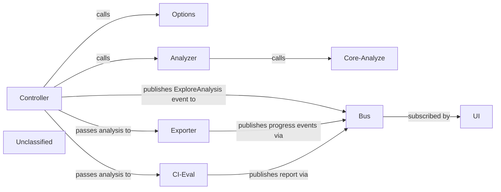

## Details

The CLI Command & Presentation subsystem orchestrates a Docker‑image analysis workflow. The Controller (root Cobra command) loads configuration via the Options component, resolves the target image, and invokes the Analyzer, which in turn calls the pure Core‑Analyze domain logic to compute layer‑wise size‑efficiency metrics. Once the analysis is ready, the Controller publishes a single ExploreAnalysis event on the lightweight Event Bus. The UI component subscribes to this event and renders an interactive terminal view. In parallel, the Controller may invoke the Exporter to write a JSON dump or the CI‑Evaluator to enforce policy thresholds; both emit progress and textual reports through the same bus but never consume the ExploreAnalysis event. The bus thus acts solely as a decoupling mechanism for progress reporting and for delivering the final analysis payload to the UI, keeping the core orchestration simple and the UI loosely coupled.

### Controller
Parses CLI flags, loads options, resolves the image, drives the overall flow (analysis → export / CI / UI).

**Related Classes/Methods**:

- <a href="https://github.com/wagoodman/dive/blob/main/cmd/dive/cli/internal/command/root.go" target="_blank" rel="noopener noreferrer">`cmd.dive.cli.internal.command.Root`</a>

### Options
Reads .dive.yaml, environment variables and CLI flags; validates and normalises them.

**Related Classes/Methods**:

- <a href="https://github.com/wagoodman/dive/blob/main/cmd/dive/cli/internal/options/analysis.go" target="_blank" rel="noopener noreferrer">`cmd.dive.cli.internal.options.Analysis`</a>

### Analyzer
Thin façade that invokes Core‑Analyze, wraps the call in a progress task (bus.StartTask). Returns the analysis payload.

**Related Classes/Methods**:

- <a href="https://github.com/wagoodman/dive/blob/main/cmd/dive/cli/internal/command/adapter/analyzer.go" target="_blank" rel="noopener noreferrer">`cmd.dive.cli.internal.command.adapter.Analyzer`</a>

### Core-Analyze
Pure domain logic: walks the image manifest, builds per‑layer file‑trees, computes efficiency metrics, returns an immutable image.Analysis.

**Related Classes/Methods**:

- <a href="https://github.com/wagoodman/dive/blob/main/dive/image/analysis.go#L20-L47" target="_blank" rel="noopener noreferrer">`dive.image.analysis.Analyze`:20-47</a>

### CI-Eval
Executes CI‑policy rules against the image.Analysis; reports success/failure via bus.Report.

**Related Classes/Methods**:

- <a href="https://github.com/wagoodman/dive/blob/main/cmd/dive/cli/internal/command/adapter/evaluator.go" target="_blank" rel="noopener noreferrer">`cmd.dive.cli.internal.command.adapter.Evaluator`</a>

### Exporter
Serialises the image.Analysis (or CI report) to JSON and writes it to the user‑specified path; wrapped in a progress task.

**Related Classes/Methods**:

- <a href="https://github.com/wagoodman/dive/blob/main/cmd/dive/cli/internal/command/adapter/exporter.go" target="_blank" rel="noopener noreferrer">`cmd.dive.cli.internal.command.adapter.Exporter`</a>

### UI [[Expand]](./UI.md)
Starts the terminal UI, subscribes to the ExploreAnalysis event on Bus, and renders the analysis when the event arrives.

**Related Classes/Methods**:

- <a href="https://github.com/wagoodman/dive/blob/main/cmd/dive/cli/internal/ui/v1/app/app.go" target="_blank" rel="noopener noreferrer">`cmd.dive.cli.internal.ui.v1.app.Run`</a>

### Bus
Lightweight pub/sub (go‑partybus) used for publishing ExploreAnalysis, progress tasks, and reports; decouples components.

**Related Classes/Methods**:

- <a href="https://github.com/wagoodman/dive/blob/main/internal/bus/bus.go" target="_blank" rel="noopener noreferrer">`internal.bus.Bus`</a>

### Unclassified
Component for all unclassified files and utility functions (Utility functions/External Libraries/Dependencies)

**Related Classes/Methods**: _None_

### [FAQ](https://github.com/CodeBoarding/GeneratedOnBoardings/tree/main?tab=readme-ov-file#faq)