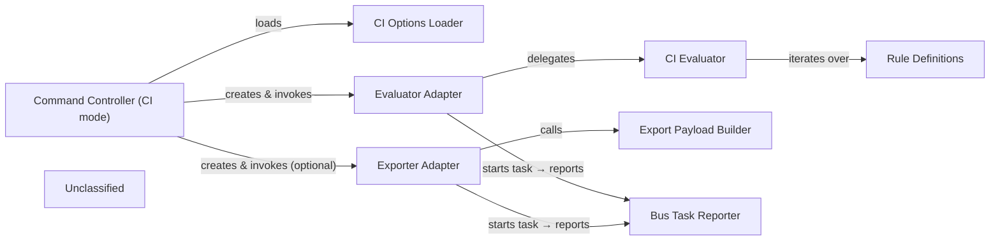

## Details

The CI‑mode command subsystem of dive provides a streamlined pipeline that transforms a container‑image analysis into a CI‑friendly pass/fail result and optionally a JSON export. The entry point (ci.go) loads CI configuration from .dive‑ci files and CLI flags, builds a slice of ci.Rule objects, and orchestrates two adapters: an Evaluator Adapter that wraps the pure CI Evaluator with a bus‑task for progress reporting, and an Exporter Adapter that serialises the analysis model via the Export Payload Builder. The CI Evaluator iterates over each rule, consulting the immutable Core Analysis Model (image.Analysis) to produce per‑rule outcomes and an aggregated Evaluation report. Both adapters publish start, progress, and completion events through the Bus Task Reporter, keeping the controller UI‑agnostic and reusable in interactive and CI contexts. This clear separation—configuration → evaluation → export—makes the subsystem easy to document, test, and diagram.

### Command Controller (CI mode)
Entry‑point for CI; loads options, creates adapters, runs evaluation, optionally triggers export, returns CLI exit code.

**Related Classes/Methods**:

- <a href="https://github.com/wagoodman/dive/blob/main/cmd/dive/cli/internal/command/ci/evaluator.go" target="_blank" rel="noopener noreferrer">`cmd/dive/cli/internal/command/ci.go`</a>

### CI Options Loader
Parses .dive‑ci configuration and CLI flags, producing a slice of ci.Rule objects.

**Related Classes/Methods**:

- <a href="https://github.com/wagoodman/dive/blob/main/cmd/dive/cli/internal/options/ci.go" target="_blank" rel="noopener noreferrer">`cmd/dive/cli/internal/options/ci.go`</a>

### Evaluator Adapter
Bridges the controller to the pure evaluator; starts a bus task, forwards the image.Analysis, and publishes the EvaluationReport.

**Related Classes/Methods**:

- <a href="https://github.com/wagoodman/dive/blob/main/cmd/dive/cli/internal/command/adapter/evaluator.go" target="_blank" rel="noopener noreferrer">`cmd/dive/cli/internal/command/adapter/evaluator.go`</a>

### CI Evaluator
Core policy engine; iterates over all loaded rules, aggregates results, and builds the final Evaluation report.

**Related Classes/Methods**:

- <a href="https://github.com/wagoodman/dive/blob/main/cmd/dive/cli/internal/command/ci/evaluator.go" target="_blank" rel="noopener noreferrer">`cmd/dive/cli/internal/command/ci/evaluator.go`</a>

### Rule Definitions
Implements the ci.Rule interface; each rule encapsulates a single CI policy such as size‑threshold or layer‑count.

**Related Classes/Methods**:

- <a href="https://github.com/wagoodman/dive/blob/main/cmd/dive/cli/internal/command/ci/rule.go" target="_blank" rel="noopener noreferrer">`cmd/dive/cli/internal/command/ci/rule.go`</a>
- <a href="https://github.com/wagoodman/dive/blob/main/cmd/dive/cli/internal/command/ci/rules.go" target="_blank" rel="noopener noreferrer">`cmd/dive/cli/internal/command/ci/rules.go`</a>

### Exporter Adapter
Serialises the analysis model to JSON, writes to the user‑specified path, and reports progress via the bus.

**Related Classes/Methods**:

- <a href="https://github.com/wagoodman/dive/blob/main/cmd/dive/cli/internal/command/adapter/exporter.go" target="_blank" rel="noopener noreferrer">`cmd/dive/cli/internal/command/adapter/exporter.go`</a>

### Export Payload Builder
Constructs a clean, public‑facing export struct that mirrors the internal image.Analysis for JSON output.

**Related Classes/Methods**:

- <a href="https://github.com/wagoodman/dive/blob/main/cmd/dive/cli/internal/command/export/export.go" target="_blank" rel="noopener noreferrer">`cmd/dive/cli/internal/command/export/export.go`</a>

### Bus Task Reporter
Provides StartTask / Report primitives used by adapters to emit UI‑agnostic progress events.

**Related Classes/Methods**:

- <a href="https://github.com/wagoodman/dive/blob/main/internal/bus/bus.go" target="_blank" rel="noopener noreferrer">`internal/bus`</a>

### Unclassified
Component for all unclassified files and utility functions (Utility functions/External Libraries/Dependencies)

**Related Classes/Methods**: _None_

### [FAQ](https://github.com/CodeBoarding/GeneratedOnBoardings/tree/main?tab=readme-ov-file#faq)