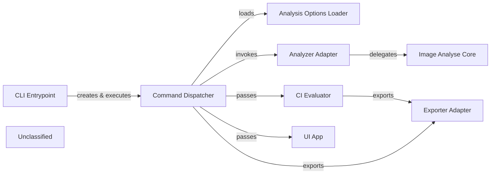

## Details

The `cmd/dive/cli` subsystem is the command‑driven front‑end of Dive. The entry point (`cli.Application` / `cli.Command`) builds a clio.Application and creates the root Cobra command, which is handed to the Command Dispatcher. The dispatcher loads configuration via the Analysis Options Loader, then orchestrates the execution path: in run mode it uses the Analyzer Adapter to delegate to the pure Image Analyse Core, producing an image.Analysis that is fed to the UI App for terminal rendering; in CI mode it passes the analysis to the CI Evaluator which runs rule checks and yields a report. When the user requests export, the Exporter Adapter serialises the analysis (or CI evaluation) to JSON/YAML and writes it to the host file system via afero. This clean separation—entry point → dispatcher → options → core analysis → UI / CI / export—provides a concise, high‑level flow ideal for documentation and diagramming.

### CLI Entrypoint
Builds a clio.Application, creates the root Cobra command and launches it.

**Related Classes/Methods**:

- <a href="https://github.com/wagoodman/dive/blob/main/cmd/dive/cli/cli.go" target="_blank" rel="noopener noreferrer">`cmd/dive/cli/cli.go:Application`</a>
- <a href="https://github.com/wagoodman/dive/blob/main/cmd/dive/cli/cli.go" target="_blank" rel="noopener noreferrer">`cmd/dive/cli/cli.go:Command`</a>

### Command Dispatcher [[Expand]](./Command_Dispatcher.md)
Registers top‑level commands, wires flags, selects UI, and orchestrates the run‑pipeline.

**Related Classes/Methods**:

- <a href="https://github.com/wagoodman/dive/blob/main/cmd/dive/cli/internal/command/root.go" target="_blank" rel="noopener noreferrer">`cmd/dive/cli/internal/command/root.go:Root`</a>

### Analysis Options Loader
Parses CLI flags, config files and environment variables into strongly‑typed option structs.

**Related Classes/Methods**:

- <a href="https://github.com/wagoodman/dive/blob/main/cmd/dive/cli/internal/options/analysis.go" target="_blank" rel="noopener noreferrer">`cmd/dive/cli/internal/options/analysis.go:DefaultAnalysis`</a>

### Analyzer Adapter
Calls the pure core image.Analyze and publishes progress events on the internal bus.

**Related Classes/Methods**:

- <a href="https://github.com/wagoodman/dive/blob/main/cmd/dive/cli/internal/command/adapter/analyzer.go" target="_blank" rel="noopener noreferrer">`cmd/dive/cli/internal/command/adapter/analyzer.go:NewAnalyzer`</a>

### Image Analyse Core
Pure business logic – builds layer trees, computes efficiency, and identifies inefficiencies.

**Related Classes/Methods**:

- <a href="https://github.com/wagoodman/dive/blob/main/dive/image/analysis.go" target="_blank" rel="noopener noreferrer">`dive/image/analysis.go:Analyze`</a>

### CI Evaluator
Executes the configured CI rule set against an image.Analysis and produces a pass/fail report.

**Related Classes/Methods**:

- <a href="https://github.com/wagoodman/dive/blob/main/cmd/dive/cli/internal/command/ci/evaluator.go" target="_blank" rel="noopener noreferrer">`cmd/dive/cli/internal/command/ci/evaluator.go:NewEvaluator`</a>
- <a href="https://github.com/wagoodman/dive/blob/main/cmd/dive/cli/internal/command/ci/evaluator.go" target="_blank" rel="noopener noreferrer">`cmd/dive/cli/internal/command/ci/evaluator.go:Evaluate`</a>

### Exporter Adapter
Serialises an image.Analysis (or CI evaluation) to JSON/YAML and writes it to the host file system via afero.

**Related Classes/Methods**:

- <a href="https://github.com/wagoodman/dive/blob/main/cmd/dive/cli/internal/command/adapter/exporter.go" target="_blank" rel="noopener noreferrer">`cmd/dive/cli/internal/command/adapter/exporter.go:NewExporter`</a>
- <a href="https://github.com/wagoodman/dive/blob/main/cmd/dive/cli/internal/command/adapter/exporter.go" target="_blank" rel="noopener noreferrer">`cmd/dive/cli/internal/command/adapter/exporter.go:ExportTo`</a>

### UI App
Renders the analysis in a terminal UI, binds the LayerSetState view‑model to UI widgets, and handles key‑bindings and the event loop.

**Related Classes/Methods**:

- <a href="https://github.com/wagoodman/dive/blob/main/cmd/dive/cli/internal/ui/v1/app/app.go" target="_blank" rel="noopener noreferrer">`cmd/dive/cli/internal/ui/v1/app/app.go:Run`</a>

### Unclassified
Component for all unclassified files and utility functions (Utility functions/External Libraries/Dependencies)

**Related Classes/Methods**: _None_

### [FAQ](https://github.com/CodeBoarding/GeneratedOnBoardings/tree/main?tab=readme-ov-file#faq)