```mermaid
graph LR
    Configuration_Manager["Configuration Manager"]
    CLI_Entrypoint["CLI Entrypoint"]
    Command_Controller["Command Controller"]
    Analyzer_Adapter["Analyzer Adapter"]
    CI_Evaluator_Adapter["CI Evaluator Adapter"]
    Export_Adapter["Export Adapter"]
    UI_Application["UI Application"]
    LayerSetState_ViewModel["LayerSetState ViewModel"]
    Unclassified["Unclassified"]
    Configuration_Manager -- "injects Application into Cobra root command" --> CLI_Entrypoint
    CLI_Entrypoint -- "creates root command with Application" --> Command_Controller
    Command_Controller -- "calls Analyze to perform core image analysis" --> Analyzer_Adapter
    Analyzer_Adapter -- "provides Analysis to Evaluate when CI enabled" --> CI_Evaluator_Adapter
    Analyzer_Adapter -- "provides Analysis to ExportTo when export flag set" --> Export_Adapter
    Analyzer_Adapter -- "passes Analysis to UI for interactive exploration" --> UI_Application
    UI_Application -- "binds UI to view‑model for state handling" --> LayerSetState_ViewModel
    LayerSetState_ViewModel -- "notifies UI of state changes" --> UI_Application
    click Configuration_Manager href "https://github.com/CodeBoarding/GeneratedOnBoardings/blob/main/dive/Configuration_Manager.md" "Details"
```

## Details

The dive CLI orchestrates container image inspection by first constructing an immutable Application configuration (Configuration Manager) that aggregates defaults, YAML files, environment variables, and CLI flags. This configuration is injected into the Cobra command tree (CLI Entrypoint) and handed to the Command Controller, which validates the image argument, resolves the image source, and drives the execution flow. The core analysis is performed by the Analyzer Adapter, yielding a rich image.Analysis object. Depending on the configuration, the analysis result is either exported as JSON (Export Adapter), evaluated against CI rules (CI Evaluator Adapter), or fed into an interactive terminal UI (UI Application). The UI is powered by a LayerSetState view‑model that tracks layer selection and diff data, enabling responsive, user‑driven exploration of the image contents. Cross‑cutting concerns such as logging and event bus are omitted to highlight the clear linear flow from configuration through command dispatch to analysis and optional CI/export/UI branches.

### Configuration Manager [[Expand]](./Configuration_Manager.md)
Loads defaults, merges .dive.yaml, .dive-ci, environment variables and CLI flags to produce an immutable Application value that drives the whole run.

**Related Classes/Methods**:

- <a href="https://github.com/wagoodman/dive/blob/main/cmd/dive/cli/internal/options/application.go" target="_blank" rel="noopener noreferrer">`cmd/dive/cli/internal/options.Application`</a>

### CLI Entrypoint
Boots the Cobra command tree, injects the immutable Application into the command controller and starts the execution loop.

**Related Classes/Methods**:

- <a href="https://github.com/wagoodman/dive/blob/main/cmd/dive/cli/cli.go" target="_blank" rel="noopener noreferrer">`cmd/dive/cli.Command`</a>

### Command Controller
Parses the image argument, selects the UI mode (TUI / CI / Export), resolves the image, and orchestrates the downstream adapters.

**Related Classes/Methods**:

- <a href="https://github.com/wagoodman/dive/blob/main/cmd/dive/cli/internal/command/root.go" target="_blank" rel="noopener noreferrer">`cmd/dive/cli/internal/command.Root`</a>

### Analyzer Adapter
Calls the core analysis engine (image.Analyze) and returns a populated *image.Analysis.

**Related Classes/Methods**:

- <a href="https://github.com/wagoodman/dive/blob/main/cmd/dive/cli/internal/command/adapter/analyzer.go" target="_blank" rel="noopener noreferrer">`cmd/dive/cli/internal/command/adapter.NewAnalyzer`</a>
- <a href="https://github.com/wagoodman/dive/blob/main/cmd/dive/cli/internal/command/adapter/analyzer.go" target="_blank" rel="noopener noreferrer">`Analyzer.Analyze`</a>

### CI Evaluator Adapter
Consumes the *image.Analysis, runs the CI rule‑set and produces a pass/fail ci.Evaluation.

**Related Classes/Methods**:

- <a href="https://github.com/wagoodman/dive/blob/main/cmd/dive/cli/internal/command/adapter/evaluator.go" target="_blank" rel="noopener noreferrer">`cmd/dive/cli/internal/command/adapter.NewEvaluator`</a>
- <a href="https://github.com/wagoodman/dive/blob/main/cmd/dive/cli/internal/command/adapter/evaluator.go" target="_blank" rel="noopener noreferrer">`Evaluator.Evaluate`</a>

### Export Adapter
Serialises the *image.Analysis to JSON and writes it to the user‑specified path.

**Related Classes/Methods**:

- <a href="https://github.com/wagoodman/dive/blob/main/cmd/dive/cli/internal/command/adapter/exporter.go" target="_blank" rel="noopener noreferrer">`cmd/dive/cli/internal/command/adapter.NewExporter`</a>
- <a href="https://github.com/wagoodman/dive/blob/main/cmd/dive/cli/internal/command/adapter/exporter.go" target="_blank" rel="noopener noreferrer">`Exporter.ExportTo`</a>

### UI Application
Builds the terminal UI, wires the view‑model, renders analysis data and reacts to user input.

**Related Classes/Methods**:

- <a href="https://github.com/wagoodman/dive/blob/main/cmd/dive/cli/internal/ui/v1/app/app.go" target="_blank" rel="noopener noreferrer">`cmd/dive/cli/internal/ui/v1/app.Run`</a>

### LayerSetState ViewModel
Holds the current layer selection, diff data and notifies UI widgets; the UI’s source of truth for interactive state.

**Related Classes/Methods**:

- <a href="https://github.com/wagoodman/dive/blob/main/cmd/dive/cli/internal/ui/v1/viewmodel/layer_set_state.go#L5-L10" target="_blank" rel="noopener noreferrer">`cmd/dive/cli/internal/ui/v1/viewmodel.LayerSetState`:5-10</a>

### Unclassified
Component for all unclassified files and utility functions (Utility functions/External Libraries/Dependencies)

**Related Classes/Methods**: _None_

### [FAQ](https://github.com/CodeBoarding/GeneratedOnBoardings/tree/main?tab=readme-ov-file#faq)