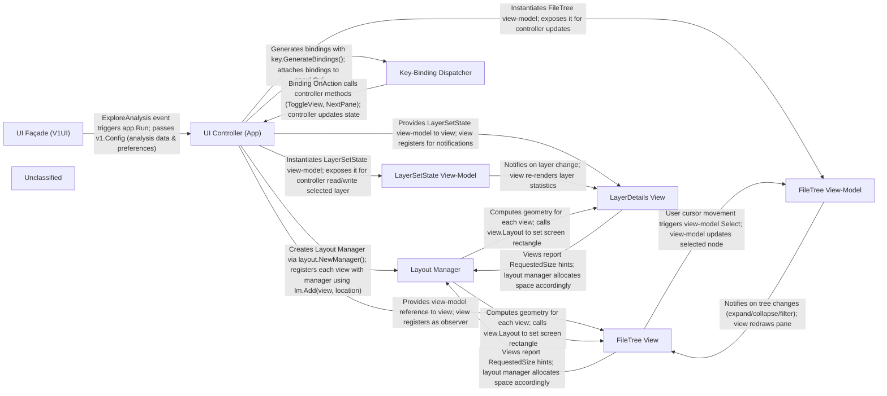

## Details

The Dive TUI subsystem (cmd/dive/cli/internal/ui/v1) implements a classic MVC architecture wrapped in a terminal‑UI framework (gocui). An event‑driven UI façade (V1UI) listens for the ExploreAnalysis event and launches the UI controller (app.Run). The controller creates the layout manager, registers key‑binding dispatchers, and builds the view‑models (LayerSetState, FileTree). Views (LayerDetails, FileTree, status/footer panes) are attached to their respective view‑models and to the layout manager, which arranges them into header, column, and footer zones. User keystrokes are translated by the key‑binding dispatcher into high‑level controller actions, which mutate view‑model state; the view‑models then push change notifications back to the views, causing a re‑render. The layout manager recomputes geometry on terminal resize, ensuring a responsive split‑pane UI. This tightly‑coupled yet modular arrangement isolates UI rendering, input handling, and state management, making the subsystem easy to reason about, test, and extend.

### UI Façade (V1UI)
UI façade that receives the ExploreAnalysis event and initiates the UI controller.

**Related Classes/Methods**:

- <a href="https://github.com/wagoodman/dive/blob/main/cmd/dive/cli/internal/ui/v1.go" target="_blank" rel="noopener noreferrer">`github.com/wagoodman/dive/cmd/dive/cli/internal/ui/v1.V1UI`</a>

### UI Controller (App)
Entry point that creates the gocui GUI, controller, layout manager, and registers key bindings.

**Related Classes/Methods**:

- <a href="https://github.com/wagoodman/dive/blob/main/cmd/dive/cli/internal/ui/v1/app/app.go" target="_blank" rel="noopener noreferrer">`github.com/wagoodman/dive/cmd/dive/cli/internal/ui/v1/app`</a>

### Layout Manager
Arranges views into zones and computes geometry for each pane.

**Related Classes/Methods**:

- <a href="https://github.com/wagoodman/dive/blob/main/cmd/dive/cli/internal/ui/v1/layout/manager.go" target="_blank" rel="noopener noreferrer">`github.com/wagoodman/dive/cmd/dive/cli/internal/ui/v1/layout.Manager`</a>

### Key‑Binding Dispatcher
Generates key bindings from configuration and attaches them to the gocui GUI.

**Related Classes/Methods**:

- <a href="https://github.com/wagoodman/dive/blob/main/cmd/dive/cli/internal/ui/v1/key/binding.go" target="_blank" rel="noopener noreferrer">`github.com/wagoodman/dive/cmd/dive/cli/internal/ui/v1/key.Binding`</a>
- <a href="https://github.com/wagoodman/dive/blob/main/cmd/dive/cli/internal/ui/v1/key/config.go" target="_blank" rel="noopener noreferrer">`github.com/wagoodman/dive/cmd/dive/cli/internal/ui/v1/key.Config`</a>

### LayerSetState View‑Model
Observable model representing the currently selected layer and its state.

**Related Classes/Methods**:

- <a href="https://github.com/wagoodman/dive/blob/main/cmd/dive/cli/internal/ui/v1/viewmodel/layer_set_state.go" target="_blank" rel="noopener noreferrer">`github.com/wagoodman/dive/cmd/dive/cli/internal/ui/v1/viewmodel.LayerSetState`</a>

### FileTree View‑Model
Observable model for the file‑tree data, selection, and filtering.

**Related Classes/Methods**:

- <a href="https://github.com/wagoodman/dive/blob/main/cmd/dive/cli/internal/ui/v1/viewmodel/filetree.go" target="_blank" rel="noopener noreferrer">`github.com/wagoodman/dive/cmd/dive/cli/internal/ui/v1/viewmodel.FileTree`</a>

### FileTree View
UI view that renders the file‑tree pane and observes the FileTree view‑model.

**Related Classes/Methods**:

- <a href="https://github.com/wagoodman/dive/blob/main/cmd/dive/cli/internal/ui/v1/view/filetree.go" target="_blank" rel="noopener noreferrer">`github.com/wagoodman/dive/cmd/dive/cli/internal/ui/v1/view.FileTree`</a>

### LayerDetails View
UI view that displays detailed information about the selected layer, observing the LayerSetState view‑model.

**Related Classes/Methods**:

- <a href="https://github.com/wagoodman/dive/blob/main/cmd/dive/cli/internal/ui/v1/view/layer_details.go" target="_blank" rel="noopener noreferrer">`github.com/wagoodman/dive/cmd/dive/cli/internal/ui/v1/view.LayerDetails`</a>

### Unclassified
Component for all unclassified files and utility functions (Utility functions/External Libraries/Dependencies)

**Related Classes/Methods**: _None_

### [FAQ](https://github.com/CodeBoarding/GeneratedOnBoardings/tree/main?tab=readme-ov-file#faq)