```mermaid
graph LR
    CLI_Bootstrap["CLI Bootstrap"]
    Command_Dispatcher["Command Dispatcher"]
    Configuration_Manager["Configuration Manager"]
    Image_Provider_Adapter["Image Provider & Adapter"]
    Analysis_Engine["Analysis Engine"]
    Event_Bus["Event Bus"]
    Terminal_UI["Terminal UI"]
    CI_Export_Services["CI & Export Services"]
    Unclassified["Unclassified"]
    CLI_Bootstrap -- "creates and registers root command" --> Command_Dispatcher
    Command_Dispatcher -- "loads configuration" --> Configuration_Manager
    Command_Dispatcher -- "resolves image source" --> Image_Provider_Adapter
    Image_Provider_Adapter -- "provides resolved image for analysis" --> Analysis_Engine
    Analysis_Engine -- "publishes ExploreAnalysis event" --> Event_Bus
    Event_Bus -- "subscribes and receives events" --> Terminal_UI
    Analysis_Engine -- "hands model to CI/export" --> CI_Export_Services
    click Command_Dispatcher href "https://github.com/CodeBoarding/GeneratedOnBoardings/blob/main/dive/Command_Dispatcher.md" "Details"
    click Configuration_Manager href "https://github.com/CodeBoarding/GeneratedOnBoardings/blob/main/dive/Configuration_Manager.md" "Details"
    click Analysis_Engine href "https://github.com/CodeBoarding/GeneratedOnBoardings/blob/main/dive/Analysis_Engine.md" "Details"
    click Terminal_UI href "https://github.com/CodeBoarding/GeneratedOnBoardings/blob/main/dive/Terminal_UI.md" "Details"
    click CI_Export_Services href "https://github.com/CodeBoarding/GeneratedOnBoardings/blob/main/dive/CI_Export_Services.md" "Details"
```

## Details

The Dive CLI application starts with the CLI Bootstrap component, which creates the clio application and registers the root Cobra command. The Command Dispatcher builds the command hierarchy, loads configuration via the Configuration Manager, and resolves the target image using the Image Provider & Adapter. The resolved image is analyzed by the Analysis Engine, which traverses image layers, builds a file‑tree model, computes efficiency metrics and publishes an ExploreAnalysis event on the central Event Bus. The Terminal UI subscribes to this bus and renders a live, split‑pane view. Simultaneously, the Analysis Engine passes the model to the CI & Export Services component, which runs CI rule‑sets and optionally exports JSON; its outcome determines the final exit status of the CLI.

### CLI Bootstrap
Creates the clio application, wires the global UI placeholder and registers the root Cobra command.

**Related Classes/Methods**:

- <a href="https://github.com/wagoodman/dive/blob/main/cmd/dive/cli/cli.go" target="_blank" rel="noopener noreferrer">`github.com/wagoodman/dive/cmd/dive/cli.Application`</a>
- <a href="https://github.com/wagoodman/dive/blob/main/cmd/dive/cli/cli.go" target="_blank" rel="noopener noreferrer">`github.com/wagoodman/dive/cmd/dive/cli.Command`</a>

### Command Dispatcher [[Expand]](./Command_Dispatcher.md)
Registers sub‑commands (run, build, ci), parses flags, and orchestrates the overall execution flow.

**Related Classes/Methods**:

- <a href="https://github.com/wagoodman/dive/blob/main/cmd/dive/cli/internal/command/root.go" target="_blank" rel="noopener noreferrer">`github.com/wagoodman/dive/cmd/dive/cli/internal/command.Root`</a>
- <a href="https://github.com/wagoodman/dive/blob/main/cmd/dive/cli/internal/command/build.go" target="_blank" rel="noopener noreferrer">`github.com/wagoodman/dive/cmd/dive/cli/internal/command.Build`</a>

### Configuration Manager [[Expand]](./Configuration_Manager.md)
Loads defaults, merges user‑provided .dive.yaml/.dive‑ci files and exposes a single options.Application object used by downstream components.

**Related Classes/Methods**:

- <a href="https://github.com/wagoodman/dive/blob/main/cmd/dive/cli/internal/options/application.go" target="_blank" rel="noopener noreferrer">`github.com/wagoodman/dive/cmd/dive/cli/internal/options.Application`</a>
- <a href="https://github.com/wagoodman/dive/blob/main/cmd/dive/cli/internal/options/application.go" target="_blank" rel="noopener noreferrer">`github.com/wagoodman/dive/cmd/dive/cli/internal/options.DefaultApplication`</a>

### Image Provider & Adapter
Resolves the concrete image source, wraps fetch/build calls with progress‑task events and returns a ready *image.Image.

**Related Classes/Methods**:

- <a href="https://github.com/wagoodman/dive/blob/main/cmd/dive/cli/internal/command/adapter/resolver.go" target="_blank" rel="noopener noreferrer">`github.com/wagoodman/dive/cmd/dive/cli/internal/command/adapter.ImageResolver`</a>

### Analysis Engine [[Expand]](./Analysis_Engine.md)
Traverses image layers, builds the file‑tree model, computes size‑efficiency metrics and publishes an ExploreAnalysis event.

**Related Classes/Methods**:

- <a href="https://github.com/wagoodman/dive/blob/main/cmd/dive/cli/internal/command/adapter/analyzer.go" target="_blank" rel="noopener noreferrer">`github.com/wagoodman/dive/cmd/dive/cli/internal/command/adapter.NewAnalyzer`</a>

### Event Bus
Central publish/subscribe hub; receives ExploreAnalysis (and other task events) and forwards them to any registered listeners.

**Related Classes/Methods**:

- <a href="https://github.com/wagoodman/dive/blob/main/internal/bus/bus.go" target="_blank" rel="noopener noreferrer">`github.com/wagoodman/dive/internal/bus`</a>
- <a href="https://github.com/wagoodman/dive/blob/main/internal/bus/event/event.go" target="_blank" rel="noopener noreferrer">`github.com/wagoodman/dive/internal/bus/event`</a>

### Terminal UI [[Expand]](./Terminal_UI.md)
Subscribes to the Event Bus, renders the split‑pane interactive UI and reacts to key‑bindings / live updates.

**Related Classes/Methods**:

- <a href="https://github.com/wagoodman/dive/blob/main/cmd/dive/cli/internal/ui/v1.go#L41-L54" target="_blank" rel="noopener noreferrer">`github.com/wagoodman/dive/cmd/dive/cli/internal/ui.NewV1UI`:41-54</a>
- <a href="https://github.com/wagoodman/dive/blob/main/cmd/dive/cli/internal/ui/v1/view/views.go#L8-L12" target="_blank" rel="noopener noreferrer">`github.com/wagoodman/dive/cmd/dive/cli/internal/ui/v1.View`:8-12</a>

### CI & Export Services [[Expand]](./CI_Export_Services.md)
Consumes the analysis model, runs CI rule‑sets (.dive‑ci) and optionally writes a JSON export; returns an exit status that becomes the CLI result.

**Related Classes/Methods**:

- <a href="https://github.com/wagoodman/dive/blob/main/cmd/dive/cli/internal/command/adapter/evaluator.go" target="_blank" rel="noopener noreferrer">`github.com/wagoodman/dive/cmd/dive/cli/internal/command/adapter.NewEvaluator`</a>
- <a href="https://github.com/wagoodman/dive/blob/main/cmd/dive/cli/internal/command/adapter/exporter.go" target="_blank" rel="noopener noreferrer">`github.com/wagoodman/dive/cmd/dive/cli/internal/command/adapter.NewExporter`</a>

### Unclassified
Component for all unclassified files and utility functions (Utility functions/External Libraries/Dependencies)

**Related Classes/Methods**: _None_

### [FAQ](https://github.com/CodeBoarding/GeneratedOnBoardings/tree/main?tab=readme-ov-file#faq)