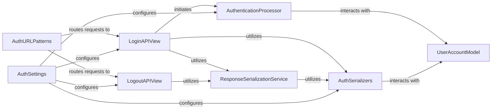

## Details

The `dj-rest-auth` subsystem provides a robust authentication and registration solution. The core interaction flow begins with `AuthURLPatterns` routing incoming requests to either `LoginAPIView` or `LogoutAPIView`. For login, `LoginAPIView` leverages `AuthSerializers` for data validation and then initiates the `AuthenticationProcessor` to verify user credentials against the `UserAccountModel`. Upon successful authentication, `ResponseSerializationService` uses `AuthSerializers` to format the API response. `AuthSettings` centrally configures the behavior of `LoginAPIView`, `LogoutAPIView`, `AuthenticationProcessor`, and `AuthSerializers`, allowing for flexible customization of the authentication process. This modular design ensures clear separation of concerns and maintainability.

### LoginAPIView
The primary API endpoint responsible for handling user login requests. It orchestrates the validation of credentials, the core authentication process, and the generation of the appropriate API response, including tokens or session information.

**Related Classes/Methods**:

- <a href="https://github.com/iMerica/dj-rest-auth/blob/master/dj_rest_auth/views.py" target="_blank" rel="noopener noreferrer">`dj_rest_auth.views.LoginAPIView`</a>

### LogoutAPIView
The API endpoint dedicated to handling user logout requests. It ensures the invalidation of user sessions or tokens to terminate the authenticated state.

**Related Classes/Methods**:

- <a href="https://github.com/iMerica/dj-rest-auth/blob/master/dj_rest_auth/views.py" target="_blank" rel="noopener noreferrer">`dj_rest_auth.views.LogoutAPIView`</a>

### AuthenticationProcessor
A core component responsible for executing the fundamental authentication logic. This includes verifying user credentials against the system's user store and managing the authenticated state (e.g., creating tokens, updating session information).

**Related Classes/Methods**:

- <a href="https://github.com/iMerica/dj-rest-auth/blob/master/dj_rest_auth/views.py#L50-L51" target="_blank" rel="noopener noreferrer">`dj_rest_auth.views.process_login`:50-51</a>

### ResponseSerializationService
A utility component responsible for formatting and serializing data into the appropriate structure for API responses. It ensures that all outgoing data adheres to the defined API contract, making it consumable by client applications.

**Related Classes/Methods**:

- <a href="https://github.com/iMerica/dj-rest-auth/blob/master/dj_rest_auth/views.py#L77-L120" target="_blank" rel="noopener noreferrer">`dj_rest_auth.views.get_response`:77-120</a>
- <a href="https://github.com/iMerica/dj-rest-auth/blob/master/dj_rest_auth/views.py#L53-L63" target="_blank" rel="noopener noreferrer">`dj_rest_auth.views.get_response_serializer`:53-63</a>

### AuthSerializers
A collection of serializer classes responsible for validating incoming request data and serializing outgoing response data for various authentication and registration operations (e.g., login, registration, password reset, user details). They define the data contract for the API.

**Related Classes/Methods**:

- <a href="https://github.com/iMerica/dj-rest-auth/blob/master/dj_rest_auth/serializers.py#L21-L135" target="_blank" rel="noopener noreferrer">`dj_rest_auth.serializers.LoginSerializer`:21-135</a>
- <a href="https://github.com/iMerica/dj-rest-auth/blob/master/dj_rest_auth/serializers.py#L148-L180" target="_blank" rel="noopener noreferrer">`dj_rest_auth.serializers.UserDetailsSerializer`:148-180</a>
- <a href="https://github.com/iMerica/dj-rest-auth/blob/master/dj_rest_auth/registration/serializers.py#L224-L280" target="_blank" rel="noopener noreferrer">`dj_rest_auth.registration.serializers.RegisterSerializer`:224-280</a>

### AuthURLPatterns
Defines the URL routes and patterns that map incoming HTTP requests to the appropriate API views within the authentication and registration subsystem. It acts as the entry point for client applications.

**Related Classes/Methods**:

- <a href="https://github.com/iMerica/dj-rest-auth/blob/master/dj_rest_auth/urls.py" target="_blank" rel="noopener noreferrer">`/mnt/e/StartUp/dj-rest-auth/dj_rest_auth/urls.py`</a>
- <a href="https://github.com/iMerica/dj-rest-auth/blob/master/dj_rest_auth/registration/urls.py" target="_blank" rel="noopener noreferrer">`/mnt/e/StartUp/dj-rest-auth/dj_rest_auth/registration/urls.py`</a>

### AuthSettings
Manages the configuration parameters and settings for the `dj-rest-auth` library, allowing developers to customize behavior such as token expiration, serializer classes, and authentication backends.

**Related Classes/Methods**:

- <a href="https://github.com/iMerica/dj-rest-auth/blob/master/dj_rest_auth/app_settings.py" target="_blank" rel="noopener noreferrer">`/mnt/e/StartUp/dj-rest-auth/dj_rest_auth/app_settings.py`</a>

### UserAccountModel
Represents the data model for user accounts, including fields like username, password (hashed), email, and other user-specific attributes. It provides the interface for interacting with the underlying database to store and retrieve user information.

**Related Classes/Methods**:

- <a href="https://github.com/iMerica/dj-rest-auth/blob/master/dj_rest_auth/models.py" target="_blank" rel="noopener noreferrer">`/mnt/e/StartUp/dj-rest-auth/dj_rest_auth/models.py`</a>

### [FAQ](https://github.com/CodeBoarding/GeneratedOnBoardings/tree/main?tab=readme-ov-file#faq)