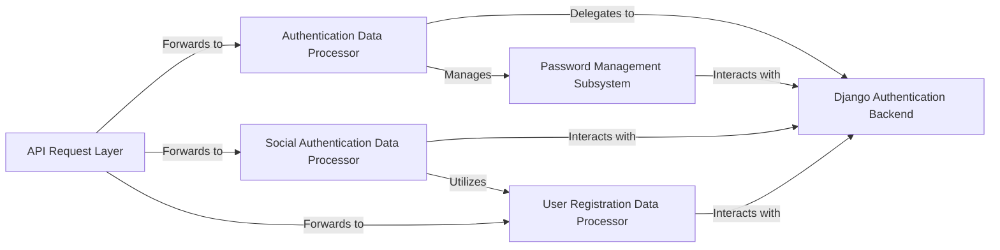

## Details

The `dj-rest-auth` subsystem primarily facilitates user authentication and registration within a Django REST framework application. It acts as an intermediary, processing incoming API requests related to user management and delegating core authentication and user persistence tasks to the underlying Django Authentication Backend. The system is structured around specialized data processors for standard authentication, social authentication, and user registration, ensuring a clear separation of concerns. A dedicated Password Management Subsystem handles secure password operations, integrating seamlessly with the core Django authentication mechanisms.

### API Request Layer
Represents the entry point for all incoming HTTP requests related to authentication and user management. It is responsible for receiving requests and forwarding them to the appropriate data processing components within `dj-rest-auth`.

**Related Classes/Methods**: _None_

### Authentication Data Processor
Manages the validation and authentication of user credentials for standard login, password changes, and password resets. It serves as the central point for authenticating users against configured backends (e.g., Django's ORM or `django-allauth`).

**Related Classes/Methods**:

- <a href="https://github.com/iMerica/dj-rest-auth/blob/master/dj_rest_auth/serializers.py" target="_blank" rel="noopener noreferrer">`dj_rest_auth.serializers`</a>

### Social Authentication Data Processor
Handles the specific data processing and validation required for social login flows. It orchestrates the interaction with social providers and integrates with the user registration process.

**Related Classes/Methods**:

- <a href="https://github.com/iMerica/dj-rest-auth/blob/master/dj_rest_auth/social_serializers.py" target="_blank" rel="noopener noreferrer">`dj_rest_auth.social_serializers`</a>

### User Registration Data Processor
Oversees the validation and creation of new user accounts, encompassing both standard and social registration. It manages the lifecycle of user signup, from initial data validation to final user object creation and post-signup hooks.

**Related Classes/Methods**:

- <a href="https://github.com/iMerica/dj-rest-auth/blob/master/dj_rest_auth/registration/serializers.py" target="_blank" rel="noopener noreferrer">`dj_rest_auth.registration.serializers`</a>

### Django Authentication Backend
Represents the underlying Django authentication system responsible for user management, session handling, and core authentication logic. `dj-rest-auth` integrates with this backend for user authentication, authorization, and persistence.

**Related Classes/Methods**:

### Password Management Subsystem
Encapsulates the logic and views related to password change and reset functionalities within `dj-rest-auth`. It interacts with the `Django Authentication Backend` to securely update user credentials.

**Related Classes/Methods**:

- <a href="https://github.com/iMerica/dj-rest-auth/blob/master/dj_rest_auth/views.py" target="_blank" rel="noopener noreferrer">`dj_rest_auth.views`</a>
- <a href="https://github.com/iMerica/dj-rest-auth/blob/master/dj_rest_auth/serializers.py" target="_blank" rel="noopener noreferrer">`dj_rest_auth.serializers`</a>

### [FAQ](https://github.com/CodeBoarding/GeneratedOnBoardings/tree/main?tab=readme-ov-file#faq)