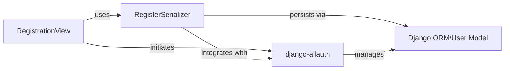

## Details

The user registration subsystem is centered around the `RegistrationView`, which acts as the primary API endpoint for new user sign-ups. It delegates the crucial tasks of data validation and user creation to the `RegisterSerializer`. The `RegisterSerializer` deeply integrates with the `django-allauth` library, leveraging its robust account management features for tasks such as email validation, password handling, and user persistence. Ultimately, `django-allauth` orchestrates the interaction with Django's built-in `Django ORM/User Model` to store new user data securely in the application's database. This architecture ensures a clear separation of concerns, with the view handling request/response, the serializer managing data integrity, and `django-allauth` providing a comprehensive, extensible account management solution built upon Django's core persistence layer.

### RegistrationView
This component serves as the API endpoint for handling user registration requests. It receives HTTP POST requests, orchestrates the registration flow by delegating data processing and validation to the `RegisterSerializer`, and initiates post-signup actions (like email verification) via `django-allauth`. It returns appropriate HTTP responses to the client. It embodies the "Authentication Endpoints" pattern.

**Related Classes/Methods**: _None_

### RegisterSerializer
Responsible for the serialization, deserialization, and validation of user registration data. It acts as an intermediary, integrating directly with the `django-allauth` library to manage user account creation, email verification, and potentially social login processes. It also provides extension points for custom signup logic. This component aligns with the "Serializers" pattern.

**Related Classes/Methods**: _None_

### django-allauth
An external, comprehensive Django application that provides a robust framework for user account management, including email-based registration, verification workflows, password management, and integration with various social authentication providers. It is a critical dependency that extends the core authentication capabilities of `dj-rest_auth`, providing adapters and settings used by `RegisterSerializer` and `RegistrationView`.

**Related Classes/Methods**: _None_

### Django ORM/User Model
Represents Django's built-in Object-Relational Mapper (ORM) and the `User` model (`django.contrib.auth.models.User`). This component is fundamental for the persistent storage and retrieval of user data within the application's database. It serves as the ultimate data source for all user-related information, accessed indirectly by `RegisterSerializer` via `django-allauth`.

**Related Classes/Methods**: _None_

### [FAQ](https://github.com/CodeBoarding/GeneratedOnBoardings/tree/main?tab=readme-ov-file#faq)