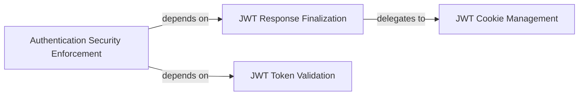

## Details

The `JWT Management` subsystem is a critical part of the `dj-rest-auth` library, focusing on the secure handling of JSON Web Tokens for user authentication and session management. Its boundaries are primarily defined by the `dj_rest_auth.jwt_auth` module.

### JWT Cookie Management
Manages the secure embedding of JWT access and refresh tokens into HTTP responses as cookies. This is crucial for client-side token storage and automatic inclusion in subsequent requests, enhancing security by leveraging browser cookie mechanisms.

**Related Classes/Methods**:

- <a href="https://github.com/iMerica/dj-rest-auth/blob/master/dj_rest_auth/jwt_auth.py#L56-L58" target="_blank" rel="noopener noreferrer">`dj_rest_auth.jwt_auth.set_jwt_cookies`:56-58</a>
- <a href="https://github.com/iMerica/dj-rest-auth/blob/master/dj_rest_auth/jwt_auth.py#L12-L30" target="_blank" rel="noopener noreferrer">`dj_rest_auth.jwt_auth.set_jwt_access_cookie`:12-30</a>
- <a href="https://github.com/iMerica/dj-rest-auth/blob/master/dj_rest_auth/jwt_auth.py#L33-L53" target="_blank" rel="noopener noreferrer">`dj_rest_auth.jwt_auth.set_jwt_refresh_cookie`:33-53</a>

### JWT Response Finalization
Orchestrates the final preparation of an authentication response, ensuring that all necessary JWT-related data, particularly cookies, are correctly attached before the response is sent to the client. This component acts as a crucial integration point for token embedding.

**Related Classes/Methods**:

- <a href="https://github.com/iMerica/dj-rest-auth/blob/master/dj_rest_auth/jwt_auth.py#L101-L111" target="_blank" rel="noopener noreferrer">`dj_rest_auth.jwt_auth.finalize_response`:101-111</a>

### JWT Token Validation
Handles the core logic for validating incoming JSON Web Tokens, with a specific focus on refresh tokens to maintain session continuity and security. This component ensures the integrity and authenticity of tokens presented by clients.

**Related Classes/Methods**:

- <a href="https://github.com/iMerica/dj-rest-auth/blob/master/dj_rest_auth/jwt_auth.py#L88-L90" target="_blank" rel="noopener noreferrer">`dj_rest_auth.jwt_auth.validate`:88-90</a>
- <a href="https://github.com/iMerica/dj-rest-auth/blob/master/dj_rest_auth/jwt_auth.py#L77-L86" target="_blank" rel="noopener noreferrer">`dj_rest_auth.jwt_auth.extract_refresh_token`:77-86</a>

### Authentication Security Enforcement
Oversees the fundamental authentication process and enforces critical security measures, such as Cross-Site Request Forgery (CSRF) protection, to safeguard against common web vulnerabilities during token-based authentication.

**Related Classes/Methods**:

- <a href="https://github.com/iMerica/dj-rest-auth/blob/master/dj_rest_auth/jwt_auth.py#L135-L154" target="_blank" rel="noopener noreferrer">`dj_rest_auth.jwt_auth.authenticate`:135-154</a>
- <a href="https://github.com/iMerica/dj-rest-auth/blob/master/dj_rest_auth/jwt_auth.py#L121-L133" target="_blank" rel="noopener noreferrer">`dj_rest_auth.jwt_auth.enforce_csrf`:121-133</a>

### [FAQ](https://github.com/CodeBoarding/GeneratedOnBoardings/tree/main?tab=readme-ov-file#faq)