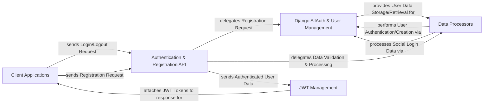

## Details

The `dj-rest-auth` project provides a robust REST API for Django authentication, acting as an intermediary between external `Client Applications` and Django's native user management, significantly leveraging the `django-allauth` library. The `Authentication & Registration API` serves as the primary public interface, handling incoming requests for user login, logout, and password management. These requests are then routed to `Data Processors` for validation and initial processing. For registration and advanced authentication features, `Data Processors` and the `Authentication & Registration API` interact with the `Django AllAuth & User Management` component, which encapsulates the project's integration with `django-allauth` and the underlying Django User model. Upon successful authentication, the `JWT Management` component is responsible for generating and handling JSON Web Tokens, which are then securely transmitted back to the `Client Applications` for session management. This architecture ensures a clear separation of concerns, facilitating maintainability and scalability for authentication workflows.

### Client Applications
External front-end applications (e.g., React, Vue, Angular) that initiate authentication and registration requests. As an external component, it does not have source code references within the `dj-rest-auth` project.

**Related Classes/Methods**: _None_

### Authentication & Registration API [[Expand]](./Authentication_Registration_API.md)
The public-facing API layer that exposes endpoints for user login, logout, and password management. It acts as the primary interface for client applications.

**Related Classes/Methods**:

- <a href="https://github.com/iMerica/dj-rest-auth/blob/master/dj_rest_auth/views.py" target="_blank" rel="noopener noreferrer">`dj_rest_auth.views`</a>

### Data Processors [[Expand]](./Data_Processors.md)
A group of modules responsible for validating and processing all incoming data related to authentication (login, password changes, resets) and user registration (new user creation, social login data).

**Related Classes/Methods**:

- <a href="https://github.com/iMerica/dj-rest-auth/blob/master/dj_rest_auth/serializers.py" target="_blank" rel="noopener noreferrer">`dj_rest_auth.serializers`</a>
- <a href="https://github.com/iMerica/dj-rest-auth/blob/master/dj_rest_auth/social_serializers.py" target="_blank" rel="noopener noreferrer">`dj_rest_auth.social_serializers`</a>

### JWT Management [[Expand]](./JWT_Management.md)
Manages the lifecycle of JSON Web Tokens, including their creation, embedding into responses (e.g., as cookies), and validation for secure session management.

**Related Classes/Methods**:

- <a href="https://github.com/iMerica/dj-rest-auth/blob/master/dj_rest_auth/jwt_auth.py" target="_blank" rel="noopener noreferrer">`dj_rest_auth.jwt_auth`</a>

### Django AllAuth & User Management [[Expand]](./Django_AllAuth_User_Management.md)
Represents the integration layer within `dj-rest-auth` that interacts with the `django-allauth` library for comprehensive authentication features (including social accounts and email verification) and the underlying Django ORM/User model for persistent user data storage and retrieval.

**Related Classes/Methods**:

- <a href="https://github.com/iMerica/dj-rest-auth/blob/master/dj_rest_auth/registration/views.py" target="_blank" rel="noopener noreferrer">`dj_rest_auth.registration.views`</a>
- <a href="https://github.com/iMerica/dj-rest-auth/blob/master/dj_rest_auth/registration/serializers.py" target="_blank" rel="noopener noreferrer">`dj_rest_auth.registration.serializers`</a>

### [FAQ](https://github.com/CodeBoarding/GeneratedOnBoardings/tree/main?tab=readme-ov-file#faq)