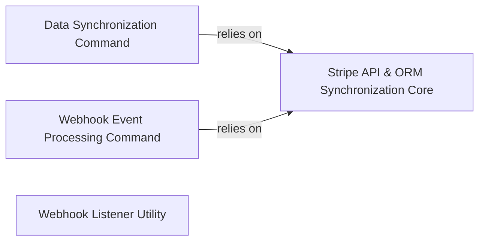

## Details

The `Data Synchronization & Management` subsystem in `dj-stripe` is primarily responsible for maintaining consistency between Stripe data and the local Django database. This involves initial and ongoing synchronization of Stripe objects and the processing of real-time webhook events.

### Data Synchronization Command
This component encapsulates the `djstripe_sync_models` Django management command. Its primary responsibility is to orchestrate the full synchronization of Stripe data models (e.g., Customers, Subscriptions, Invoices) into the local Django database. It handles fetching data from the Stripe API, determining whether to create new Django model instances or update existing ones, and includes specialized logic for various Stripe object types.

**Related Classes/Methods**:

- <a href="https://github.com/dj-stripe/dj-stripe/blob/main/djstripe/management/commands/djstripe_sync_models.py#L66-L104" target="_blank" rel="noopener noreferrer">`djstripe.management.commands.djstripe_sync_models.handle`:66-104</a>
- <a href="https://github.com/dj-stripe/dj-stripe/blob/main/djstripe/management/commands/djstripe_sync_models.py#L132-L206" target="_blank" rel="noopener noreferrer">`djstripe.management.commands.djstripe_sync_models.sync_model`:132-206</a>
- <a href="https://github.com/dj-stripe/dj-stripe/blob/main/djstripe/management/commands/djstripe_sync_models.py#L448-L482" target="_blank" rel="noopener noreferrer">`djstripe.management.commands.djstripe_sync_models.get_list_kwargs`:448-482</a>
- <a href="https://github.com/dj-stripe/dj-stripe/blob/main/djstripe/management/commands/djstripe_sync_models.py#L484-L514" target="_blank" rel="noopener noreferrer">`djstripe.management.commands.djstripe_sync_models.sync_bank_accounts_and_cards`:484-514</a>

### Webhook Event Processing Command
This component represents the `djstripe_process_events` Django management command. Its core responsibility is to process queued Stripe webhook events. It iterates through pending events, dispatches them to appropriate handlers, and facilitates updates to local Django models based on the event data, ensuring the local database reflects real-time changes from Stripe.

**Related Classes/Methods**:

- <a href="https://github.com/dj-stripe/dj-stripe/blob/main/djstripe/management/commands/djstripe_process_events.py#L48-L89" target="_blank" rel="noopener noreferrer">`djstripe.management.commands.djstripe_process_events.handle`:48-89</a>
- <a href="https://github.com/dj-stripe/dj-stripe/blob/main/djstripe/management/commands/djstripe_process_events.py#L91-L110" target="_blank" rel="noopener noreferrer">`djstripe.management.commands.djstripe_process_events.process_events`:91-110</a>

### Stripe API & ORM Synchronization Core
This foundational module (`djstripe.sync`) serves as the low-level business logic layer for interacting directly with both the Stripe API and the Django ORM. It encapsulates the detailed operations for fetching, creating, updating, and deleting Stripe-related data within the Django application. It is a critical dependency for both the data synchronization and webhook processing commands, ensuring data consistency.

**Related Classes/Methods**:

- <a href="https://github.com/dj-stripe/dj-stripe/blob/main/djstripe/sync.py" target="_blank" rel="noopener noreferrer">`djstripe.sync`</a>

### Webhook Listener Utility
This component provides the `stripe_listen` Django management command, which offers a command-line interface to set up a local listener for Stripe webhook events. While not part of the core production data flow, it is crucial for development and testing, allowing developers to simulate and debug webhook reception locally.

**Related Classes/Methods**:

- <a href="https://github.com/dj-stripe/dj-stripe/blob/main/djstripe/management/commands/stripe_listen.py#L41-L114" target="_blank" rel="noopener noreferrer">`djstripe.management.commands.stripe_listen.handle`:41-114</a>

### [FAQ](https://github.com/CodeBoarding/GeneratedOnBoardings/tree/main?tab=readme-ov-file#faq)