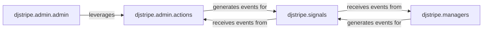

## Details

The `Django Admin & Extensibility` subsystem in `dj-stripe` focuses on integrating Stripe data management seamlessly into the Django administration interface and providing robust extensibility points for developers.

### djstripe.admin.admin
This component serves as the primary interface for `dj-stripe` models within the Django administration panel. It registers `dj-stripe` models, customizes their display, and enables administrative management of Stripe-related data directly from the Django backend. It is crucial for providing a user-friendly, Django-native way to interact with synchronized Stripe data.

**Related Classes/Methods**:

- <a href="https://github.com/dj-stripe/dj-stripe/blob/main/djstripe/admin/admin.py" target="_blank" rel="noopener noreferrer">`djstripe.admin.admin`</a>

### djstripe.admin.actions
This component encapsulates specific, reusable business logic as actions executable from the Django admin list views. These actions abstract complex operations, such as bulk synchronization with the Stripe API, allowing administrators to perform common tasks efficiently. It extends the admin's functionality beyond basic CRUD operations.

**Related Classes/Methods**:

- <a href="https://github.com/dj-stripe/dj-stripe/blob/main/djstripe/admin/actions.py" target="_blank" rel="noopener noreferrer">`djstripe.admin.actions`</a>

### djstripe.managers
This component extends Django's ORM by providing custom model managers for `dj-stripe` models. These managers offer domain-specific query methods, encapsulating complex database interactions and business logic related to Stripe data (e.g., retrieving active subscriptions, finding customers by Stripe ID). They enhance the `dj-stripe` models with powerful, Stripe-aware querying capabilities.

**Related Classes/Methods**:

- <a href="https://github.com/dj-stripe/dj-stripe/blob/main/djstripe/managers.py" target="_blank" rel="noopener noreferrer">`djstripe.managers`</a>

### djstripe.signals
This component defines and dispatches Django signals at key events within the `dj-stripe` system, such as object synchronization (creation/update of Stripe objects in the local database) or webhook processing. It provides a decoupled, publish-subscribe mechanism, allowing other parts of the application or third-party modules to react to `dj-stripe`'s internal state changes without tight coupling, thus promoting extensibility.

**Related Classes/Methods**:

- <a href="https://github.com/dj-stripe/dj-stripe/blob/main/djstripe/signals.py" target="_blank" rel="noopener noreferrer">`djstripe.signals`</a>

### [FAQ](https://github.com/CodeBoarding/GeneratedOnBoardings/tree/main?tab=readme-ov-file#faq)