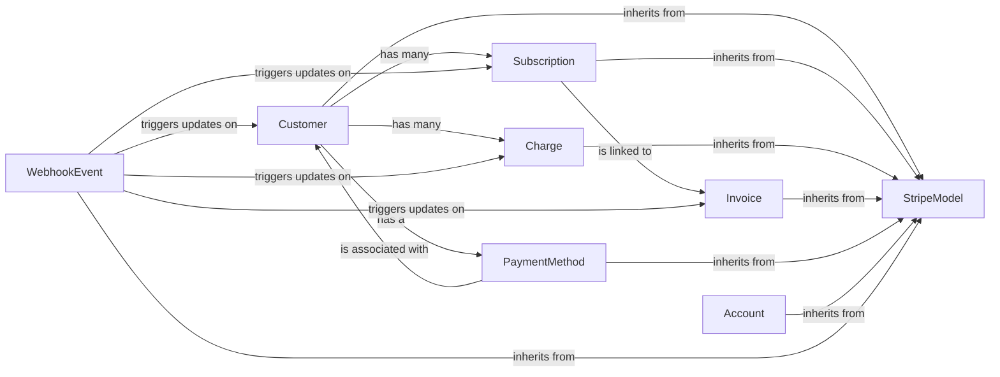

## Details

The Django Stripe Models (ORM) subsystem provides the core data persistence layer for dj-stripe, mirroring Stripe's API objects as Django models. It acts as the ORM interface, enabling Django applications to interact with Stripe data using familiar database operations.

### StripeModel
The abstract base class for all `dj-stripe` models. It provides generic API interaction methods (retrieve, list, update, delete) and crucial data synchronization logic (`sync_from_stripe_data`, `_create_from_stripe_object`) to keep local database records consistent with Stripe.

**Related Classes/Methods**:

- <a href="https://github.com/dj-stripe/dj-stripe/blob/main/djstripe/models/base.py#L83-L1075" target="_blank" rel="noopener noreferrer">`djstripe.models.base.StripeModel`:83-1075</a>

### Customer
Represents a Stripe Customer. This is a key entity, linking Django users to their Stripe customer profiles and managing their associated subscriptions and charges.

**Related Classes/Methods**:

- <a href="https://github.com/dj-stripe/dj-stripe/blob/main/djstripe/models/core.py" target="_blank" rel="noopener noreferrer">`djstripe.models.core.Customer`</a>

### Subscription
Manages customer subscriptions to various plans. It handles the lifecycle of subscriptions, including activation, cancellation, and renewal, and tracks their status and validity.

**Related Classes/Methods**:

- <a href="https://github.com/dj-stripe/dj-stripe/blob/main/djstripe/models/billing.py" target="_blank" rel="noopener noreferrer">`djstripe.models.billing.Subscription`</a>

### Charge
Represents a single payment transaction made through Stripe. It details the amount, status, and related customer information, and supports refund operations.

**Related Classes/Methods**:

- <a href="https://github.com/dj-stripe/dj-stripe/blob/main/djstripe/models/core.py" target="_blank" rel="noopener noreferrer">`djstripe.models.core.Charge`</a>

### Invoice
Details billing for subscriptions or one-off charges. It provides a record of financial transactions and their line items.

**Related Classes/Methods**:

- <a href="https://github.com/dj-stripe/dj-stripe/blob/main/djstripe/models/billing.py" target="_blank" rel="noopener noreferrer">`djstripe.models.billing.Invoice`</a>

### PaymentMethod
Handles various payment instruments (e.g., credit cards, bank accounts) associated with customers or accounts. It abstracts the different Stripe payment method types.

**Related Classes/Methods**:

- <a href="https://github.com/dj-stripe/dj-stripe/blob/main/djstripe/models/payment_methods.py#L907-L1028" target="_blank" rel="noopener noreferrer">`djstripe.models.payment_methods.PaymentMethod`:907-1028</a>

### Account
Mirrors the Stripe Account object itself, primarily used for managing API keys and account-specific branding settings within the local application.

**Related Classes/Methods**:

- <a href="https://github.com/dj-stripe/dj-stripe/blob/main/djstripe/models/account.py#L10-L306" target="_blank" rel="noopener noreferrer">`djstripe.models.account.Account`:10-306</a>

### WebhookEvent
Stores and processes incoming Stripe webhook events. This component is vital for the webhook-driven architecture, ensuring that changes in Stripe are reflected in the local database models.

**Related Classes/Methods**:

- <a href="https://github.com/dj-stripe/dj-stripe/blob/main/djstripe/models/webhooks.py#L135-L362" target="_blank" rel="noopener noreferrer">`djstripe.models.webhooks.WebhookEvent`:135-362</a>

### [FAQ](https://github.com/CodeBoarding/GeneratedOnBoardings/tree/main?tab=readme-ov-file#faq)