```mermaid
graph LR
    Webhook_Endpoint["Webhook Endpoint"]
    Webhook_Security_Parsing["Webhook Security & Parsing"]
    Event_Orchestration_Dispatcher["Event Orchestration & Dispatcher"]
    Specific_Event_Handlers["Specific Event Handlers"]
    Generic_CRUD_Handlers["Generic CRUD Handlers"]
    Webhook_Endpoint -- "passes raw request data to" --> Webhook_Security_Parsing
    Webhook_Security_Parsing -- "provides validated and parsed event data to" --> Event_Orchestration_Dispatcher
    Event_Orchestration_Dispatcher -- "dispatches the event to" --> Specific_Event_Handlers
    Specific_Event_Handlers -- "delegates database update/creation tasks to" --> Generic_CRUD_Handlers
```

## Details

This subsystem is critical for `dj-stripe`'s ability to maintain data consistency with Stripe by processing real-time events. It adheres to the "Webhook-driven Architecture" and integrates deeply with Django's ORM and signal processing, aligning with the "Web Framework Extension/Library" project type.

### Webhook Endpoint
Serves as the HTTP entry point for Stripe to send webhook events. It is responsible for receiving the raw request body and headers from Stripe. This component is the initial touchpoint for all incoming Stripe event data.

**Related Classes/Methods**:

- <a href="https://github.com/dj-stripe/dj-stripe/blob/main/djstripe/urls.py" target="_blank" rel="noopener noreferrer">`djstripe.urls`</a>

### Webhook Security & Parsing
Ensures the authenticity and integrity of incoming webhook events by verifying Stripe's signature using the configured secret. It also handles the parsing of the raw JSON payload into a usable data structure. This component acts as a crucial security and data preparation layer.

**Related Classes/Methods**:

- <a href="https://github.com/dj-stripe/dj-stripe/blob/main/djstripe/models/webhooks.py#L302-L350" target="_blank" rel="noopener noreferrer">`djstripe.models.webhooks.validate`:302-350</a>
- <a href="https://github.com/dj-stripe/dj-stripe/blob/main/djstripe/models/webhooks.py#L285-L300" target="_blank" rel="noopener noreferrer">`djstripe.models.webhooks.verify_signature`:285-300</a>
- <a href="https://github.com/dj-stripe/dj-stripe/blob/main/djstripe/models/webhooks.py#L278-L283" target="_blank" rel="noopener noreferrer">`djstripe.models.webhooks.json_body`:278-283</a>

### Event Orchestration & Dispatcher
Orchestrates the initial processing of validated webhook events and acts as the central routing mechanism. It determines the event type and dispatches the event to the appropriate specific event handler, often leveraging Django's signal system.

**Related Classes/Methods**:

- <a href="https://github.com/dj-stripe/dj-stripe/blob/main/djstripe/models/webhooks.py#L352-L362" target="_blank" rel="noopener noreferrer">`djstripe.models.webhooks.process`:352-362</a>
- <a href="https://github.com/dj-stripe/dj-stripe/blob/main/djstripe/event_handlers.py#L50-L98" target="_blank" rel="noopener noreferrer">`djstripe.event_handlers.djstripe_receiver`:50-98</a>
- <a href="https://github.com/dj-stripe/dj-stripe/blob/main/djstripe/event_handlers.py#L74-L81" target="_blank" rel="noopener noreferrer">`djstripe.event_handlers._check_signal_exists`:74-81</a>

### Specific Event Handlers
Implement the distinct business logic for processing particular Stripe event types (e.g., `customer.created`, `charge.succeeded`). These handlers are responsible for interpreting the event data and initiating the necessary updates or creations of corresponding Django models.

**Related Classes/Methods**:

- <a href="https://github.com/dj-stripe/dj-stripe/blob/main/djstripe/event_handlers.py#L101-L127" target="_blank" rel="noopener noreferrer">`djstripe.event_handlers.handle_customer_event`:101-127</a>
- <a href="https://github.com/dj-stripe/dj-stripe/blob/main/djstripe/event_handlers.py#L130-L153" target="_blank" rel="noopener noreferrer">`djstripe.event_handlers.handle_customer_subscription_event`:130-153</a>
- <a href="https://github.com/dj-stripe/dj-stripe/blob/main/djstripe/event_handlers.py#L248-L265" target="_blank" rel="noopener noreferrer">`djstripe.event_handlers.handle_charge_event`:248-265</a>
- <a href="https://github.com/dj-stripe/dj-stripe/blob/main/djstripe/event_handlers.py#L29-L47" target="_blank" rel="noopener noreferrer">`djstripe.event_handlers.update_customer_helper`:29-47</a>

### Generic CRUD Handlers
Provides a reusable and abstracted mechanism for performing Create, Retrieve, Update, or Delete (CRUD) operations on Django models based on incoming Stripe event data. These handlers are typically called by `Specific Event Handlers` to standardize database interactions.

**Related Classes/Methods**:

- <a href="https://github.com/dj-stripe/dj-stripe/blob/main/djstripe/event_handlers.py#L421-L487" target="_blank" rel="noopener noreferrer">`djstripe.event_handlers._handle_crud_like_event`:421-487</a>
- <a href="https://github.com/dj-stripe/dj-stripe/blob/main/djstripe/event_handlers.py#L402-L418" target="_blank" rel="noopener noreferrer">`djstripe.event_handlers.determine`:402-418</a>

### [FAQ](https://github.com/CodeBoarding/GeneratedOnBoardings/tree/main?tab=readme-ov-file#faq)