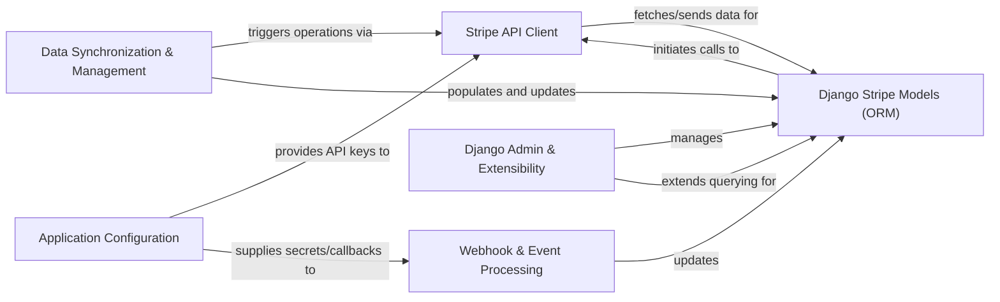

## Details

The `dj-stripe` project is structured around several key components that facilitate the integration of Stripe's API with Django applications. The `Django Stripe Models (ORM)` component serves as the central data layer, persisting Stripe object representations in the local database. It interacts directly with the `Stripe API Client`, which handles all external communication with the Stripe API for data retrieval and manipulation.

Incoming Stripe events are managed by the `Webhook & Event Processing` component, which updates the `Django Stripe Models (ORM)` to ensure data consistency. For initial setup and ongoing maintenance, the `Data Synchronization & Management` component provides utilities to trigger operations via the `Stripe API Client` and populate/update the `Django Stripe Models (ORM)`.

The `Django Admin & Extensibility` component allows administrators to manage and extend querying capabilities for the `Django Stripe Models (ORM)` through the Django admin interface. Finally, the `Application Configuration` component centralizes critical settings, providing API keys to the `Stripe API Client` and supplying secrets/callbacks to the `Webhook & Event Processing` component, thereby influencing the overall behavior and security of the integration. This architecture ensures a clear separation of concerns, enabling robust and maintainable Stripe integration within Django projects.

### Stripe API Client [[Expand]](./Stripe_API_Client.md)
Manages all direct communication with the external Stripe API, handling requests for creating, retrieving, updating, and deleting Stripe objects.

**Related Classes/Methods**:

- <a href="https://github.com/dj-stripe/dj-stripe/blob/main/djstripe/models/base.py" target="_blank" rel="noopener noreferrer">`djstripe.models.base`</a>
- <a href="https://github.com/dj-stripe/dj-stripe/blob/main/djstripe/models/api.py" target="_blank" rel="noopener noreferrer">`djstripe.models.api`</a>
- <a href="https://github.com/dj-stripe/dj-stripe/blob/main/djstripe/utils.py" target="_blank" rel="noopener noreferrer">`djstripe.utils`</a>

### Django Stripe Models (ORM) [[Expand]](./Django_Stripe_Models_ORM_.md)
Django models that mirror and persist Stripe objects within the local application database, providing the ORM interface for all Stripe-related data.

**Related Classes/Methods**:

- <a href="https://github.com/dj-stripe/dj-stripe/blob/main/djstripe/models/account.py" target="_blank" rel="noopener noreferrer">`djstripe.models.account`</a>
- <a href="https://github.com/dj-stripe/dj-stripe/blob/main/djstripe/models/billing.py" target="_blank" rel="noopener noreferrer">`djstripe.models.billing`</a>
- <a href="https://github.com/dj-stripe/dj-stripe/blob/main/djstripe/models/core.py" target="_blank" rel="noopener noreferrer">`djstripe.models.core`</a>
- <a href="https://github.com/dj-stripe/dj-stripe/blob/main/djstripe/models/payment_methods.py" target="_blank" rel="noopener noreferrer">`djstripe.models.payment_methods`</a>
- <a href="https://github.com/dj-stripe/dj-stripe/blob/main/djstripe/models/webhooks.py" target="_blank" rel="noopener noreferrer">`djstripe.models.webhooks`</a>

### Webhook & Event Processing [[Expand]](./Webhook_Event_Processing.md)
Responsible for receiving, validating, and processing incoming Stripe webhook events, ensuring the local database reflects the latest Stripe data.

**Related Classes/Methods**:

- <a href="https://github.com/dj-stripe/dj-stripe/blob/main/djstripe/models/webhooks.py" target="_blank" rel="noopener noreferrer">`djstripe.models.webhooks`</a>
- <a href="https://github.com/dj-stripe/dj-stripe/blob/main/djstripe/event_handlers.py" target="_blank" rel="noopener noreferrer">`djstripe.event_handlers`</a>
- <a href="https://github.com/dj-stripe/dj-stripe/blob/main/djstripe/urls.py" target="_blank" rel="noopener noreferrer">`djstripe.urls`</a>

### Data Synchronization & Management [[Expand]](./Data_Synchronization_Management.md)
Provides Django management commands and internal utilities for initial data synchronization, ongoing updates, and processing queued webhook events.

**Related Classes/Methods**:

- <a href="https://github.com/dj-stripe/dj-stripe/blob/main/djstripe/management/commands/djstripe_sync_models.py" target="_blank" rel="noopener noreferrer">`djstripe.management.commands.djstripe_sync_models`</a>
- <a href="https://github.com/dj-stripe/dj-stripe/blob/main/djstripe/management/commands/djstripe_process_events.py" target="_blank" rel="noopener noreferrer">`djstripe.management.commands.djstripe_process_events`</a>
- <a href="https://github.com/dj-stripe/dj-stripe/blob/main/djstripe/management/commands/stripe_listen.py" target="_blank" rel="noopener noreferrer">`djstripe.management.commands.stripe_listen`</a>
- <a href="https://github.com/dj-stripe/dj-stripe/blob/main/djstripe/sync.py" target="_blank" rel="noopener noreferrer">`djstripe.sync`</a>

### Django Admin & Extensibility [[Expand]](./Django_Admin_Extensibility.md)
Extends the Django administration interface for managing `dj-stripe` models and offers extensibility points via custom model managers and Django signals.

**Related Classes/Methods**:

- <a href="https://github.com/dj-stripe/dj-stripe/blob/main/djstripe/admin/admin.py" target="_blank" rel="noopener noreferrer">`djstripe.admin.admin`</a>
- <a href="https://github.com/dj-stripe/dj-stripe/blob/main/djstripe/admin/actions.py" target="_blank" rel="noopener noreferrer">`djstripe.admin.actions`</a>
- <a href="https://github.com/dj-stripe/dj-stripe/blob/main/djstripe/managers.py" target="_blank" rel="noopener noreferrer">`djstripe.managers`</a>
- <a href="https://github.com/dj-stripe/dj-stripe/blob/main/djstripe/signals.py" target="_blank" rel="noopener noreferrer">`djstripe.signals`</a>

### Application Configuration
Centralizes `dj-stripe` specific settings, API keys, and configurable callback functions, influencing the behavior of other components.

**Related Classes/Methods**:

- <a href="https://github.com/dj-stripe/dj-stripe/blob/main/djstripe/settings.py" target="_blank" rel="noopener noreferrer">`djstripe.settings`</a>
- <a href="https://github.com/dj-stripe/dj-stripe/blob/main/djstripe/apps.py" target="_blank" rel="noopener noreferrer">`djstripe.apps`</a>

### [FAQ](https://github.com/CodeBoarding/GeneratedOnBoardings/tree/main?tab=readme-ov-file#faq)