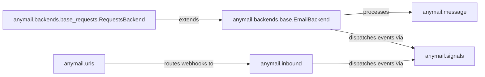

## Details

The Anymail subsystem orchestrates email communication within Django applications, handling both outbound sending and inbound webhook processing. At its core, `anymail.backends.base.EmailBackend` defines the abstract interface for sending emails, processing `anymail.message` objects and dispatching events through `anymail.signals`. Specialized backends like `anymail.backends.base_requests.RequestsBackend` extend `EmailBackend` to manage HTTP-based interactions with Email Service Providers (ESPs). For inbound email and webhook processing, `anymail.urls` routes incoming requests to `anymail.inbound`, which then parses the data and dispatches relevant events via `anymail.signals`, enabling a flexible and extensible event-driven architecture.

### anymail.message
Extends Django's `EmailMessage` to encapsulate and manage the structure and content of email messages, including Anymail-specific features like `AnymailStatus` and inline attachments. It serves as the standardized data carrier for email communication within Anymail.

**Related Classes/Methods**:

- <a href="https://github.com/anymail/django-anymail/blob/main/anymail/message.py" target="_blank" rel="noopener noreferrer">`anymail.message`</a>

### anymail.backends.base.EmailBackend
Defines the abstract contract and common logic for all Anymail email sending backends. It orchestrates message preparation, recipient handling, and dispatches `pre_send` and `post_send` signals. This class is the primary extension point for concrete ESP-specific backends, embodying the Strategy pattern.

**Related Classes/Methods**:

- <a href="https://github.com/anymail/django-anymail/blob/main/anymail/backends/base.py" target="_blank" rel="noopener noreferrer">`anymail.backends.base.EmailBackend`</a>

### anymail.backends.base_requests.RequestsBackend
Provides a foundational layer for ESP backends that communicate via REST APIs. It extends `EmailBackend` to abstract away the complexities of HTTP session management, request construction, and response handling, acting as a Facade over the `requests` library for API-based email sending.

**Related Classes/Methods**:

- <a href="https://github.com/anymail/django-anymail/blob/main/anymail/backends/base_requests.py" target="_blank" rel="noopener noreferrer">`anymail.backends.base_requests.RequestsBackend`</a>

### anymail.signals
Manages Django signals, enabling a loosely coupled, event-driven architecture. It defines and dispatches signals for key events such as email sending (`pre_send`, `post_send`) and webhook processing (`inbound`, `tracking`).

**Related Classes/Methods**:

- <a href="https://github.com/anymail/django-anymail/blob/main/anymail/signals.py" target="_blank" rel="noopener noreferrer">`anymail.signals`</a>

### anymail.inbound
Parses raw inbound email data (typically received via webhooks) into structured `AnymailInboundMessage` objects. It extracts headers, body content (text and HTML), and attachments, making inbound email data easily consumable by Django applications.

**Related Classes/Methods**:

- <a href="https://github.com/anymail/django-anymail/blob/main/anymail/inbound.py" target="_blank" rel="noopener noreferrer">`anymail.inbound`</a>

### anymail.urls
Configures Django URL patterns to receive and route incoming webhook requests from various ESPs to the appropriate Anymail webhook handlers. It serves as the initial entry point for inbound events from external ESPs.

**Related Classes/Methods**:

- <a href="https://github.com/anymail/django-anymail/blob/main/anymail/urls.py" target="_blank" rel="noopener noreferrer">`anymail.urls`</a>

### [FAQ](https://github.com/CodeBoarding/GeneratedOnBoardings/tree/main?tab=readme-ov-file#faq)