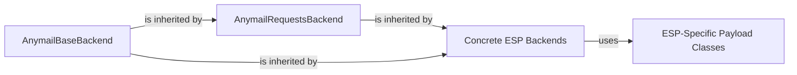

## Details

The `anymail.backends` subsystem provides a robust and extensible framework for integrating Django applications with various Email Service Providers. It is anchored by the `AnymailBaseBackend`, which establishes a universal interface for email sending. This base is extended by `AnymailRequestsBackend`, centralizing HTTP communication logic for web-API-driven ESPs. Building upon these, `Concrete ESP Backends` implement the unique API interactions for specific providers, acting as adapters that translate generic email messages into ESP-specific formats. These concrete backends, in turn, rely on `ESP-Specific Payload Classes` to meticulously construct the data payloads required by each provider's API, ensuring accurate and efficient email delivery. This modular design facilitates easy integration of new ESPs and maintains a consistent, high-level abstraction for email dispatch.

### AnymailBaseBackend
Serves as the abstract base class for all Anymail backends. It defines the fundamental contract for email sending, including common message validation and the overall email dispatch lifecycle. It acts as the entry point for the Strategy/Plugin pattern, allowing different ESP implementations to be seamlessly integrated.

**Related Classes/Methods**: _None_

### AnymailRequestsBackend
An abstract class that extends `AnymailBaseBackend`, providing common HTTP request handling for most web-API-based ESPs. It centralizes logic for creating and managing `requests.Session` objects, posting data to API endpoints, handling HTTP-level errors, and deserializing JSON responses.

**Related Classes/Methods**:

- <a href="https://github.com/anymail/django-anymail/blob/main/anymail/backends/base_requests.py#L12-L176" target="_blank" rel="noopener noreferrer">`anymail.backends.base_requests.AnymailRequestsBackend`:12-176</a>

### Concrete ESP Backends
These are concrete implementations, each tailored to send emails through a specific Email Service Provider. They encapsulate the unique API interactions, including authentication, endpoint specifics, and response parsing for their respective ESPs. They embody the Adapter pattern, translating the generic `Anymail` message into the specific format required by the ESP.

**Related Classes/Methods**: _None_

### ESP-Specific Payload Classes
These internal classes or methods, typically associated with a `Concrete ESP Backend`, are responsible for structuring the exact data payload required by the respective ESP's API. They ensure that email data (recipients, subject, body, attachments, etc.) is correctly formatted according to each provider's specific API documentation.

**Related Classes/Methods**: _None_

### [FAQ](https://github.com/CodeBoarding/GeneratedOnBoardings/tree/main?tab=readme-ov-file#faq)