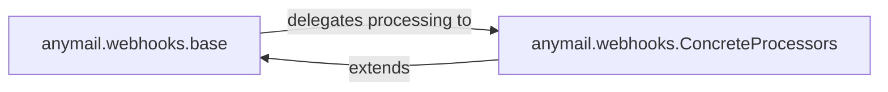

## Details

The `anymail.webhooks` subsystem provides a flexible and extensible framework for handling incoming webhook events from various Email Service Providers (ESPs). At its core, `anymail.webhooks.base` establishes an abstract interface and a common processing pipeline, ensuring consistent handling of webhook requests. This base component delegates the ESP-specific parsing and validation to a set of `anymail.webhooks.ConcreteProcessors`. Each concrete processor acts as an adapter, extending the base interface to implement the unique logic required for its respective ESP, transforming raw webhook data into standardized `django-anymail` event objects. This design promotes modularity, allowing new ESP integrations to be added by simply implementing a new concrete processor that adheres to the defined base interface.

### anymail.webhooks.base
This component defines the abstract interface and the common processing flow for all ESP webhook handlers. It acts as the central orchestrator, providing a consistent API (`validate_request`, `parse_events`, `post`) that all concrete webhook processors must adhere to. It ensures that regardless of the ESP, the initial handling and dispatching of webhook events follow a predictable pattern.

**Related Classes/Methods**:

- <a href="https://github.com/anymail/django-anymail/blob/main/anymail/webhooks/base.py" target="_blank" rel="noopener noreferrer">`anymail.webhooks.base`</a>

### anymail.webhooks.ConcreteProcessors
This conceptual component represents the collection of concrete implementations, each designed as an adapter for a specific Email Service Provider (e.g., Amazon SES, Brevo, Mailgun, SendGrid, etc.). Each concrete processor is responsible for the ESP-specific logic of receiving, validating (if applicable), and parsing the raw incoming webhook data. Their primary role is to transform the ESP's unique data format into standardized `django-anymail` event objects (`AnymailEvent`) and, in some cases, handle inbound email messages or attachments.

**Related Classes/Methods**:

- <a href="https://github.com/anymail/django-anymail/blob/main/anymail/webhooks/amazon_ses.py" target="_blank" rel="noopener noreferrer">`anymail.webhooks.amazon_ses`</a>
- <a href="https://github.com/anymail/django-anymail/blob/main/anymail/webhooks/brevo.py" target="_blank" rel="noopener noreferrer">`anymail.webhooks.brevo`</a>
- <a href="https://github.com/anymail/django-anymail/blob/main/anymail/webhooks/mailersend.py" target="_blank" rel="noopener noreferrer">`anymail.webhooks.mailersend`</a>
- <a href="https://github.com/anymail/django-anymail/blob/main/anymail/webhooks/mailgun.py" target="_blank" rel="noopener noreferrer">`anymail.webhooks.mailgun`</a>
- <a href="https://github.com/anymail/django-anymail/blob/main/anymail/webhooks/mailjet.py" target="_blank" rel="noopener noreferrer">`anymail.webhooks.mailjet`</a>
- <a href="https://github.com/anymail/django-anymail/blob/main/anymail/webhooks/mandrill.py" target="_blank" rel="noopener noreferrer">`anymail.webhooks.mandrill`</a>
- <a href="https://github.com/anymail/django-anymail/blob/main/anymail/webhooks/postmark.py" target="_blank" rel="noopener noreferrer">`anymail.webhooks.postmark`</a>
- <a href="https://github.com/anymail/django-anymail/blob/main/anymail/webhooks/resend.py" target="_blank" rel="noopener noreferrer">`anymail.webhooks.resend`</a>
- <a href="https://github.com/anymail/django-anymail/blob/main/anymail/webhooks/sendgrid.py" target="_blank" rel="noopener noreferrer">`anymail.webhooks.sendgrid`</a>

### [FAQ](https://github.com/CodeBoarding/GeneratedOnBoardings/tree/main?tab=readme-ov-file#faq)