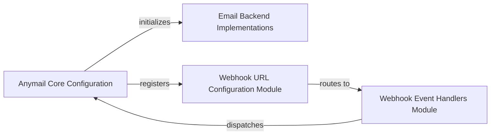

## Details

The django-anymail library provides a robust framework for integrating various Email Service Providers (ESPs) with Django applications, handling both outgoing email dispatch and incoming webhook event processing. Its core design revolves around a pluggable backend system for ESP communication, a dedicated webhook processing module for event handling, and a signal-based architecture for custom application logic. The library's configuration is managed through its Django AppConfig, ensuring seamless integration within a Django project's settings and URL routing.

### Anymail Core Configuration
This component is responsible for the fundamental setup and integration of the django-anymail library within a Django project. It defines the application's configuration, including its name and readiness checks, ensuring that django-anymail is properly initialized and recognized by the Django framework.

**Related Classes/Methods**:

- <a href="https://github.com/anymail/django-anymail/blob/main/anymail/apps.py" target="_blank" rel="noopener noreferrer">`anymail.apps.AnymailConfig`</a>

### Email Backend Implementations
This module provides the concrete implementations for sending emails through various Email Service Providers (ESPs). It abstracts the complexities of different ESP APIs, offering a unified interface for dispatching email messages. Each backend handles the specific communication protocols and data formats required by its respective ESP.

**Related Classes/Methods**:

- <a href="https://github.com/anymail/django-anymail/blob/main/anymail/backends/base.py" target="_blank" rel="noopener noreferrer">`anymail.backends.base.AnymailBackend`</a>
- <a href="https://github.com/anymail/django-anymail/blob/main/anymail/backends/sendgrid.py" target="_blank" rel="noopener noreferrer">`anymail.backends.sendgrid.SendGridBackend`</a>

### Webhook URL Configuration Module
This component manages the routing of incoming webhook requests from Email Service Providers to the appropriate django-anymail internal views. It defines the URL patterns that allow ESPs to send delivery, open, click, bounce, and other event notifications, ensuring they are correctly received and processed by the library.

**Related Classes/Methods**:

- <a href="https://github.com/anymail/django-anymail/blob/main/anymail/urls.py" target="_blank" rel="noopener noreferrer">`anymail.urls.urlpatterns`</a>

### Webhook Event Handlers Module
This module is dedicated to processing and dispatching events received via webhooks from Email Service Providers. It parses incoming webhook data, normalizes it into a consistent format, and then dispatches Django signals (e.g., tracking_event, inbound_event) that user applications can subscribe to for custom logic.

**Related Classes/Methods**:

- <a href="https://github.com/anymail/django-anymail/blob/main/anymail/signals.py" target="_blank" rel="noopener noreferrer">`anymail.signals.tracking_event`</a>
- <a href="https://github.com/anymail/django-anymail/blob/main/anymail/webhooks/base.py" target="_blank" rel="noopener noreferrer">`anymail.webhooks.base.AnymailWebhookView`</a>
- <a href="https://github.com/anymail/django-anymail/blob/main/anymail/inbound.py#L14-L415" target="_blank" rel="noopener noreferrer">`anymail.inbound.AnymailInboundMessage`:14-415</a>

### [FAQ](https://github.com/CodeBoarding/GeneratedOnBoardings/tree/main?tab=readme-ov-file#faq)