```mermaid
graph LR
    Django_Application["Django Application"]
    Anymail_Core_Library["Anymail Core Library"]
    Anymail_ESP_Backends["Anymail ESP Backends"]
    Anymail_Webhook_Processors["Anymail Webhook Processors"]
    Email_Service_Providers_ESPs_["Email Service Providers (ESPs)"]
    Django_Application -- "initiates email sending (Control Flow) to" --> Anymail_Core_Library
    Anymail_Core_Library -- "sends event signals (Data Flow) to" --> Django_Application
    Anymail_Core_Library -- "delegates email sending (Control Flow) to" --> Anymail_ESP_Backends
    Anymail_Core_Library -- "provides message payload (Data Flow) to" --> Anymail_ESP_Backends
    Anymail_ESP_Backends -- "sends email data (Data Flow) to" --> Email_Service_Providers_ESPs_
    Anymail_ESP_Backends -- "invokes ESP API (Control Flow) on" --> Email_Service_Providers_ESPs_
    Email_Service_Providers_ESPs_ -- "sends webhook events (Data Flow) to" --> Anymail_Webhook_Processors
    Email_Service_Providers_ESPs_ -- "triggers webhook endpoint (Control Flow) on" --> Anymail_Webhook_Processors
    Anymail_Webhook_Processors -- "processes webhook events (Data Flow) to" --> Anymail_Core_Library
    Anymail_Webhook_Processors -- "notifies core of events (Control Flow) to" --> Anymail_Core_Library
    click Django_Application href "https://github.com/CodeBoarding/GeneratedOnBoardings/blob/main/django-anymail/Django_Application.md" "Details"
    click Anymail_Core_Library href "https://github.com/CodeBoarding/GeneratedOnBoardings/blob/main/django-anymail/Anymail_Core_Library.md" "Details"
    click Anymail_ESP_Backends href "https://github.com/CodeBoarding/GeneratedOnBoardings/blob/main/django-anymail/Anymail_ESP_Backends.md" "Details"
    click Anymail_Webhook_Processors href "https://github.com/CodeBoarding/GeneratedOnBoardings/blob/main/django-anymail/Anymail_Webhook_Processors.md" "Details"
```

## Details

The django-anymail project acts as an intermediary between a Django Application and various Email Service Providers (ESPs). The Django Application initiates email sending requests, which are processed by the Anymail Core Library. This core library then delegates the actual email transmission to specific Anymail ESP Backends, each tailored for a particular ESP. These backends interact directly with the Email Service Providers (ESPs) via their respective APIs. Conversely, Email Service Providers (ESPs) send webhook events (e.g., delivery status, bounces) back to the django-anymail system. These events are received and processed by Anymail Webhook Processors, which translate the ESP-specific formats into standardized events that are then handled by the Anymail Core Library, ultimately signaling the Django Application. This architecture ensures a modular and extensible system for email sending and event handling within Django projects.

### Django Application [[Expand]](./Django_Application.md)
The user's Django project that integrates with django-anymail to send emails and receive event notifications. It consumes the django-anymail library's functionalities.

**Related Classes/Methods**:

- <a href="https://github.com/anymail/django-anymail/blob/main/anymail/urls.py" target="_blank" rel="noopener noreferrer">`anymail.urls`</a>

### Anymail Core Library [[Expand]](./Anymail_Core_Library.md)
The central hub of django-anymail, providing the foundational interfaces, message construction, HTTP communication, and signal dispatching. It orchestrates interactions between the Django application, ESP-specific backends, and webhook processors.

**Related Classes/Methods**:

- <a href="https://github.com/anymail/django-anymail/blob/main/anymail/message.py" target="_blank" rel="noopener noreferrer">`anymail.message`</a>
- <a href="https://github.com/anymail/django-anymail/blob/main/anymail/backends/base.py" target="_blank" rel="noopener noreferrer">`anymail.backends.base`</a>
- <a href="https://github.com/anymail/django-anymail/blob/main/anymail/backends/base_requests.py" target="_blank" rel="noopener noreferrer">`anymail.backends.base_requests`</a>
- <a href="https://github.com/anymail/django-anymail/blob/main/anymail/signals.py" target="_blank" rel="noopener noreferrer">`anymail.signals`</a>
- <a href="https://github.com/anymail/django-anymail/blob/main/anymail/inbound.py" target="_blank" rel="noopener noreferrer">`anymail.inbound`</a>
- <a href="https://github.com/anymail/django-anymail/blob/main/anymail/urls.py" target="_blank" rel="noopener noreferrer">`anymail.urls`</a>

### Anymail ESP Backends [[Expand]](./Anymail_ESP_Backends.md)
A collection of concrete implementations, each tailored to send emails through a specific Email Service Provider. These backends extend the Anymail Core Library's base interface and encapsulate unique API interactions.

**Related Classes/Methods**:

- <a href="https://github.com/anymail/django-anymail/blob/main/anymail/backends" target="_blank" rel="noopener noreferrer">`anymail.backends`</a>

### Anymail Webhook Processors [[Expand]](./Anymail_Webhook_Processors.md)
A collection of concrete implementations designed to receive, parse, and process incoming webhook events from specific Email Service Providers, translating ESP-specific formats into standardized django-anymail events.

**Related Classes/Methods**:

- <a href="https://github.com/anymail/django-anymail/blob/main/anymail/webhooks" target="_blank" rel="noopener noreferrer">`anymail.webhooks`</a>

### Email Service Providers (ESPs)
External third-party services responsible for sending emails and providing event notifications (delivery status, bounces, opens, clicks, etc.) via webhooks. (Note: This component is external to the django-anymail project and does not have internal source code references.)

**Related Classes/Methods**: _None_

### [FAQ](https://github.com/CodeBoarding/GeneratedOnBoardings/tree/main?tab=readme-ov-file#faq)