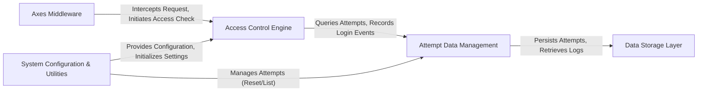

## Details

The `django-axes` architecture is centered around its `Axes Middleware`, which acts as the primary interceptor for all incoming Django requests. This middleware hands off control to the `Access Control Engine`, the core logic component responsible for evaluating access permissions and applying lockout rules based on configured settings and client data. The engine relies on the `Attempt Data Management` component, an abstract layer that orchestrates the recording and retrieval of access attempts, seamlessly integrating with either database or cache-based storage. All persistent data, including access attempts and logs, is managed by the `Data Storage Layer` through Django's ORM. Complementing these operational components, the `System Configuration & Utilities` module handles the application's lifecycle, loads and validates settings, and provides essential administrative tools for managing the security state. This modular design ensures clear separation of concerns, extensibility, and efficient integration within the Django framework, making it ideal for visual representation as a data flow diagram.

### Axes Middleware
The primary entry point for `django-axes`, intercepting HTTP requests to initiate access control checks.

**Related Classes/Methods**:

- <a href="https://github.com/jazzband/django-axes/blob/master/axes/middleware.py" target="_blank" rel="noopener noreferrer">`axes/middleware.py`</a>

### Access Control Engine
The core decision-making component that evaluates access permissions, applies lockout policies, and processes client-specific data.

**Related Classes/Methods**:

- <a href="https://github.com/jazzband/django-axes/blob/master/axes/handlers/base.py" target="_blank" rel="noopener noreferrer">`axes/handlers/base.py`</a>
- <a href="https://github.com/jazzband/django-axes/blob/master/axes/helpers.py" target="_blank" rel="noopener noreferrer">`axes/helpers.py`</a>

### Attempt Data Management
An abstraction layer for handling access attempt data, decoupling the core logic from specific storage implementations (database or cache).

**Related Classes/Methods**:

- <a href="https://github.com/jazzband/django-axes/blob/master/axes/handlers/proxy.py" target="_blank" rel="noopener noreferrer">`axes/handlers/proxy.py`</a>
- <a href="https://github.com/jazzband/django-axes/blob/master/axes/handlers/database.py" target="_blank" rel="noopener noreferrer">`axes/handlers/database.py`</a>
- <a href="https://github.com/jazzband/django-axes/blob/master/axes/handlers/cache.py" target="_blank" rel="noopener noreferrer">`axes/handlers/cache.py`</a>

### Data Storage Layer
Defines the Django ORM models for persisting access attempt and log data in the database.

**Related Classes/Methods**:

- <a href="https://github.com/jazzband/django-axes/blob/master/axes/models.py" target="_blank" rel="noopener noreferrer">`axes/models.py`</a>

### System Configuration & Utilities
Manages application lifecycle, loads and validates configuration settings, and provides administrative commands for system management.

**Related Classes/Methods**:

- <a href="https://github.com/jazzband/django-axes/blob/master/axes/apps.py" target="_blank" rel="noopener noreferrer">`axes/apps.py`</a>
- <a href="https://github.com/jazzband/django-axes/blob/master/axes/conf.py" target="_blank" rel="noopener noreferrer">`axes/conf.py`</a>
- <a href="https://github.com/jazzband/django-axes/blob/master/axes/checks.py" target="_blank" rel="noopener noreferrer">`axes/checks.py`</a>
- <a href="https://github.com/jazzband/django-axes/blob/master/axes/management/commands/axes_reset.py" target="_blank" rel="noopener noreferrer">`axes/management/commands/axes_reset.py`</a>
- <a href="https://github.com/jazzband/django-axes/blob/master/axes/management/commands/axes_list_attempts.py" target="_blank" rel="noopener noreferrer">`axes/management/commands/axes_list_attempts.py`</a>

### [FAQ](https://github.com/CodeBoarding/GeneratedOnBoardings/tree/main?tab=readme-ov-file#faq)