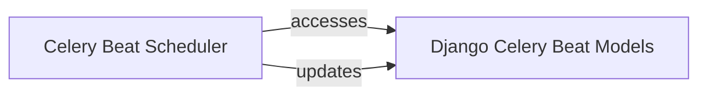

## Details

The `django-celery-beat` subsystem primarily revolves around the `Celery Beat Scheduler` and the `Django Celery Beat Models`. The `Celery Beat Scheduler` acts as the orchestrator, continuously monitoring and dispatching scheduled tasks. It interacts directly with the `Django Celery Beat Models` to retrieve task definitions and their schedules from the database. After determining which tasks are due, the scheduler dispatches them to the Celery task queue for execution. Furthermore, the `Celery Beat Scheduler` updates the `Django Celery Beat Models` to reflect the last run times and other relevant state changes of the periodic tasks, ensuring persistence and accurate scheduling for future runs. This interaction forms the core loop of the `celery beat` service, enabling dynamic and database-driven task scheduling.

### Celery Beat Scheduler [[Expand]](./Celery_Beat_Scheduler.md)
This is the core runtime component that implements the main scheduling loop for the Celery `beat` service. It is responsible for querying the database for `PeriodicTask` entries, determining which tasks are due for execution based on their defined schedules, and dispatching them to the Celery task queue. It also manages the state of these tasks, such as updating their last run times.

**Related Classes/Methods**:

- <a href="https://github.com/celery/django-celery-beat/blob/main/django_celery_beat/schedulers.py#L1-L300" target="_blank" rel="noopener noreferrer">`schedulers`:1-300</a>

### Django Celery Beat Models
This component defines the database schema and provides the Object-Relational Mapping (ORM) interface for all scheduled tasks and their associated schedule configurations. It serves as the persistent and authoritative source of truth for `PeriodicTask` entries, including `IntervalSchedule`, `CrontabSchedule`, `SolarSchedule`, and `ClockedSchedule` types.

**Related Classes/Methods**:

- <a href="https://github.com/celery/django-celery-beat/blob/main/django_celery_beat/schedulers.py#L273-L279" target="_blank" rel="noopener noreferrer">`models`:273-279</a>

### [FAQ](https://github.com/CodeBoarding/GeneratedOnBoardings/tree/main?tab=readme-ov-file#faq)