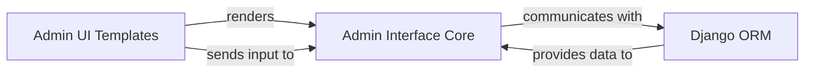

## Details

The `django-celery-beat` subsystem primarily facilitates the management of periodic tasks within a Django application. Its core functionality revolves around the `Admin Interface Core`, which provides the backend logic for configuring and controlling these tasks. This core component interacts directly with the `Django ORM` through `django-celery-beat`'s models to persist and retrieve task definitions and schedules. The `Admin UI Templates` component is responsible for rendering the user-facing interface within the Django Admin, allowing administrators to interact with the system. User input from the `Admin UI Templates` is processed by the `Admin Interface Core`, which then orchestrates the necessary database operations via the `Django ORM`.

### Admin Interface Core
This component is responsible for the backend logic of the Django Admin interface. It registers the `django-celery-beat` models (`PeriodicTask`, `IntervalSchedule`, `CrontabSchedule`, `SolarSchedule`, `ClockedSchedule`) with the Django admin site, defines custom `ModelAdmin` classes to tailor their appearance and behavior, handles form submissions for creating and editing tasks, orchestrates task discovery (e.g., available Celery tasks), and manages task activation/deactivation. It serves as the control layer for administrative operations.

**Related Classes/Methods**:

- <a href="https://github.com/celery/django-celery-beat/blob/main/django_celery_beat/admin.py#L1-L100" target="_blank" rel="noopener noreferrer">`django_celery_beat.admin`:1-100</a>

### Admin UI Templates
This component is responsible for rendering the visual user interface within the Django Admin for listing, creating, and editing periodic tasks and their associated schedules. It provides the HTML structure and presentation layer that users interact with to configure tasks.

**Related Classes/Methods**:

- <a href="https://github.com/celery/django-celery-beat/blob/main/django_celery_beat/templates/admin/djcelery/change_list.html#L1-L100" target="_blank" rel="noopener noreferrer">`django_celery_beat.templates.admin.djcelery.change_list.html`:1-100</a>
- <a href="https://github.com/celery/django-celery-beat/blob/main/django_celery_beat/templates/admin/djcelery/change_periodictask_form.html#L1-L100" target="_blank" rel="noopener noreferrer">`django_celery_beat.templates.admin.djcelery.change_periodictask_form.html`:1-100</a>

### Django ORM
The Django Object-Relational Mapper (ORM) provides a way to interact with the database using Python objects. Within this subsystem, it is utilized by the `Admin Interface Core` to manage and persist `PeriodicTask` and other schedule-related data.

**Related Classes/Methods**:

- <a href="https://github.com/celery/django-celery-beat/blob/main/django_celery_beat/models.py#L432-L676" target="_blank" rel="noopener noreferrer">`django_celery_beat.models.PeriodicTask`:432-676</a>

### [FAQ](https://github.com/CodeBoarding/GeneratedOnBoardings/tree/main?tab=readme-ov-file#faq)