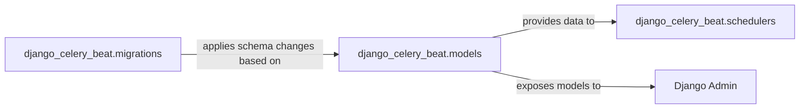

## Details

The `django-celery-beat` subsystem primarily manages the scheduling of periodic tasks within a Django application using Celery. At its core, the `django_celery_beat.models` component defines the database schema for various types of periodic tasks and their schedules, acting as the central data repository. The `django_celery_beat.migrations` component is responsible for applying and managing changes to this database schema, ensuring the database structure aligns with the defined models. For task execution, the `django_celery_beat.schedulers` component queries the `django_celery_beat.models` to retrieve task definitions and determine which tasks are due. Finally, the `Django Admin` interface provides a user-friendly way for administrators to interact with and manage these periodic tasks by directly exposing the `django_celery_beat.models` for CRUD operations. This architecture ensures a clear separation of concerns, with models defining data, migrations handling schema evolution, schedulers executing tasks based on data, and the admin interface providing management capabilities.

### django_celery_beat.models
This component defines the core Django ORM models (e.g., `PeriodicTask`, `CrontabSchedule`, `IntervalSchedule`, `ClockedSchedule`) that represent various types of periodic tasks and their scheduling parameters. It encapsulates the logic for data persistence (CRUD operations), provides methods for retrieving and representing schedule information, implements change tracking, and includes internal validation rules to maintain data integrity.

**Related Classes/Methods**:

- <a href="https://github.com/celery/django-celery-beat/blob/main/django_celery_beat/models.py" target="_blank" rel="noopener noreferrer">`django_celery_beat.models`</a>

### django_celery_beat.migrations
This component is integral to the Persistence Layer, handling the evolution of the database schema for the models defined in `django_celery_beat.models`. It contains the migration files that Django uses to create, alter, and manage database tables, ensuring compatibility across different versions of the application and facilitating database setup.

**Related Classes/Methods**:

- <a href="https://github.com/celery/django-celery-beat/blob/main/django_celery_beat/migrations" target="_blank" rel="noopener noreferrer">`django_celery_beat.migrations`</a>

### django_celery_beat.schedulers
This component is responsible for interacting with the `django_celery_beat.models` to retrieve and manage periodic task schedules. It acts as the bridge between the defined tasks in the database and the Celery beat process, determining which tasks are due to run and when.

**Related Classes/Methods**:

- <a href="https://github.com/celery/django-celery-beat/blob/main/django_celery_beat/schedulers.py" target="_blank" rel="noopener noreferrer">`django_celery_beat.schedulers`</a>

### Django Admin
This is an external, core Django component that provides an automatic administrative interface for managing application data. It interacts directly with the `django_celery_beat.models` to allow administrators to create, view, update, and delete periodic tasks and their associated schedules through a user-friendly web interface.

**Related Classes/Methods**: _None_

### [FAQ](https://github.com/CodeBoarding/GeneratedOnBoardings/tree/main?tab=readme-ov-file#faq)