```mermaid
graph LR
    Django_Admin_Configuration["Django Admin & Configuration"]
    Persistence_Layer["Persistence Layer"]
    Celery_Beat_Scheduler["Celery Beat Scheduler"]
    Schedule_Type_Handlers["Schedule Type Handlers"]
    Input_Validators["Input Validators"]
    Django_Signals_Integration["Django Signals Integration"]
    Django_Admin_Configuration -- "Configures/Manages" --> Persistence_Layer
    Input_Validators -- "Validates Input For" --> Django_Admin_Configuration
    Persistence_Layer -- "Provides Schedules To" --> Celery_Beat_Scheduler
    Celery_Beat_Scheduler -- "Evaluates Schedules Using" --> Schedule_Type_Handlers
    Celery_Beat_Scheduler -- "Updates Status In" --> Persistence_Layer
    Django_Signals_Integration -- "Monitors/Triggers" --> Persistence_Layer
    click Django_Admin_Configuration href "https://github.com/CodeBoarding/GeneratedOnBoardings/blob/main/django-celery-beat/Django_Admin_Configuration.md" "Details"
    click Persistence_Layer href "https://github.com/CodeBoarding/GeneratedOnBoardings/blob/main/django-celery-beat/Persistence_Layer.md" "Details"
    click Celery_Beat_Scheduler href "https://github.com/CodeBoarding/GeneratedOnBoardings/blob/main/django-celery-beat/Celery_Beat_Scheduler.md" "Details"
```

## Details

The `django-celery-beat` architecture centers around bridging Django's data management capabilities with Celery's asynchronous task processing. The Django Admin & Configuration component serves as the primary interface for users to define and manage scheduled tasks, with Input Validators ensuring data integrity. These task definitions are then durably stored in the Persistence Layer using Django's ORM. The Celery Beat Scheduler acts as the orchestrator, continuously polling the Persistence Layer for due tasks. It relies on Schedule Type Handlers to accurately interpret and evaluate various schedule types (e.g., Crontab, Interval). Upon identifying a due task, the scheduler dispatches it to external Celery Workers for execution, subsequently updating the task's status in the Persistence Layer. This design provides a robust, database-driven scheduling system for Celery, enabling persistent and manageable periodic task execution within a Django application.

### Django Admin & Configuration [[Expand]](./Django_Admin_Configuration.md)
The user-facing component for defining and managing periodic tasks and their schedules.

**Related Classes/Methods**:

- <a href="https://github.com/celery/django-celery-beat/blob/main/django_celery_beat/admin.py" target="_blank" rel="noopener noreferrer">`django_celery_beat.admin`</a>
- <a href="https://github.com/celery/django-celery-beat/blob/main/django_celery_beat/templates/admin/djcelery/change_list.html" target="_blank" rel="noopener noreferrer">`django_celery_beat.templates.admin.djcelery.change_list.html`</a>
- <a href="https://github.com/celery/django-celery-beat/blob/main/django_celery_beat/templates/admin/djcelery/change_periodictask_form.html" target="_blank" rel="noopener noreferrer">`django_celery_beat.templates.admin.djcelery.change_periodictask_form.html`</a>

### Persistence Layer [[Expand]](./Persistence_Layer.md)
Stores all periodic task and schedule configurations.

**Related Classes/Methods**:

- <a href="https://github.com/celery/django-celery-beat/blob/main/django_celery_beat/models.py" target="_blank" rel="noopener noreferrer">`django_celery_beat.models`</a>
- <a href="https://github.com/celery/django-celery-beat/blob/main/django_celery_beat/migrations/" target="_blank" rel="noopener noreferrer">`django_celery_beat.migrations`</a>

### Celery Beat Scheduler [[Expand]](./Celery_Beat_Scheduler.md)
The core runtime component responsible for identifying and dispatching due tasks.

**Related Classes/Methods**:

- <a href="https://github.com/celery/django-celery-beat/blob/main/django_celery_beat/schedulers.py" target="_blank" rel="noopener noreferrer">`django_celery_beat.schedulers`</a>

### Schedule Type Handlers
Encapsulates the logic for different types of schedules.

**Related Classes/Methods**:

- <a href="https://github.com/celery/django-celery-beat/blob/main/django_celery_beat/clockedschedule.py" target="_blank" rel="noopener noreferrer">`django_celery_beat.clockedschedule`</a>
- <a href="https://github.com/celery/django-celery-beat/blob/main/django_celery_beat/tzcrontab.py" target="_blank" rel="noopener noreferrer">`django_celery_beat.tzcrontab`</a>

### Input Validators
Provides validation for schedule inputs.

**Related Classes/Methods**:

- <a href="https://github.com/celery/django-celery-beat/blob/main/django_celery_beat/validators.py" target="_blank" rel="noopener noreferrer">`django_celery_beat.validators`</a>

### Django Signals Integration
Manages Django signal integration for model events.

**Related Classes/Methods**:

- <a href="https://github.com/celery/django-celery-beat/blob/main/django_celery_beat/signals.py#L4-L44" target="_blank" rel="noopener noreferrer">`django_celery_beat.signals`:4-44</a>

### [FAQ](https://github.com/CodeBoarding/GeneratedOnBoardings/tree/main?tab=readme-ov-file#faq)