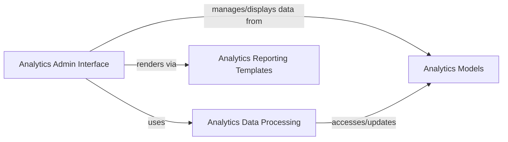

## Details

The `Analytics & Reporting` subsystem provides crucial business intelligence by transforming raw CRM data into actionable insights through aggregation, analysis, and visualization. Its architecture follows the Model-View-Template (MVT) pattern inherent in Django, with a strong emphasis on administrative interface-driven development.

### Analytics Models
This component defines the database schema for all analytical data, including various statistical reports and aggregated metrics such as deal statistics, income statistics, lead source statistics, and closing reason statistics. It serves as the persistent storage layer for the business intelligence generated by the CRM.

**Related Classes/Methods**:

- <a href="https://github.com/DjangoCRM/django-crm/analytics/models.py#L1-L1" target="_blank" rel="noopener noreferrer">`analytics.models` (1:1)</a>

### Analytics Data Processing
This component encompasses the core business logic responsible for aggregating raw CRM data into meaningful statistics and providing common helper functions used across the analytics subsystem. It includes scheduled tasks for generating monthly snapshots of key metrics, ensuring that reports are based on up-to-date and pre-processed data.

**Related Classes/Methods**:

- <a href="https://github.com/DjangoCRM/django-crm/analytics/utils/helpers.py#L1-L1" target="_blank" rel="noopener noreferrer">`analytics.utils.helpers` (1:1)</a>
- <a href="https://github.com/DjangoCRM/django-crm/analytics/utils/monthly_snapshot_saving.py#L1-L1" target="_blank" rel="noopener noreferrer">`analytics.utils.monthly_snapshot_saving` (1:1)</a>

### Analytics Admin Interface
This component provides the administrative interface within Django for viewing, managing, and potentially configuring the various analytical reports and dashboards. It leverages Django's admin site to present aggregated data, allowing administrators to gain insights into sales performance, lead conversion, and other key CRM metrics through a user-friendly interface. It includes specialized admin classes for different types of statistics.

**Related Classes/Methods**:

- <a href="https://github.com/DjangoCRM/django-crm/analytics/admin.py#L1-L1" target="_blank" rel="noopener noreferrer">`analytics.admin` (1:1)</a>
- <a href="https://github.com/DjangoCRM/django-crm/analytics/site/dealstatadmin.py#L1-L1" target="_blank" rel="noopener noreferrer">`analytics.site.dealstatadmin` (1:1)</a>
- <a href="https://github.com/DjangoCRM/django-crm/analytics/site/incomestatadmin.py#L1-L1" target="_blank" rel="noopener noreferrer">`analytics.site.incomestatadmin` (1:1)</a>
- <a href="https://github.com/DjangoCRM/django-crm/analytics/site/anlmodeladmin.py#L1-L1" target="_blank" rel="noopener noreferrer">`analytics.site.anlmodeladmin` (1:1)</a>

### Analytics Reporting Templates
This component consists of the HTML templates responsible for rendering the visual representation of the analytical data within the Django Admin interface. These templates are used to display charts, data tables, and summary views for various reports, ensuring that the processed data is presented in a clear and understandable format.

**Related Classes/Methods**:

- `analytics.templates.admin.analytics.bar_chart.html` (1:1)
- `analytics.templates.admin.analytics.data_table.html` (1:1)
- `analytics.templates.admin.analytics.summary_change_list.html` (1:1)
- `analytics.templates.analytics.bar_chart.html` (1:1)
- `analytics.templates.analytics.data_table.html` (1:1)
- `analytics.templates.analytics.summary_change_list.html` (1:1)

### [FAQ](https://github.com/CodeBoarding/GeneratedOnBoardings/tree/main?tab=readme-ov-file#faq)