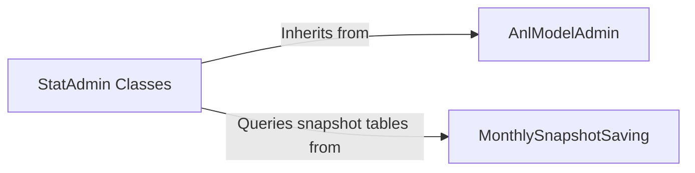

## Details

Abstract Components Overview

### AnlModelAdmin
Serves as the foundational admin interface controller for all analytics reports. It standardizes common UI elements and behaviors, such as custom filters, date-range selectors, and data visualization hooks, ensuring a consistent user experience across different statistical views.

**Related Classes/Methods**:

- <a href="https://github.com/DjangoCRM/django-crm/blob/main/analytics/site/anlmodeladmin.py#L16-L105" target="_blank" rel="noopener noreferrer">`analytics.site.anlmodeladmin.AnlModelAdmin` (16:105)</a>

### StatAdmin Classes
A group of specialized controllers that manage the display of specific business metrics reports within the Django admin site. Each class links a data model to a view, handling the unique logic for reports like deal flow, lead sources, sales funnels, and income.

**Related Classes/Methods**:

- <a href="https://github.com/DjangoCRM/django-crm/blob/main/analytics/site/dealstatadmin.py#L13-L84" target="_blank" rel="noopener noreferrer">`analytics.site.dealstatadmin.DealStatAdmin` (13:84)</a>
- <a href="https://github.com/DjangoCRM/django-crm/blob/main/analytics/site/incomestatadmin.py#L44-L469" target="_blank" rel="noopener noreferrer">`analytics.site.incomestatadmin.IncomeStatAdmin` (44:469)</a>
- <a href="https://github.com/DjangoCRM/django-crm/blob/main/analytics/site/leadsourcestatadmin.py#L27-L118" target="_blank" rel="noopener noreferrer">`analytics.site.leadsourcestatadmin.LeadSourceStatAdmin` (27:118)</a>
- <a href="https://github.com/DjangoCRM/django-crm/blob/main/analytics/site/salesfunnelsadmin.py#L10-L48" target="_blank" rel="noopener noreferrer">`analytics.site.salesfunnelsadmin.SalesFunnelAdmin` (10:48)</a>
- <a href="https://github.com/DjangoCRM/django-crm/blob/main/analytics/site/closingreasonstatadmin.py#L26-L91" target="_blank" rel="noopener noreferrer">`analytics.site.closingreasonstatadmin.ClosingReasonStatAdmin` (26:91)</a>

### MonthlySnapshotSaving
A data processing service responsible for periodic data aggregation. It runs on a schedule to transform raw, transactional CRM data into pre-calculated summary tables (snapshots). This pre-aggregation is a crucial performance optimization.

**Related Classes/Methods**:

- <a href="https://github.com/DjangoCRM/django-crm/blob/main/analytics/utils/monthly_snapshot_saving.py#L20-L58" target="_blank" rel="noopener noreferrer">`analytics.utils.monthly_snapshot_saving.MonthlySnapshotSaving` (20:58)</a>

### [FAQ](https://github.com/CodeBoarding/GeneratedOnBoardings/tree/main?tab=readme-ov-file#faq)