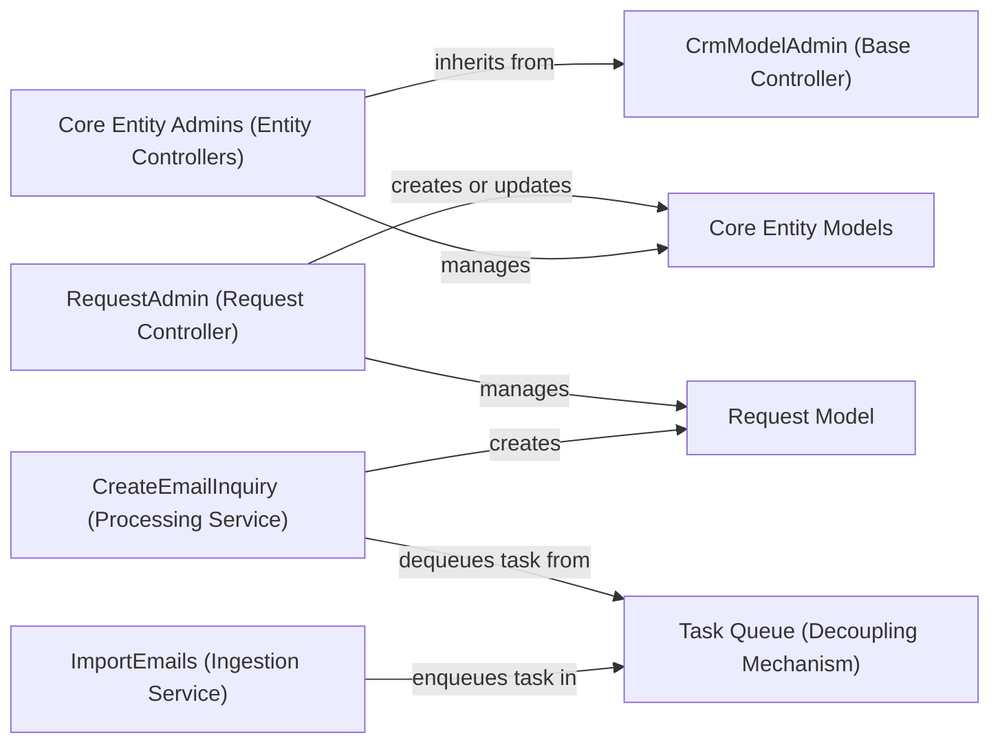

## Details

One paragraph explaining the functionality which is represented by this graph. What the main flow is and what is its purpose.

### Core Entity Models
These are the foundational data models that represent the primary entities of the CRM: `Contact`, `Company`, `Lead`, and `Deal`. They define the database schema and are the single source of truth for all customer-related data.

**Related Classes/Methods**:

- <a href="https://github.com/DjangoCRM/django-crm/blob/main/crm/models/contact.py#L9-L29" target="_blank" rel="noopener noreferrer">`Contact` (9:29)</a>
- <a href="https://github.com/DjangoCRM/django-crm/blob/main/crm/models/company.py#L10-L92" target="_blank" rel="noopener noreferrer">`Company` (10:92)</a>
- <a href="https://github.com/DjangoCRM/django-crm/blob/main/crm/models/lead.py#L9-L76" target="_blank" rel="noopener noreferrer">`Lead` (9:76)</a>
- <a href="https://github.com/DjangoCRM/django-crm/blob/main/crm/models/deal.py#L10-L202" target="_blank" rel="noopener noreferrer">`Deal` (10:202)</a>

### CrmModelAdmin (Base Controller)
An abstract base class that provides common functionality for all CRM entity administration views in the Django admin. It standardizes features like ownership tracking, permissions, and UI layout, ensuring a consistent administrative experience.

**Related Classes/Methods**:

- `CrmModelAdmin`

### Core Entity Admins (Entity Controllers)
Concrete controller classes (`ContactAdmin`, `CompanyAdmin`, `LeadAdmin`, `DealAdmin`) that manage the lifecycle and business logic for their respective core entities. They inherit from `CrmModelAdmin` and implement entity-specific administrative views and actions.

**Related Classes/Methods**:

- `ContactAdmin`
- `CompanyAdmin`
- `LeadAdmin`
- `DealAdmin`

### Request Model
Represents an incoming customer inquiry or request, typically created from a parsed email. This model serves as a temporary holding record that bridges raw, inbound communication with structured CRM entities, pending review and action.

**Related Classes/Methods**:

- <a href="https://github.com/DjangoCRM/django-crm/blob/main/crm/models/request.py#L16-L434" target="_blank" rel="noopener noreferrer">`Request` (16:434)</a>

### RequestAdmin (Request Controller)
The dedicated controller for the `Request` model. It manages the lifecycle of a request, including its assignment, status changes, and the crucial action of converting a qualified request into a `Deal`.

**Related Classes/Methods**:

- `RequestAdmin`

### ImportEmails (Ingestion Service)
A service responsible for connecting to an IMAP email server to fetch new messages. For each message, it enqueues a processing task for asynchronous handling, decoupling ingestion from processing.

**Related Classes/Methods**:

- `import_emails`

### Task Queue (Decoupling Mechanism)
An intermediary message broker or task queue that decouples the email ingestion process from the email processing logic. It receives task definitions from the `ImportEmails` service and ensures they are processed reliably by available workers.

**Related Classes/Methods**:

- `(Conceptual Component)`

### CreateEmailInquiry (Processing Service)
A background task worker that consumes messages from the Task Queue. It takes raw email data from a task, parses its content (sender, subject, body), and creates a structured `Request` record in the database.

**Related Classes/Methods**:

- <a href="https://github.com/DjangoCRM/django-crm/blob/main/crm/utils/create_email_request.py#L39-L94" target="_blank" rel="noopener noreferrer">`create_email_request` (39:94)</a>

### [FAQ](https://github.com/CodeBoarding/GeneratedOnBoardings/tree/main?tab=readme-ov-file#faq)