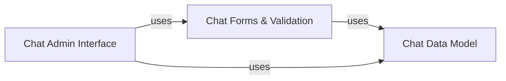

## Details

The Chat Module in this CRM system is designed to facilitate internal real-time communication. Its architecture follows the Django MVT pattern, with clear separation of concerns for data modeling, form handling, and administrative interfaces.

### Chat Data Model
This component defines the foundational database schema and Object-Relational Mapper (ORM) models for all chat-related entities, primarily ChatMessage. It serves as the single source of truth for chat data, encapsulating how messages are structured and stored. It is fundamental because it provides the persistence layer for all chat-related information.

**Related Classes/Methods**:

- <a href="https://github.com/DjangoCRM/django-crm/chat/models.py#L11-L59" target="_blank" rel="noopener noreferrer">`chat.models.ChatMessage` (11:59)</a>

### Chat Forms & Validation
This component is responsible for handling the business logic associated with chat messages, including data validation, cleaning, and preparation for persistence. It primarily leverages Django Forms to manage user input for chat messages, ensuring data integrity before it interacts with the data model. This component is crucial for maintaining data quality and consistency.

**Related Classes/Methods**:

- `chat.forms.ChatMessageForm` (1:1)

### Chat Admin Interface
This component provides the administrative interface within the Django Admin panel for managing chat messages. It integrates the Chat Data Model and Chat Forms & Validation to enable administrators to perform Create, Read, Update, and Delete (CRUD) operations on chat messages directly through a user-friendly interface. It is fundamental for system administrators to manage and audit chat data.

**Related Classes/Methods**:

- <a href="https://github.com/DjangoCRM/django-crm/chat/site/chatmessageadmin.py#L57-L319" target="_blank" rel="noopener noreferrer">`chat.site.chatmessageadmin.ChatMessageAdmin` (57:319)</a>

### [FAQ](https://github.com/CodeBoarding/GeneratedOnBoardings/tree/main?tab=readme-ov-file#faq)