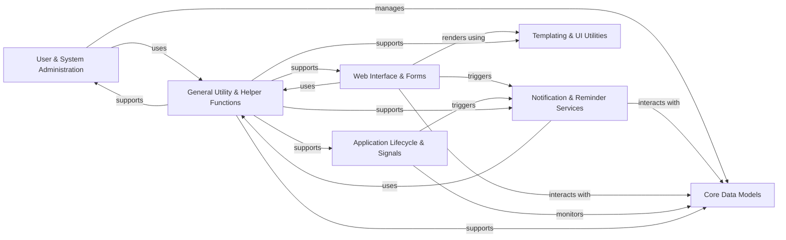

## Details

The `Common Utilities & Base Services` component is a foundational part of the CRM system, providing essential cross-cutting functionalities and data structures. It adheres to the Monolithic Web Application and Enterprise CRM patterns by centralizing shared resources, ensuring consistency, and supporting core operations across the application.

### Core Data Models
Defines the foundational database schemas for common entities like UserProfile, Reminder, and TheFile, along with base models (Base, StageBase) for common attributes. These models serve as the persistent data structures for core entities used throughout the CRM.

**Related Classes/Methods**:

- <a href="https://github.com/DjangoCRM/django-crm/common/models.py#L1-L1" target="_blank" rel="noopener noreferrer">`common/models.py` (1:1)</a>
- `common/migrations/` (1:1)

### User & System Administration
Provides the administrative interface and logic for managing common data models (users, reminders, files) through the Django Admin. It includes custom admin classes and site configurations to enable system administrators to perform CRUD operations and manage system-wide settings.

**Related Classes/Methods**:

- <a href="https://github.com/DjangoCRM/django-crm/common/admin.py#L1-L1" target="_blank" rel="noopener noreferrer">`common/admin.py` (1:1)</a>
- <a href="https://github.com/DjangoCRM/django-crm/common/site/basemodeladmin.py#L1-L1" target="_blank" rel="noopener noreferrer">`common/site/basemodeladmin.py` (1:1)</a>
- <a href="https://github.com/DjangoCRM/django-crm/common/site/crmsite.py#L1-L1" target="_blank" rel="noopener noreferrer">`common/site/crmsite.py` (1:1)</a>
- <a href="https://github.com/DjangoCRM/django-crm/common/site/reminderadmin.py#L1-L1" target="_blank" rel="noopener noreferrer">`common/site/reminderadmin.py` (1:1)</a>
- <a href="https://github.com/DjangoCRM/django-crm/common/site/userprofileadmin.py#L1-L1" target="_blank" rel="noopener noreferrer">`common/site/userprofileadmin.py` (1:1)</a>
- `common/templates/admin/common/` (1:1)

### Notification & Reminder Services
Handles the creation, scheduling, and dispatch of various notifications (e.g., emails) and reminders to users. This component is crucial for user engagement, timely task management, and ensuring users are informed of relevant events within the CRM.

**Related Classes/Methods**:

- <a href="https://github.com/DjangoCRM/django-crm/common/utils/notif_email_sender.py#L1-L1" target="_blank" rel="noopener noreferrer">`common/utils/notif_email_sender.py` (1:1)</a>
- <a href="https://github.com/DjangoCRM/django-crm/common/utils/reminders_sender.py#L1-L1" target="_blank" rel="noopener noreferrer">`common/utils/reminders_sender.py` (1:1)</a>
- <a href="https://github.com/DjangoCRM/django-crm/common/utils/notify_user.py#L1-L1" target="_blank" rel="noopener noreferrer">`common/utils/notify_user.py` (1:1)</a>
- <a href="https://github.com/DjangoCRM/django-crm/common/utils/remind_me.py#L1-L1" target="_blank" rel="noopener noreferrer">`common/utils/remind_me.py` (1:1)</a>
- <a href="https://github.com/DjangoCRM/django-crm/common/utils/email_to_participants.py#L1-L1" target="_blank" rel="noopener noreferrer">`common/utils/email_to_participants.py` (1:1)</a>
- `common/templates/common/email_notification_base.html` (1:1)
- `common/templates/common/notice_participants_email.html` (1:1)

### General Utility & Helper Functions
A collection of reusable helper functions and middleware for common tasks like data manipulation, security (e.g., secure URLs), file operations, and user-related session management. It acts as a shared toolbox for various modules across the application.

**Related Classes/Methods**:

- <a href="https://github.com/DjangoCRM/django-crm/common/utils/helpers.py#L1-L1" target="_blank" rel="noopener noreferrer">`common/utils/helpers.py` (1:1)</a>
- <a href="https://github.com/DjangoCRM/django-crm/common/utils/chat_link.py#L1-L1" target="_blank" rel="noopener noreferrer">`common/utils/chat_link.py` (1:1)</a>
- <a href="https://github.com/DjangoCRM/django-crm/common/utils/hide_main_tasks.py#L1-L1" target="_blank" rel="noopener noreferrer">`common/utils/hide_main_tasks.py` (1:1)</a>
- <a href="https://github.com/DjangoCRM/django-crm/common/utils/secure_url.py#L1-L1" target="_blank" rel="noopener noreferrer">`common/utils/secure_url.py` (1:1)</a>
- <a href="https://github.com/DjangoCRM/django-crm/common/utils/copy_files.py#L1-L1" target="_blank" rel="noopener noreferrer">`common/utils/copy_files.py` (1:1)</a>
- <a href="https://github.com/DjangoCRM/django-crm/common/utils/usermiddleware.py#L1-L1" target="_blank" rel="noopener noreferrer">`common/utils/usermiddleware.py` (1:1)</a>
- <a href="https://github.com/DjangoCRM/django-crm/common/utils/for_translation.py#L1-L1" target="_blank" rel="noopener noreferrer">`common/utils/for_translation.py` (1:1)</a>
- <a href="https://github.com/DjangoCRM/django-crm/common/utils/get_signature_preview.py#L1-L1" target="_blank" rel="noopener noreferrer">`common/utils/get_signature_preview.py` (1:1)</a>
- <a href="https://github.com/DjangoCRM/django-crm/common/utils/help_to_admin.py#L1-L1" target="_blank" rel="noopener noreferrer">`common/utils/help_to_admin.py` (1:1)</a>
- <a href="https://github.com/DjangoCRM/django-crm/common/utils/parse_full_name.py#L1-L1" target="_blank" rel="noopener noreferrer">`common/utils/parse_full_name.py` (1:1)</a>

### Web Interface & Forms
Manages the user-facing web interactions for common functionalities, including views for data display, form processing (e.g., reminder forms), and URL routing for these shared features. It provides the direct interface for users to interact with common CRM elements.

**Related Classes/Methods**:

- `common/views/` (1:1)
- <a href="https://github.com/DjangoCRM/django-crm/common/forms/reminderform.py#L1-L1" target="_blank" rel="noopener noreferrer">`common/forms/reminderform.py` (1:1)</a>
- <a href="https://github.com/DjangoCRM/django-crm/common/urls.py#L1-L1" target="_blank" rel="noopener noreferrer">`common/urls.py` (1:1)</a>
- `common/templates/common/` (1:1)

### Application Lifecycle & Signals
Handles application-wide events, configurations, and signal processing (e.g., post-save hooks for models) to ensure proper system behavior and integration across different parts of the common app. It manages how the application reacts to internal events.

**Related Classes/Methods**:

- <a href="https://github.com/DjangoCRM/django-crm/common/apps.py#L1-L1" target="_blank" rel="noopener noreferrer">`common/apps.py` (1:1)</a>
- <a href="https://github.com/DjangoCRM/django-crm/common/signals/handlers.py#L1-L1" target="_blank" rel="noopener noreferrer">`common/signals/handlers.py` (1:1)</a>

### Templating & UI Utilities
Provides custom Django template tags for rendering common UI elements or processing data within templates, promoting consistency and reusability in the user interface. It also manages static assets (CSS, JavaScript, images) for the common app.

**Related Classes/Methods**:

- <a href="https://github.com/DjangoCRM/django-crm/common/templatetags/util.py#L1-L1" target="_blank" rel="noopener noreferrer">`common/templatetags/util.py` (1:1)</a>
- <a href="https://github.com/DjangoCRM/django-crm/common/templatetags/crm_list.py#L1-L1" target="_blank" rel="noopener noreferrer">`common/templatetags/crm_list.py` (1:1)</a>
- `common/static/common/` (1:1)
- `common/templates/common/widgets/` (1:1)

### [FAQ](https://github.com/CodeBoarding/GeneratedOnBoardings/tree/main?tab=readme-ov-file#faq)